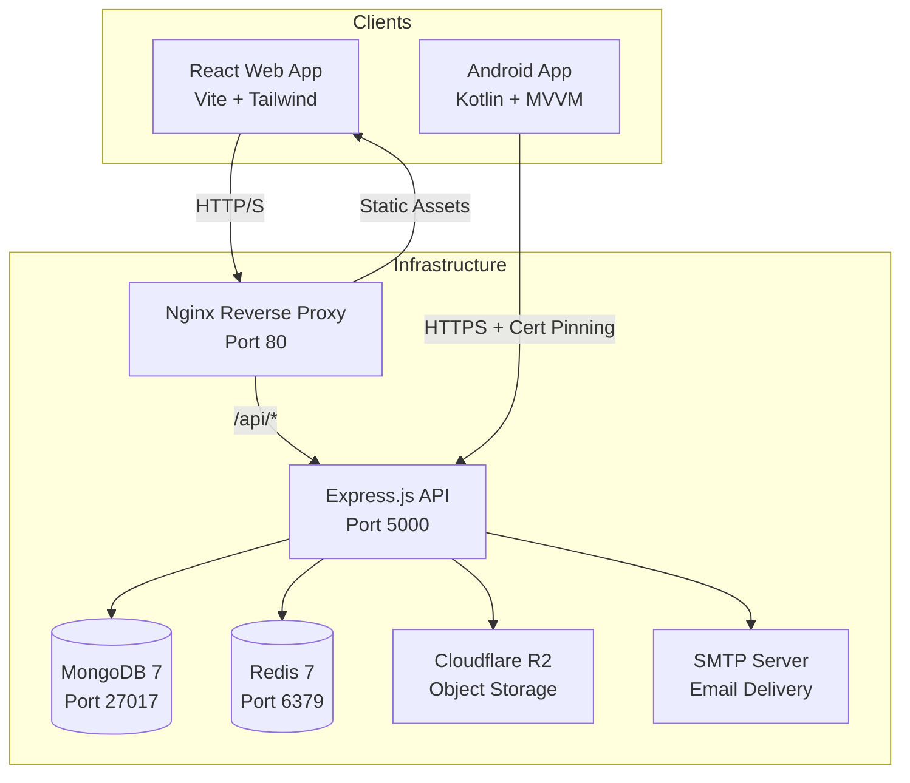
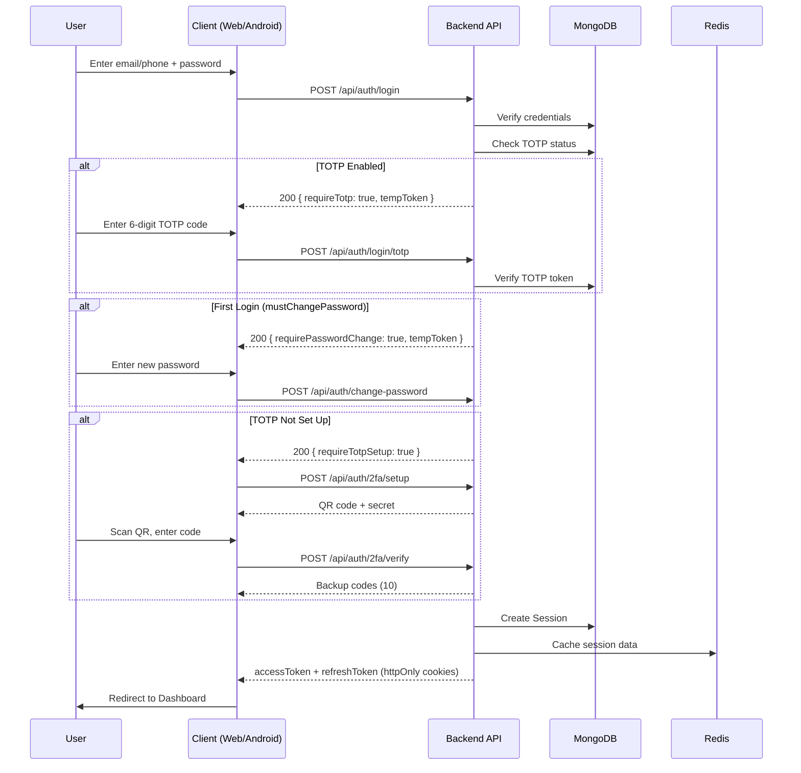
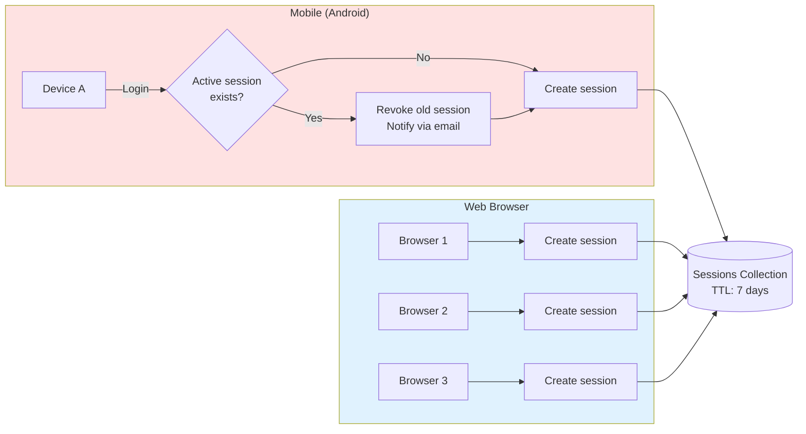
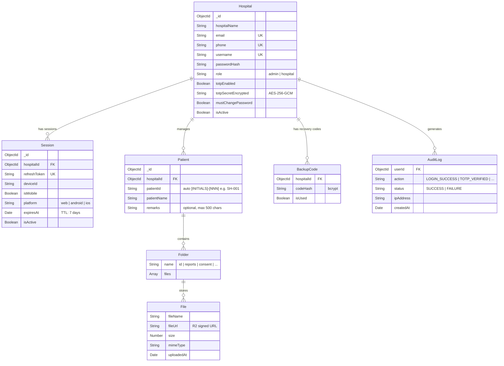
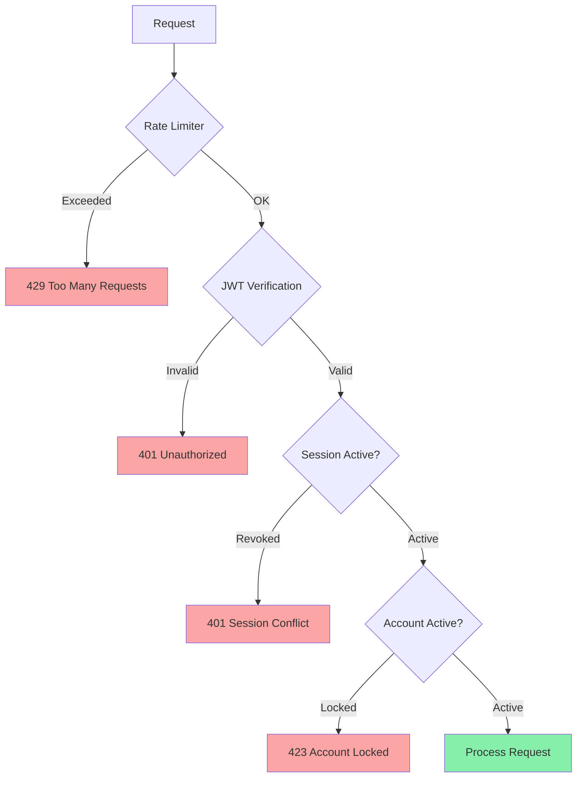
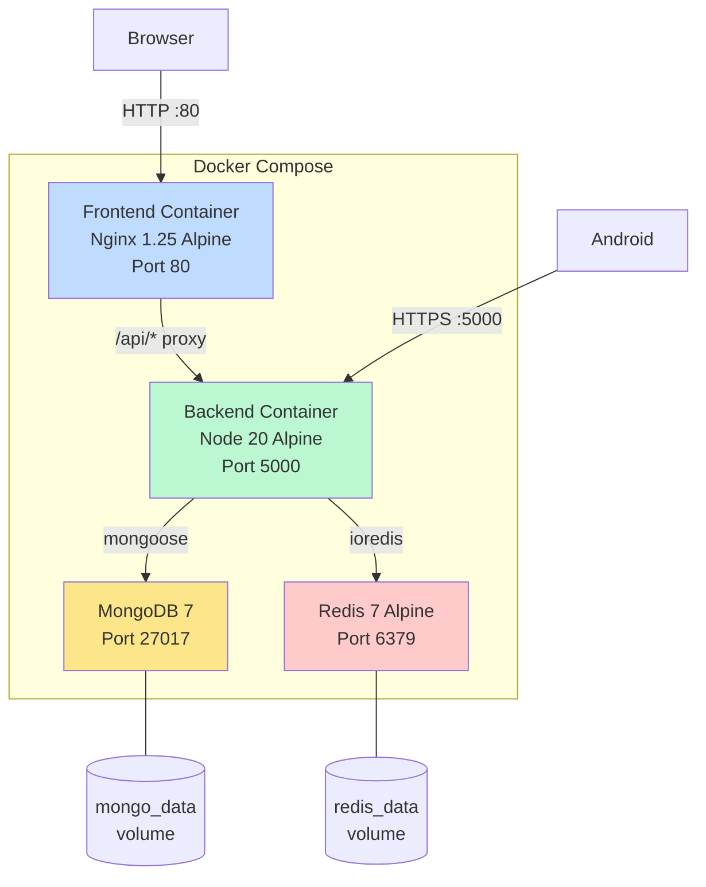

# Hospital Management System

A full-stack, multi-tenant hospital management platform with a Node.js/Express backend, React frontend, and native Android app. Built for secure patient record management with enterprise-grade authentication, TOTP 2FA, and Cloudflare R2 file storage.

---

## System Architecture



---

## Authentication Flow



---

## Session Management



> **Mobile:** Single device policy - new login revokes the previous session.
> **Web:** Multiple concurrent sessions allowed (read-only multi-session).

---

## Project Structure

```
Hospital-Management/
├── backend/                # Node.js + Express REST API
│   ├── src/
│   │   ├── config/         # Database, Redis, environment
│   │   ├── controllers/    # Route handlers
│   │   ├── middleware/      # Auth, rate limiting, validation
│   │   ├── models/          # Mongoose schemas
│   │   ├── routes/          # Express routers
│   │   ├── services/        # Business logic (TOTP, email, R2, PDF)
│   │   ├── jobs/            # Cron jobs (auto-delete)
│   │   └── index.js         # Entry point
│   ├── Dockerfile
│   └── package.json
│
├── frontend/               # React + TypeScript SPA
│   ├── src/
│   │   ├── components/     # Reusable UI (OtpInput, Navbar, etc.)
│   │   ├── pages/          # Route pages (Login, Dashboard, etc.)
│   │   ├── hooks/          # useAuth context
│   │   ├── services/       # API clients
│   │   ├── layouts/        # MainLayout with Navbar
│   │   └── App.tsx         # Router setup
│   ├── Dockerfile
│   ├── nginx.conf
│   └── package.json
│
├── android-app/            # Kotlin native Android app
│   └── app/src/main/java/com/hospital/management/
│       ├── data/           # API, repositories, models, Room DB
│       ├── domain/         # Use cases
│       ├── ui/             # Activities, ViewModels, adapters
│       └── utils/          # Network, session, biometric, security
│
├── docker-compose.yml      # Full-stack orchestration
├── .env.example            # Environment variable template
└── BUILD                   # Build automation script
```

---

## Data Model



---

## Quick Start

### Prerequisites

- **Docker & Docker Compose** (recommended) OR
- **Node.js 20+**, **MongoDB 7**, **Redis 7**
- **Android Studio** (for mobile app development)

### 1. Clone & Configure

```bash
git clone <repo-url>
cd Hospital-Management
cp .env.example .env
# Edit .env with your secrets (JWT, TOTP key, SMTP, etc.)
```

### 2. Start with Docker (Recommended)

```bash
docker-compose up --build
```

This starts all services:

| Service  | URL                    |
|----------|------------------------|
| Frontend | http://localhost       |
| Backend  | http://localhost:5000  |
| MongoDB  | localhost:27017        |
| Redis    | localhost:6379         |

### 3. Seed Demo Data

```bash
cd backend
node src/seed.js
```

Creates 5 hospitals and 54 patients with test data.

**Demo Login:** `admin@citymedical.com` / `Test@1234`

### 4. Start Without Docker (Development)

```bash
# Terminal 1 - Backend
cd backend
npm install
npm run dev

# Terminal 2 - Frontend
cd frontend
npm install
npm run dev
```

### 5. Build Android APK

Open `android-app/` in Android Studio, sync Gradle, and run on device/emulator.

---

## Security Architecture



| Layer | Implementation |
|-------|----------------|
| **Password Hashing** | bcrypt with salt rounds |
| **2FA** | TOTP (RFC 6238) via speakeasy, AES-256-GCM encrypted secrets |
| **Recovery** | 10 single-use backup codes (bcrypt hashed) |
| **Sessions** | JWT + DB-backed sessions with TTL auto-expiry |
| **Rate Limiting** | Per-endpoint limits (5 auth/15min, 3 OTP/min) |
| **Account Lockout** | 5 failed TOTP attempts = 5-minute lock |
| **Headers** | Helmet.js security headers |
| **CORS** | Origin-validated cross-origin policy |
| **Android** | Certificate pinning, encrypted storage, root detection |
| **Audit Trail** | All auth events logged (HIPAA compliance) |

---

## Deployment Architecture



---

## API Overview

| Method | Endpoint | Description |
|--------|----------|-------------|
| `POST` | `/api/auth/login` | Login with email/phone/username |
| `POST` | `/api/auth/login/totp` | Verify TOTP during login |
| `POST` | `/api/auth/login/recovery` | Login with backup code |
| `POST` | `/api/auth/2fa/setup` | Generate TOTP QR code |
| `POST` | `/api/auth/2fa/verify` | Complete TOTP setup |
| `POST` | `/api/auth/change-password` | Change password |
| `POST` | `/api/auth/refresh-token` | Refresh access token |
| `POST` | `/api/auth/logout` | End session |
| `POST` | `/api/auth/register-hospital` | Admin: create hospital |
| `GET`  | `/api/patients` | List patients (paginated) |
| `POST` | `/api/patients` | Create patient |
| `GET`  | `/api/patients/:id` | Get patient details |
| `POST` | `/api/patients/:id/files/:folder` | Upload file |
| `GET`  | `/api/patients/:id/download/pdf` | Download all as PDF |
| `GET`  | `/api/patients/:id/download/zip` | Download all as ZIP |
| `GET`  | `/api/hospitals/me` | Get current hospital |
| `POST` | `/api/export/archive` | Export modules as ZIP |

> See [backend/README.md](backend/README.md) for full endpoint documentation.

---

## Environment Variables

See [.env.example](.env.example) for the full list. Critical variables:

| Variable | Required | Description |
|----------|----------|-------------|
| `JWT_SECRET` | Yes | 64+ char secret for access tokens |
| `REFRESH_TOKEN_SECRET` | Yes | 64+ char secret for refresh tokens |
| `TOTP_ENCRYPTION_KEY` | Yes | 64-char hex string (32-byte AES key) |
| `MONGODB_URI` | Yes (prod) | MongoDB connection string |
| `SMTP_HOST/USER/PASS` | Yes | Email delivery configuration |
| `R2_*` | Optional | Cloudflare R2 for file storage |
| `REDIS_URL` | Optional | Redis (falls back to in-memory) |

---

## Tech Stack

| Component | Technology |
|-----------|------------|
| **Backend** | Node.js, Express, Mongoose, JWT, speakeasy |
| **Frontend** | React 18, TypeScript, Vite, Tailwind CSS |
| **Android** | Kotlin, Retrofit, Room, WorkManager, ML Kit |
| **Database** | MongoDB 7 |
| **Cache** | Redis 7 |
| **File Storage** | Cloudflare R2 (S3-compatible) |
| **Deployment** | Docker Compose, Nginx |

---

## Documentation

| Module | README |
|--------|--------|
| Backend API | [backend/README.md](backend/README.md) |
| Frontend Web | [frontend/README.md](frontend/README.md) |
| Android App | [android-app/README.md](android-app/README.md) |

---

## License

This project is proprietary software. All rights reserved.
