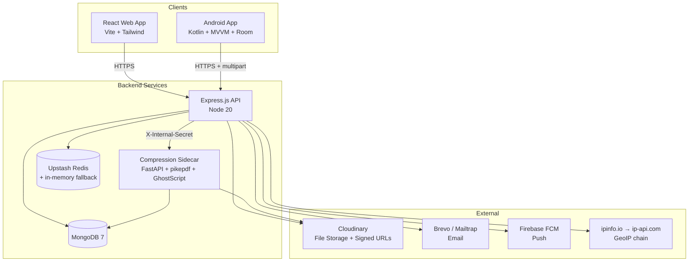
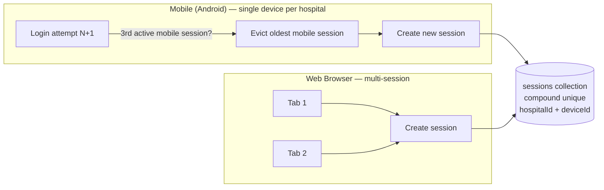
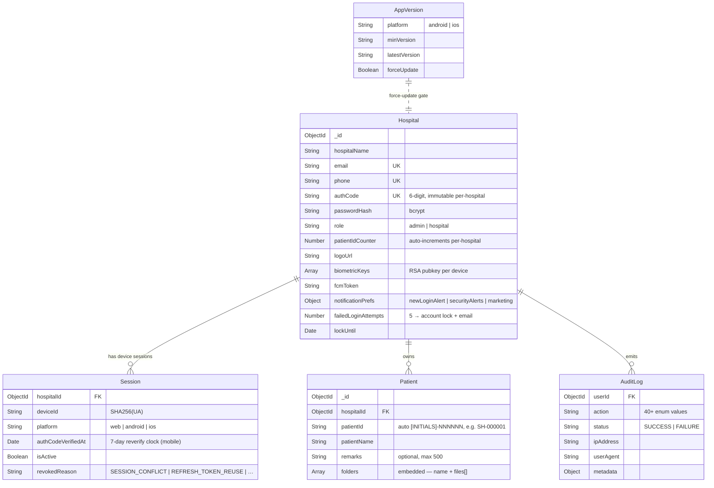

# Hospital Management System

A multi-tenant hospital records system. Each hospital gets one login and stores patient files (PDFs and images) grouped into per-patient folders. The primary user surface is a **native Android app** (file capture, upload, offline cache); the **React web app** is a read-mostly admin/management console; a **Python compression sidecar** merges and shrinks PDFs for download.

The canonical engineering reference is [CLAUDE.md](CLAUDE.md). The full audit set lives under [docs/audit/](docs/audit/) — start at [docs/audit/README.md](docs/audit/README.md). The 30 architecture diagrams (backend, web, sidecar, Android) live in [docs/audit/03-architecture-diagrams.md](docs/audit/03-architecture-diagrams.md).

---

## System Architecture



---

## Authentication Flow

Two-step login on every email/password attempt. The 6-digit **Auth Code** (immutable, per-hospital) is the only second factor. Biometric is the only path that bypasses the Auth Code step on Android. SMS gateway is deferred — all OTP flows go through email.

```mermaid
sequenceDiagram
    participant U as User
    participant C as Client (Web/Android)
    participant S as Backend API

    U->>C: Enter email/phone + password
    C->>S: POST /api/auth/login
    S-->>C: 200 { tempToken, purpose: "AUTH_CODE" }

    U->>C: Enter 6-digit Auth Code
    C->>S: POST /api/auth/verify-auth-code (Bearer tempToken)
    S-->>C: 200 { accessToken (24h) + refreshToken (httpOnly, 365d) }

    Note over C,S: Access token in module-scoped memory (NOT sessionStorage — TD-029)

    Note over C,S: Refresh rotation (TD-002): every /refresh-token call mints a fresh token; replaying a rotated-out token revokes every active session for the hospital
```

**Android-only specifics:**

- Biometric (RSA keypair per device) — `register` → `challenge` → `verify`. A successful biometric verify resets the 7-day Auth Code clock.
- After 7 days a mobile session must re-verify the Auth Code (`401 AUTH_CODE_REQUIRED`).
- Up to 2 mobile sessions per hospital; the 3rd login evicts the oldest.

**Forgot password:** 3-step (`init` → `verify-otp` → `reset`). `init` always returns 200 to prevent enumeration.

**Password policy:** ≥8 chars, upper + lower + digit + special. 5 failed attempts → account lock with email.

---

## Session Management



- Mobile is exempt from the 7-day reverify only after a successful biometric verify.
- Web is multi-session and not subject to the 7-day reverify check.
- Refresh token rotation + reuse detection enforce a single live refresh token per session.

---

## Project Structure

```text
Hospital-Management/
├── backend/                  # Node.js + Express REST API (primary service)
│   ├── src/
│   │   ├── config/           # env validation, Mongoose, Redis
│   │   ├── controllers/      # Route handlers (auth, patient, hospital, admin, export, …)
│   │   ├── middleware/       # JWT/admin guards, rate limiting, validation
│   │   ├── models/           # Mongoose schemas (5 collections)
│   │   ├── routes/           # Express routers
│   │   ├── services/         # storage (Cloudinary), compression, mail, push, geoip, token, …
│   │   ├── jobs/             # node-cron auto-delete (90d)
│   │   ├── utils/            # pino logger, request-id middleware
│   │   └── index.js          # entry point
│   ├── scripts/              # operator CLIs (migrations, smoke tests)
│   └── package.json
│
├── frontend/                 # React 18 + TypeScript SPA
│   ├── src/
│   │   ├── components/       # Navbar, OtpInput, DocumentViewer, modals, …
│   │   ├── pages/            # 20 page components (24 routes total)
│   │   ├── hooks/            # useAuth, useDocumentTitle, useInactivityTimeout, …
│   │   ├── services/         # axios api.ts, authService, hospitalService, audit.service
│   │   ├── layouts/          # MainLayout (navbar + outlet, calc-height)
│   │   ├── routes/           # AppRoutes.tsx
│   │   └── App.tsx
│   └── package.json
│
├── android-app/              # Kotlin native app (primary user surface)
│   └── app/src/main/java/com/hospital/management/
│       ├── data/             # Retrofit API, repositories, DTOs, Room v4 cache
│       ├── domain/           # UseCases (kept for ViewModelFactory R8 stability)
│       ├── presentation/     # Activities, ViewModels, adapters
│       ├── worker/           # WorkManager: SyncDocumentsWorker, DownloadWorker, …
│       └── utils/            # SessionManager, NetworkMonitor, BiometricHelper, FileLogger
│
├── compression-service/      # Python 3.12 + FastAPI PDF sidecar
│   └── app/                  # pikepdf + pypdfium2 + fpdf2 + GhostScript
│
├── docs/                     # SRS, end-to-end PDF, architecture diagrams, audit
│   └── audit/                # 7 audit reports + tech-debt ledger (incl. TD-A01..A20)
│
├── docker-compose.yml        # Local dev orchestration
├── .env.example              # All backend env vars (in sync with code as of 2026-04-21)
├── CLAUDE.md                 # Canonical project context
└── README.md                 # This file
```

---

## Data Model

Five MongoDB collections. The schema is multi-tenant: every patient record is scoped to a `hospitalId`. Folders and files are **embedded inside `patients`** — they are not top-level collections.



The Python sidecar additionally writes its own `merged_pdf_cache` and `compression_audits` collections (separate concern, not user-facing).

---

## Quick Start

### Prerequisites

- **Docker & Docker Compose** (recommended) OR
- **Node 20+**, **MongoDB 7**, optionally **Upstash Redis** (the backend will fall back to an in-memory `Map` with full TTL semantics if Redis is unset)
- **Python 3.12** + **GhostScript** for the compression sidecar
- **Android Studio** for the mobile app

### 1. Clone & Configure

```bash
git clone <repo-url>
cd Hospital-Management
cp .env.example .env
# Fill in JWT_SECRET, REFRESH_TOKEN_SECRET (64+ chars each, no `dev-` prefix in prod),
# Cloudinary creds, Brevo/Mailtrap, Firebase service account, optional Upstash Redis.
```

### 2. Start with Docker

```bash
docker-compose up --build
```

| Service  | URL                     |
| -------- | ----------------------- |
| Frontend | `http://localhost`      |
| Backend  | `http://localhost:5000` |
| Sidecar  | `http://localhost:8000` |
| MongoDB  | `localhost:27017`       |

### 3. Seed Demo Data

```bash
cd backend
node src/seed.js
```

### 4. Run Without Docker (Development)

```bash
# Terminal 1 — Backend
cd backend && npm install && npm run dev

# Terminal 2 — Frontend
cd frontend && npm install && npm run dev

# Terminal 3 — Compression sidecar (optional in dev; mandatory in prod, see TD-D4)
cd compression-service && pip install -r requirements.txt && uvicorn app.main:app --reload
```

### 5. Build Android APK

Open `android-app/` in Android Studio, configure your upload keystore (see [android-app/KEYSTORE_SETUP.md](android-app/KEYSTORE_SETUP.md)), and run `./gradlew assembleRelease` or `bundleRelease`. Release signing reads `HMS_UPLOAD_KEYSTORE_PATH` / `HMS_UPLOAD_KEYSTORE_PWD` / `HMS_UPLOAD_KEY_PWD` from env or `~/.gradle/gradle.properties`.

---

## File Pipeline & Downloads

- Android uploads files via multipart → backend → Cloudinary at public*id `HospitALL/h*{hospitalId}/p*{patientId}/{folder_slug}/{date}*{hash}`. Files are either `public`or`signed` (5-min TTL). 120×120 thumbnails for images.
- Downloads come in three modes: per-file, per-folder, per-patient. PDF (merged) and ZIP (per-folder) are gated by a size pre-check (soft 10 MB / hard 100 MB).
- The compression sidecar handles PDF merging + size reduction. The backend calls it with `X-Internal-Secret`; the sidecar fetches inputs from Cloudinary, runs a tier ladder (digital / scanned / aggressive), uploads the result, and caches by SHA256 of inputs. **Mandatory in prod (TD-D4)** — the in-process pdf-lib fallback OOMs at scale.
- A nightly cron (00:00 UTC) hard-deletes patients older than 90 days and cascades the Cloudinary delete. There is no soft-delete or trash UI.

---

## Security

| Concern          | Mechanism                                                                                                    |
| ---------------- | ------------------------------------------------------------------------------------------------------------ |
| Password hashing | bcryptjs                                                                                                     |
| Second factor    | 6-digit immutable Auth Code (per-hospital)                                                                   |
| Token format     | JWT (access 24h) + JWT refresh (httpOnly cookie, 365d, **rotated** on every refresh — TD-002)                |
| Reuse detection  | Replaying a rotated-out refresh token revokes every active session for the hospital and emails the operator  |
| Brute-force      | 5 failed password attempts → account lock + email                                                            |
| OTP enumeration  | `forgot-password/init` always returns 200                                                                    |
| Rate limiting    | Per-endpoint (auth, OTP, patient downloads, …); see [backend/README.md](backend/README.md)                   |
| Headers          | helmet defaults                                                                                              |
| Android          | Biometric (RSA), root detection, EncryptedSharedPreferences, certificate pinning                             |
| Audit            | All sensitive actions emit an `AuditLog` (40+ action enum values); fire-and-forget, never blocks the request |
| GeoIP            | ipinfo.io (keyed) → ip-api.com (keyless fallback); attached to sessions + login emails                       |
| Logging          | pino + pino-http; auto-redacts Authorization, Cookie, password\*, token, refreshToken, otp, authCode         |

---

## API Overview

52 endpoints total (auth 24 · patients 20 · hospitals 12 · export 1 · audit 2 · admin 2 · version 1 · health 2). See [backend/README.md](backend/README.md) for the full table.

| Method | Endpoint                                            | Description                                            |
| ------ | --------------------------------------------------- | ------------------------------------------------------ |
| `POST` | `/api/auth/login`                                   | Login (returns tempToken, purpose=AUTH_CODE)           |
| `POST` | `/api/auth/verify-auth-code`                        | Exchange tempToken + Auth Code → access/refresh        |
| `POST` | `/api/auth/refresh-token`                           | Rotate refresh token, mint new access                  |
| `POST` | `/api/auth/biometric/{register,challenge,verify}`   | Android biometric flow                                 |
| `POST` | `/api/auth/forgot-password/{init,verify-otp,reset}` | Forgot-password 3-step                                 |
| `POST` | `/api/auth/register-hospital`                       | Admin: create hospital (welcome email + temp password) |
| `POST` | `/api/auth/register`                                | Self-service registration (sends OTP)                  |
| `GET`  | `/api/patients`                                     | List patients (paginated, searchable)                  |
| `POST` | `/api/patients/:id/folders/:folder/files`           | Upload file                                            |
| `GET`  | `/api/patients/:id/download/{pdf,zip}`              | Download all (size-checked)                            |
| `GET`  | `/api/audits`                                       | Admin-only, hospital-scoped audit log                  |
| `GET`  | `/api/health`, `/api/health/deep`                   | Liveness + dependency probes                           |

---

## Environment Variables

See [.env.example](.env.example) for the full list (in sync with code as of 2026-04-21, TD-004). Critical ones:

| Variable                                                                           | Required       | Notes                                                                                       |
| ---------------------------------------------------------------------------------- | -------------- | ------------------------------------------------------------------------------------------- |
| `JWT_SECRET`, `REFRESH_TOKEN_SECRET`                                               | Yes            | 64+ chars, no `dev-` prefix in prod                                                         |
| `MONGODB_URI`                                                                      | Yes            | MongoDB connection string                                                                   |
| `CLOUDINARY_CLOUD_NAME` / `_API_KEY` / `_API_SECRET`                               | Yes            | Primary file storage                                                                        |
| `BREVO_API_KEY`                                                                    | prod           | Email delivery (Mailtrap in dev)                                                            |
| `FIREBASE_PROJECT_ID` / `_PRIVATE_KEY` / `_CLIENT_EMAIL`                           | Yes (mobile)   | FCM push                                                                                    |
| `UPSTASH_REDIS_REST_URL` / `_TOKEN`                                                | Optional       | Falls back to in-memory `Map`                                                               |
| `USE_COMPRESSION_SERVICE`, `COMPRESSION_SERVICE_URL`, `COMPRESSION_SERVICE_SECRET` | **Yes (prod)** | Mandatory (TD-D4) — `env.js` refuses to boot without `USE_COMPRESSION_SERVICE=true` in prod |
| `IPINFO_TOKEN`                                                                     | Optional       | Activates ipinfo.io as primary GeoIP provider                                               |
| `TRUST_PROXY_HOPS`                                                                 | Optional       | Default `2`; must be a numeric value (not `true`)                                           |
| `LOG_LEVEL`                                                                        | Optional       | Default `info` in prod, `debug` in dev                                                      |

R2 / S3 keys (`R2_ENDPOINT`, `R2_ACCESS_KEY_ID`, …) remain in `.env.example` as a **legacy fallback**. Active code uses Cloudinary. `r2.service.js` is currently dead code (TD-003).

---

## Tech Stack

| Component  | Technology                                                                                                                                                                  |
| ---------- | --------------------------------------------------------------------------------------------------------------------------------------------------------------------------- |
| Backend    | Node 20 · Express · Mongoose 7 · JWT · bcryptjs · Multer · Cloudinary · Brevo · Firebase Admin · Upstash Redis · pdfkit · pdf-lib · archiver · node-cron · pino + pino-http |
| Frontend   | React 18 · TypeScript 5 · Vite · Tailwind CSS 3 · React Router 6 · Axios · Headless UI · React Context                                                                      |
| Android    | Kotlin · Retrofit · Room v4 · WorkManager · BiometricPrompt · FCM · ML Kit Document Scanner                                                                                 |
| Sidecar    | Python 3.12 · FastAPI · pikepdf · pypdfium2 · fpdf2 · GhostScript · Motor (async Mongo)                                                                                     |
| Storage    | Cloudinary (primary) · R2 / S3 (legacy fallback, dead code)                                                                                                                 |
| Database   | MongoDB 7                                                                                                                                                                   |
| Cache / KV | Upstash Redis (REST), with in-memory `Map` fallback                                                                                                                         |
| Deployment | Docker Compose (dev), Render (prod)                                                                                                                                         |

---

## Documentation

| Module                                                          | README                                                         |
| --------------------------------------------------------------- | -------------------------------------------------------------- |
| Backend API                                                     | [backend/README.md](backend/README.md)                         |
| Frontend Web                                                    | [frontend/README.md](frontend/README.md)                       |
| Android App                                                     | [android-app/README.md](android-app/README.md)                 |
| Compression Sidecar                                             | [compression-service/README.md](compression-service/README.md) |
| Canonical project context                                       | [CLAUDE.md](CLAUDE.md)                                         |
| Audit set (drift, dead code, diagrams, enhancements, tech-debt) | [docs/audit/README.md](docs/audit/README.md)                   |

---

## License

Proprietary software. All rights reserved.
