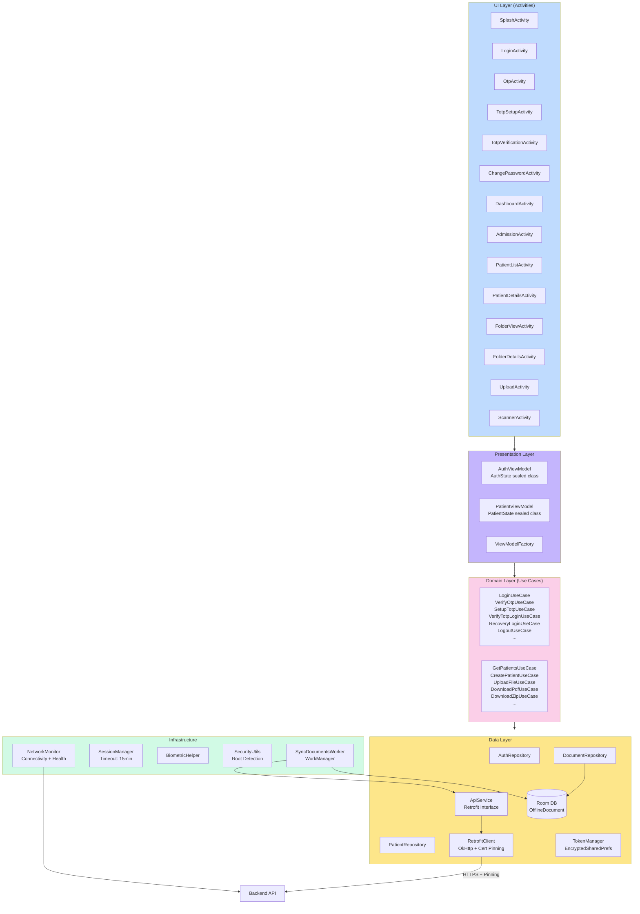
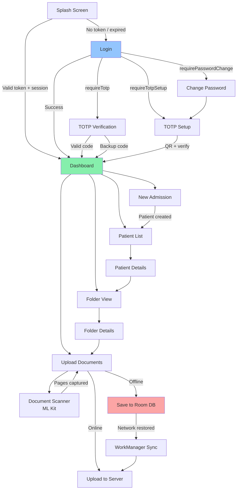
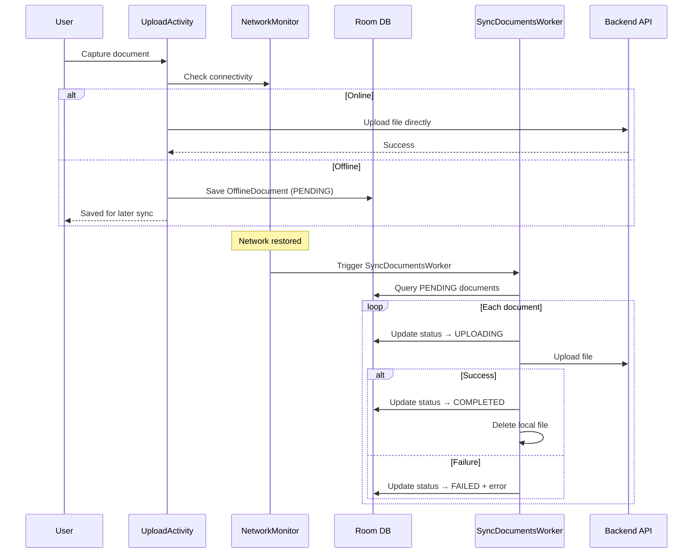
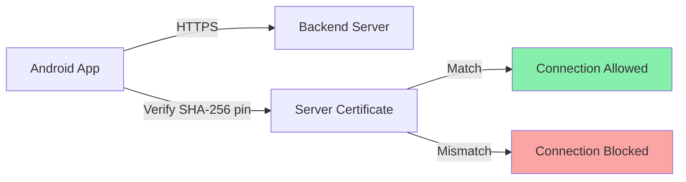

# Android App - Hospital Management

Native Kotlin Android application built with Clean Architecture (MVVM), Retrofit, Room, and enterprise-grade security including certificate pinning, encrypted storage, and TOTP 2FA.

> **Before publishing to Google Play:** see [`KEYSTORE_SETUP.md`](KEYSTORE_SETUP.md) for the upload-keystore generation runbook (TD-A01). The release build will fail unless `HMS_UPLOAD_KEYSTORE_PATH` / `HMS_UPLOAD_KEYSTORE_PWD` / `HMS_UPLOAD_KEY_PWD` are set.

## Architecture



## Screen Flow



## Offline Sync



## Session & Security

```mermaid
flowchart TD
    subgraph Startup
        APP[HospitalApplication.onCreate]
        APP --> ROOT{Root detected?}
        ROOT -->|Yes| WARN[Show warning toast]
        ROOT -->|No| INIT[Initialize app]
        INIT --> NET_INIT[Start NetworkMonitor]
        INIT --> SESS_INIT[Start SessionManager]
    end

    subgraph Runtime["Activity Lifecycle"]
        RESUME[onResume] --> TIMEOUT{Session valid?<br/>&#40;15 min timeout&#41;}
        TIMEOUT -->|Expired| LOGOUT[Force logout<br/>→ LoginActivity]
        TIMEOUT -->|Valid| CONTINUE[Continue]
        PAUSE[onPause] --> UPDATE[Update last interaction time]
    end

    subgraph Conflict["Multi-Device Detection"]
        REQ[API Request] --> INTERCEPT[AuthInterceptor]
        INTERCEPT -->|401 SESSION_CONFLICT| BROADCAST[Broadcast<br/>ACTION_SESSION_REVOKED]
        BROADCAST --> REVOKE[DashboardActivity receives]
        REVOKE --> LOGOUT2[Force logout + toast]
    end

    style LOGOUT fill:#fca5a5
    style LOGOUT2 fill:#fca5a5
    style WARN fill:#fef08a
```



## Directory Structure

```
android-app/app/src/main/
├── java/com/hospital/management/
│   ├── HospitalApplication.kt          # App lifecycle, network callback, sync
│   │
│   ├── data/
│   │   ├── api/
│   │   │   ├── ApiService.kt           # Retrofit endpoints (30+)
│   │   │   ├── AuthInterceptor.kt      # Token injection + session conflict
│   │   │   └── RetrofitClient.kt       # Singleton, cert pinning, cookies
│   │   ├── local/
│   │   │   ├── AppDatabase.kt          # Room DB (offline_documents table)
│   │   │   ├── DocumentDao.kt          # CRUD for offline queue
│   │   │   └── OfflineDocument.kt      # Entity + SyncStatus enum
│   │   ├── model/
│   │   │   ├── AuthModels.kt           # Login, TOTP, password responses
│   │   │   ├── Hospital.kt
│   │   │   ├── Patient.kt              # Patient, Folder, FileItem
│   │   │   └── PatientRequest.kt
│   │   └── repository/
│   │       ├── AuthRepository.kt       # Auth API wrapper
│   │       ├── PatientRepository.kt    # Patient API wrapper
│   │       └── DocumentRepository.kt   # Offline-first document management
│   │
│   ├── domain/usecase/
│   │   ├── AuthUseCases.kt             # 11 auth use cases
│   │   └── PatientUseCases.kt          # 11 patient use cases
│   │
│   ├── ui/
│   │   ├── auth/
│   │   │   ├── LoginActivity.kt
│   │   │   ├── OtpActivity.kt
│   │   │   ├── ChangePasswordActivity.kt
│   │   │   ├── TotpSetupActivity.kt
│   │   │   └── TotpVerificationActivity.kt
│   │   ├── dashboard/
│   │   │   └── DashboardActivity.kt
│   │   ├── patient/
│   │   │   ├── PatientListActivity.kt
│   │   │   ├── PatientDetailsActivity.kt
│   │   │   ├── AdmissionActivity.kt
│   │   │   ├── FolderViewActivity.kt
│   │   │   ├── FolderDetailsActivity.kt
│   │   │   ├── UploadActivity.kt
│   │   │   └── ScannerActivity.kt
│   │   ├── adapter/
│   │   │   ├── PatientAdapter.kt
│   │   │   ├── FileAdapter.kt
│   │   │   └── FolderAdapter.kt
│   │   ├── viewmodel/
│   │   │   ├── AuthViewModel.kt
│   │   │   ├── PatientViewModel.kt
│   │   │   └── ViewModelFactory.kt
│   │   └── SplashActivity.kt
│   │
│   ├── utils/
│   │   ├── NetworkMonitor.kt           # Connectivity + health check
│   │   ├── SessionManager.kt           # 15-min timeout enforcement
│   │   ├── BiometricHelper.kt          # Fingerprint/face auth
│   │   ├── SecurityUtils.kt            # Root detection
│   │   └── TokenManager.kt             # EncryptedSharedPreferences
│   │
│   └── worker/
│       └── SyncDocumentsWorker.kt      # WorkManager background sync
│
├── res/
│   ├── layout/                         # XML layouts for all activities
│   ├── drawable/                        # Icons and backgrounds
│   ├── values/                          # Strings, colors, themes
│   └── xml/
│       └── network_security_config.xml  # Certificate pinning
│
└── AndroidManifest.xml
```

## Key Features

### Certificate Pinning



Configured in `network_security_config.xml`:
- Pins SHA-256 hash of server certificate
- Cleartext traffic disabled globally
- Localhost exempted for development
- Expiry: 2027-01-01

### Encrypted Storage

All sensitive data stored via `EncryptedSharedPreferences`:
- **MasterKey:** AES256-GCM scheme
- **Key encryption:** AES256-SIV
- **Value encryption:** AES256-GCM

Stored values:
| Key | Description |
|-----|-------------|
| `access_token` | JWT access token |
| `refresh_token` | JWT refresh token |
| `temp_token` | Temporary token for TOTP/password flows |
| `hospital_id` | Current hospital ID |
| `hospital_name` | Display name |
| `logo_url` | Hospital logo URL |
| `session_timestamp` | Last interaction time |
| `biometric_enrolled` | Biometric auth flag |

### Document Scanner

Integrates **Google ML Kit Document Scanner** for:
- Camera-based document capture
- Auto-edge detection and perspective correction
- Multi-page scanning with thumbnail preview
- Page reordering and deletion before upload

### Background Sync (WorkManager)

```
Network restored
    → SyncDocumentsWorker triggered
    → Query Room DB for PENDING documents
    → Upload each to backend via Retrofit
    → Update status: COMPLETED / FAILED
    → Delete local files on success
```

## Build Requirements

| Requirement | Version |
|-------------|---------|
| Android Studio | Hedgehog+ |
| Kotlin | 1.9.0 |
| Gradle | 8.5 |
| Min SDK | 26 (Android 8.0) |
| Target SDK | 34 (Android 14) |
| Compile SDK | 34 |
| Java | 1.8 |

## Setup

### 1. Open in Android Studio

```
File → Open → select android-app/ directory
```

### 2. Sync Gradle

Android Studio will auto-sync. If not: `File → Sync Project with Gradle Files`

### 3. Configure Server URL

Update the base URL in `RetrofitClient.kt` to point to your backend:

```kotlin
private const val BASE_URL = "https://your-backend-url.com/"
```

### 4. Update Certificate Pin

If using a different server, update `network_security_config.xml`:

```xml
<pin-set expiration="2027-01-01">
    <pin digest="SHA-256">YOUR_CERTIFICATE_HASH</pin>
</pin-set>
```

### 5. Build & Run

- **Debug:** Run button in Android Studio (or `./gradlew assembleDebug`)
- **Release:** `./gradlew assembleRelease` (requires signing config)

## Dependencies

| Library | Version | Purpose |
|---------|---------|---------|
| Retrofit | 2.9.0 | HTTP client |
| OkHttp | 4.12.0 | HTTP + cert pinning |
| Room | 2.6.1 | SQLite database (offline queue) |
| DataStore | 1.0.0 | Preferences storage |
| Coroutines | 1.7.3 | Async operations |
| WorkManager | 2.9.0 | Background sync |
| ML Kit Scanner | 16.0.0-beta1 | Document scanning |
| CameraX | 1.3.0 | Camera capture |
| Glide | 4.16.0 | Image loading |
| iText7 | 7.2.5 | PDF generation |
| Biometric | 1.1.0 | Fingerprint/face auth |
| EncryptedSharedPrefs | - | AES-256 encrypted storage |
| Jetpack Compose | 1.5.4 | Modern UI toolkit |

## Permissions

| Permission | Purpose |
|------------|---------|
| `INTERNET` | API communication |
| `CAMERA` | Document scanning |
| `POST_NOTIFICATIONS` | Sync status notifications |
