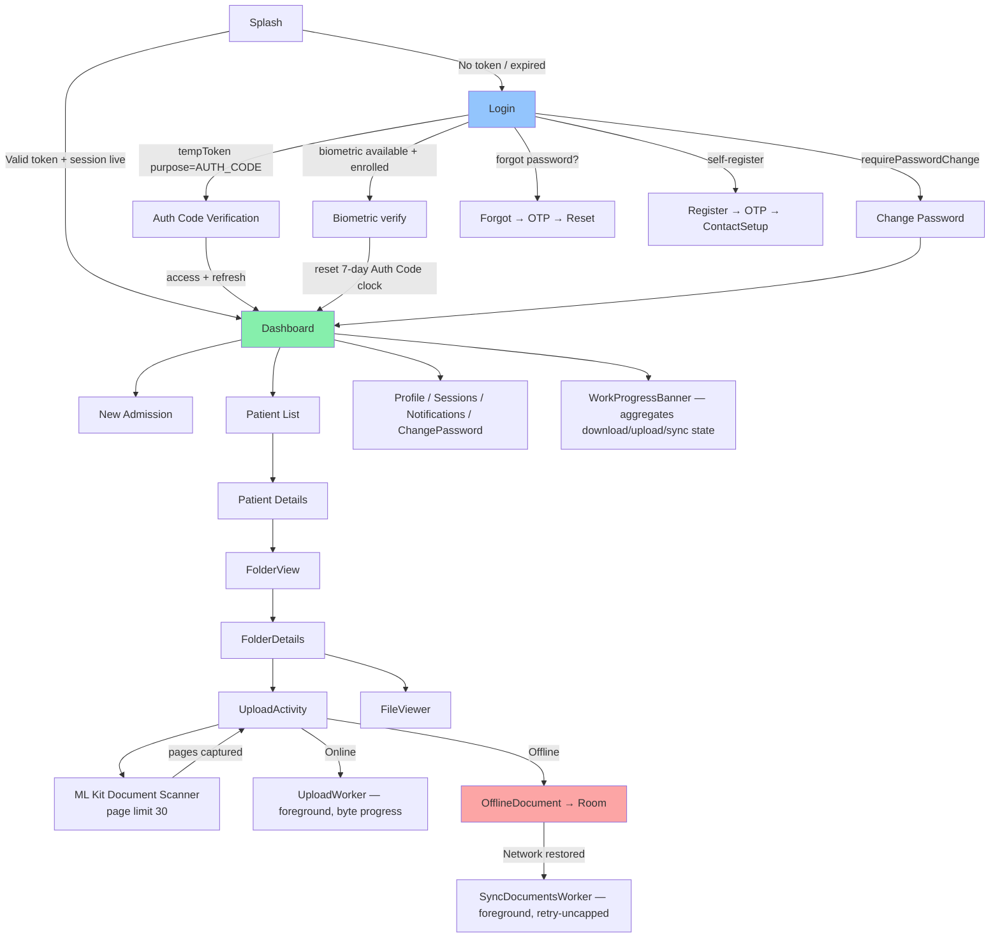
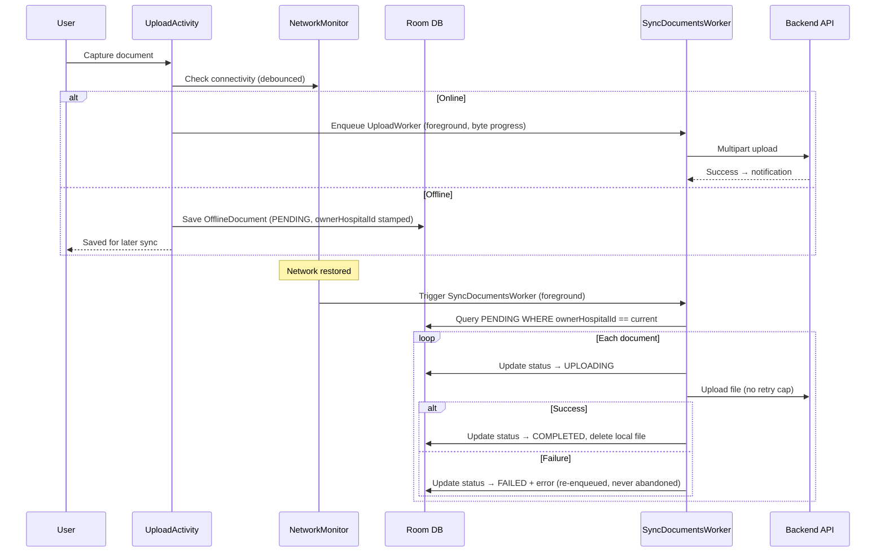
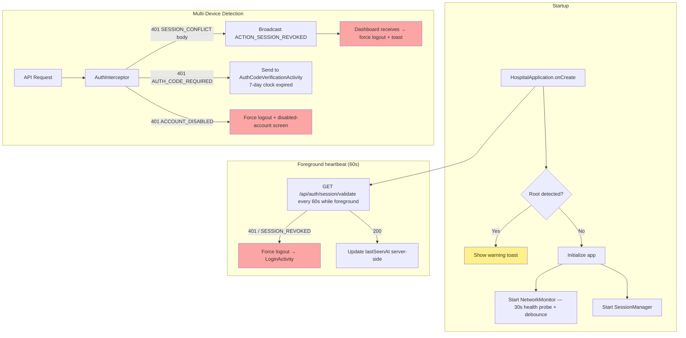
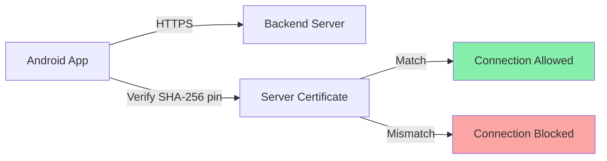

# Android App — MediVault

Native Kotlin Android application — the **primary user surface** for file capture, upload, and offline cache. Built with MVVM + Repository + UseCases (no DI framework), Retrofit, Room v4, WorkManager. Authenticates via the same two-step Auth Code flow as the web app — TOTP was removed from the system; the immutable 6-digit Auth Code is the only second factor (see [../CLAUDE.md §5](../CLAUDE.md)). Biometric is the only path that bypasses the Auth Code step.

Canonical project context: [../CLAUDE.md](../CLAUDE.md). Android-specific audit: [../docs/audit/android.md](../docs/audit/android.md). Tech-debt items `TD-A01..TD-A20` in [../docs/audit/06-tech-debt-ledger.md](../docs/audit/06-tech-debt-ledger.md).

> **Before publishing to Google Play:** see [`KEYSTORE_SETUP.md`](KEYSTORE_SETUP.md) for the upload-keystore generation runbook (TD-A01 / TD-A02). The release build will fail closed unless `HMS_UPLOAD_KEYSTORE_PATH` / `HMS_UPLOAD_KEYSTORE_PWD` / `HMS_UPLOAD_KEY_PWD` are set (env or `~/.gradle/gradle.properties`). Bump `versionCode` on every upload.

## Architecture

```mermaid
graph TB
    subgraph UI["UI Layer (Activities — ViewBinding XML)"]
        SPLASH[SplashActivity]
        LOGIN[LoginActivity]
        AUTHCODE[AuthCodeVerificationActivity]
        CHPW[ChangePasswordActivity]
        FORGOT["ForgotPassword{,Otp,Reset}Activity"]
        REG["Register{,Otp}Activity"]
        DASH[DashboardActivity]
        ADMISSION[AdmissionActivity]
        FOLDER_VIEW[FolderViewActivity]
        FOLDER_DETAIL[FolderDetailsActivity]
        FILE_VIEWER[FileViewerActivity]
        UPLOAD[UploadActivity]
        SCANNER[ScannerActivity]
        PROFILE[ProfileActivity]
        SESSIONS[SessionsActivity]
        NOTIFY[NotificationsActivity]
    end

    subgraph Presentation["Presentation Layer"]
        AUTH_VM[AuthViewModel]
        PAT_VM[PatientViewModel]
        VMF[ViewModelFactory<br/>kept for R8 stability — see proguard-rules.pro]
    end

    subgraph Domain["Domain Layer (UseCases)"]
        AUTH_UC[Login / VerifyAuthCode / Biometric{Register,Challenge,Verify}<br/>Forgot{Init,VerifyOtp,Reset} / ChangePassword / Logout]
        PAT_UC[GetPatients / CreatePatient / UploadFile<br/>DownloadFolder{Pdf,Zip} / DownloadPatient{Pdf,Zip} / ...]
    end

    subgraph Data["Data Layer"]
        AUTH_REPO[AuthRepository]
        PAT_REPO[PatientRepository]
        DOC_REPO[DocumentRepository]
        API[ApiService<br/>Retrofit Interface]
        CLIENT[RetrofitClient<br/>OkHttp + Cert Pinning + AuthInterceptor]
        ROOM[(Room DB v4<br/>OfflineDocument + CachedPatient + CachedFile)]
        TOKEN[TokenManager<br/>EncryptedSharedPrefs]
    end

    subgraph Infra["Infrastructure"]
        NET[NetworkMonitor<br/>Connectivity + 30s health probe + ONLINE↔OFFLINE debounce]
        SESS[SessionManager<br/>60s foreground heartbeat → /session/validate]
        BIO[BiometricHelper<br/>RSA keypair per device]
        SEC[SecurityUtils<br/>Root detection]
        DL[DownloadWorker<br/>foreground; bulk PDF/ZIP folder + patient]
        UL[UploadWorker<br/>foreground; online direct uploads w/ byte progress]
        SYNC[SyncDocumentsWorker<br/>foreground; offline-queue drain]
        FCM[FcmTokenWorker / OfflineLogoutWorker]
    end

    UI --> Presentation
    Presentation --> Domain
    Domain --> Data
    Data --> API
    API --> CLIENT
    CLIENT -->|HTTPS + Pinning| BACKEND[Backend API<br/>BuildConfig.BASE_URL]
    DOC_REPO --> ROOM
    SYNC --> ROOM
    SYNC --> API
    DL --> API
    UL --> API
    NET --> BACKEND

    style UI fill:#bfdbfe
    style Presentation fill:#c4b5fd
    style Domain fill:#fbcfe8
    style Data fill:#fde68a
    style Infra fill:#d1fae5
```

## Screen Flow



`PatientListActivity` and `PatientDetailsActivity` are declared in the manifest but currently have **zero `startActivity` callers** — Dashboard taps route straight to `FolderViewActivity` and the patient-edit dialog lives there. Tracked for deletion as [TD-A09](../docs/audit/06-tech-debt-ledger.md).

## Bulk Download / Upload / Sync (Phase 1+2, shipped 2026-04-25)

All bulk transfers run through foreground WorkManager workers — never inline on the UI thread.

| Worker                | Drives                                           | Notes                                                                                                                                                                                                                                                        |
| --------------------- | ------------------------------------------------ | ------------------------------------------------------------------------------------------------------------------------------------------------------------------------------------------------------------------------------------------------------------ |
| `DownloadWorker`      | folder PDF, folder ZIP, patient PDF, patient ZIP | Accepts JSON request bodies for bulk merges. Resumes partial transfers via `RandomAccessFile`. `pollUntilReady(statusUrl)` polls the sidecar's status URL when a server-side merge is in progress. Inline-download plumbing was deleted in commit `8d8956f`. |
| `UploadWorker`        | online direct uploads                            | Foreground notification + byte-level progress via `ProgressRequestBody`.                                                                                                                                                                                     |
| `SyncDocumentsWorker` | offline-queue drain                              | Promoted to foreground service in the same wave. Retry cap was removed (`df13d0f`) — every queued upload must eventually land.                                                                                                                               |
| `FcmTokenWorker`      | Push token re-register                           |                                                                                                                                                                                                                                                              |
| `OfflineLogoutWorker` | Deferred logout when offline                     |                                                                                                                                                                                                                                                              |

The `WorkProgressBanner` ([ui/components/WorkProgressBanner.kt](app/src/main/java/com/hospital/management/ui/components/WorkProgressBanner.kt)) on Dashboard aggregates state from all in-flight workers. `NetworkMonitor` debounces ONLINE↔OFFLINE flips so scanner / background transitions don't flicker (`3573f1a`).

## Offline Sync



**Cross-account-leak guard (load-bearing — healthcare-compliance):** on logout, `SessionManager.logoutUser` deletes every queued upload owned by the logging-out hospital; on sync, `SyncDocumentsWorker` refuses to upload rows owned by any other hospital (including legacy `''` rows). [SessionManager.kt:159-173](app/src/main/java/com/hospital/management/utils/SessionManager.kt) + [SyncDocumentsWorker.kt:62-71](app/src/main/java/com/hospital/management/worker/SyncDocumentsWorker.kt). Don't weaken.

**Room DB schema migrations:** `AppDatabase` has `fallbackToDestructiveMigration()` on ([AppDatabase.kt:120](app/src/main/java/com/hospital/management/data/local/AppDatabase.kt)). Any missed migration silently wipes queued uploads. When changing the schema, write a numbered migration — don't rely on the fallback.

## Session & Security



- **Mobile sessions are exempt from the 60-min server-side idle sweep** ([backend/src/jobs/idleSweep.job.js](../backend/src/jobs/idleSweep.job.js), commit `61fa6ad`) — the foreground 60 s heartbeat already drives idle logouts on the client.
- After 7 days a mobile session must re-verify the Auth Code (401 `AUTH_CODE_REQUIRED`). A successful biometric verify resets the 7-day clock.
- Up to 2 mobile sessions per hospital; the 3rd login evicts the oldest with `revokedReason: SESSION_CONFLICT` and emails the operator.
- `AuthInterceptor` classifies 401s by **substring-matching the response body** (`SESSION_CONFLICT`, `AUTH_CODE_REQUIRED`, `ACCOUNT_DISABLED`). A backend wording change silently breaks this — coordinated fix tracked as [TD-A07](../docs/audit/06-tech-debt-ledger.md).

## Directory Structure

```text
android-app/app/src/main/
├── java/com/hospital/management/
│   ├── HospitalApplication.kt          # App lifecycle, 60s session heartbeat
│   │
│   ├── data/
│   │   ├── api/
│   │   │   ├── ApiService.kt           # Retrofit endpoints
│   │   │   ├── AuthInterceptor.kt      # Token injection + 401 body classification
│   │   │   └── RetrofitClient.kt       # Singleton, cert pinning, BuildConfig.BASE_URL
│   │   ├── local/
│   │   │   ├── AppDatabase.kt          # Room v4 (offline_documents, cached_patient, cached_file)
│   │   │   ├── DocumentDao.kt
│   │   │   ├── OfflineDocument.kt      # Entity + SyncStatus enum + ownerHospitalId stamp
│   │   │   └── ...                     # CachedPatient, CachedFileItem, etc.
│   │   ├── models/                     # Typed DTOs — never Map<String,Any> for @Body (R8 fragile)
│   │   └── repository/
│   │       ├── AuthRepository.kt
│   │       ├── PatientRepository.kt
│   │       └── DocumentRepository.kt
│   │
│   ├── domain/usecase/                 # Kept under domain.** for R8 stability
│   │   ├── AuthUseCases.kt
│   │   └── PatientUseCases.kt
│   │
│   ├── ui/
│   │   ├── auth/                       # Login, AuthCodeVerification, ChangePassword,
│   │   │                               #   ForgotPassword{,Otp,Reset}, Register{,Otp}
│   │   ├── dashboard/DashboardActivity.kt
│   │   ├── admission/AdmissionActivity.kt
│   │   ├── patients/                   # PatientList + PatientDetails (orphaned — TD-A09)
│   │   ├── folders/                    # FolderView, FolderDetails, FileViewer + adapters
│   │   ├── upload/UploadActivity.kt
│   │   ├── scanner/ScannerActivity.kt  # ML Kit Document Scanner (page limit 30)
│   │   ├── splash/SplashActivity.kt
│   │   ├── profile/                    # Profile, Sessions, Notifications, ChangePasswordSettings
│   │   ├── components/                 # GlassAppBar, GlassCardView, GlassSnackbar,
│   │   │                               #   GradientBlobBackground, OtpInputView, WorkProgressBanner
│   │   └── base/BaseActivity.kt
│   │
│   ├── presentation/viewmodel/         # AuthVM, PatientVM, ViewModelFactory
│   │
│   ├── services/                       # FCM service
│   │
│   ├── utils/
│   │   ├── NetworkMonitor.kt           # Connectivity + 30s health probe + ONLINE↔OFFLINE debounce
│   │   ├── SessionManager.kt           # Cross-account-leak guard on logout (load-bearing)
│   │   ├── BiometricHelper.kt          # RSA keypair per device
│   │   ├── SecurityUtils.kt            # Root detection
│   │   ├── TokenManager.kt             # EncryptedSharedPreferences
│   │   └── FileLogger.kt               # On-device 7-day rolling logs (release-build crash debug)
│   │
│   └── worker/
│       ├── DownloadWorker.kt           # Foreground bulk PDF/ZIP — folder + patient
│       ├── UploadWorker.kt             # Foreground online uploads w/ byte progress
│       ├── SyncDocumentsWorker.kt      # Foreground offline-queue drain (no retry cap)
│       ├── ProgressRequestBody.kt      # Byte-level upload progress wrapper
│       ├── DownloadProgress.kt / UploadProgress.kt
│       ├── FcmTokenWorker.kt
│       └── OfflineLogoutWorker.kt
│
├── res/
│   ├── layout/
│   ├── drawable/
│   ├── values/
│   └── xml/
│       └── network_security_config.xml  # Certificate pinning (expiry 2027-01-01)
│
└── AndroidManifest.xml                  # Declares FOREGROUND_SERVICE_DATA_SYNC (Play disclosure required)
```

## Key Features

### Certificate Pinning



Configured in `network_security_config.xml`:

- Pins SHA-256 hash of server certificate
- Cleartext traffic disabled globally
- Localhost exempted for development
- Pin expiry: 2027-01-01

### Encrypted Storage

All sensitive data stored via `EncryptedSharedPreferences` (AES256-SIV key, AES256-GCM value, AES256-GCM master key).

| Key                  | Description                                                         |
| -------------------- | ------------------------------------------------------------------- |
| `access_token`       | JWT access token                                                    |
| `refresh_token`      | JWT refresh token                                                   |
| `temp_token`         | Temporary token (Auth Code, password-change, forgot-password flows) |
| `hospital_id`        | Current hospital ID                                                 |
| `hospital_name`      | Display name                                                        |
| `logo_url`           | Hospital logo URL                                                   |
| `session_timestamp`  | Last interaction time                                               |
| `biometric_enrolled` | Biometric auth flag                                                 |

### Document Scanner

Integrates **Google ML Kit Document Scanner** for camera-based capture, auto-edge detection + perspective correction, multi-page scanning with thumbnail preview, page reordering and deletion before upload. **Page limit raised 20 → 30** to match the ML Kit ceiling (`d4bf016`).

### BASE_URL Build Variable

`BASE_URL` is exposed as `BuildConfig.BASE_URL` per buildType in [app/build.gradle](app/build.gradle) (TD-A05). To add staging, switch the `release { buildConfigField ... }` per buildType (or add a `productFlavors` block) — no source edit needed. Legacy callers (e.g. `OfflineLogoutWorker`) read `RetrofitClient.BASE_URL`, which re-exports the BuildConfig value.

## R8 / ProGuard — Release Build Rules (mandatory)

Release APK login was failing with a masked "Network error" because R8 rewrote types that Gson/Retrofit reach via reflection. Four rules are now load-bearing in [proguard-rules.pro](app/proguard-rules.pro) — **do not remove any of them** (full background in [../CLAUDE.md §11](../CLAUDE.md)):

1. `-keep class com.hospital.management.domain.** { *; }` — UseCase classes; without this rule R8 inlines them and `ViewModelFactory` crashes.
2. `-keep class kotlin.Metadata { *; }` + Continuation + `RuntimeVisibleAnnotations` / `AnnotationDefault` — without these, Gson can't see Kotlin data-class constructors.
3. `-keepclassmembers class com.hospital.management.data.models.** { <init>(...); <fields>; }` + enum keep — preserves Gson's constructor-less instantiation path.
4. `-keep,allowobfuscation,allowshrinking class com.google.gson.reflect.TypeToken` — without this, Retrofit suspend calls throw `java.lang.Class cannot be cast to java.lang.reflect.ParameterizedType`.

**API DTO rules:** never use `Map<String, Any>` for a Retrofit `@Body` (Gson resolves `Any` via runtime reflection — fragile under R8). Every response DTO field should be **nullable with `= null` default** — Gson bypasses Kotlin null-checks via reflection, so a server omission becomes a delayed NPE at the use-site. Null-check at the caller instead.

## Build Requirements

| Requirement    | Version                              |
| -------------- | ------------------------------------ |
| Android Studio | Hedgehog+                            |
| Kotlin         | 1.9.x                                |
| Gradle         | 8.x                                  |
| Min SDK        | 26 (Android 8.0)                     |
| Target SDK     | **35** (TD-A03 / TD-A04, 2026-04-25) |
| Compile SDK    | **35**                               |
| Java           | 1.8                                  |
| versionCode    | **2** (bump every Play upload)       |
| versionName    | **1.0.1**                            |

## Setup

### 1. Open in Android Studio

```text
File → Open → select android-app/ directory
```

### 2. Sync Gradle

Android Studio will auto-sync. If not: `File → Sync Project with Gradle Files`.

### 3. Configure Server URL

`BASE_URL` is set as a `buildConfigField` per buildType in [app/build.gradle](app/build.gradle) — no source edit. Override per buildType / flavor as needed.

### 4. Update Certificate Pin

If pointing at a different server, update `network_security_config.xml`:

```xml
<pin-set expiration="2027-01-01">
    <pin digest="SHA-256">YOUR_CERTIFICATE_HASH</pin>
</pin-set>
```

### 5. Build & Run

- **Debug:** Run button in Android Studio (or `./gradlew assembleDebug`)
- **Release:** `./gradlew assembleRelease` or `./gradlew bundleRelease` (requires upload keystore env — see [`KEYSTORE_SETUP.md`](KEYSTORE_SETUP.md))

### Release-only debugging playbook

If a release-only failure recurs (R8 / Gson regression):

1. Bump `HttpLoggingInterceptor.Level` in [RetrofitClient.kt](app/src/main/java/com/hospital/management/data/api/RetrofitClient.kt) to `BODY` **temporarily** — BODY writes payloads to the on-device log file; revert before shipping.
2. `adb logcat AuthViewModel:V LoginActivity:V AuthInterceptor:V OkHttp:V AndroidRuntime:E FileLogger:V *:S > /tmp/hms_logcat.txt`
3. The verbose catch blocks in `AuthViewModel.login` and `LoginActivity.checkConflictThenLogin` are intentional — they log `e.javaClass.name` + full throwable. Keep that verbosity.

## Pre-Play-Store Publish Checklist

The release APK runs correctly via sideload but has never been uploaded to Google Play. Operator actions still pending before first upload (full list in [`memory/project_android_play_store_checklist.md`](../memory/project_android_play_store_checklist.md)):

- Backup `hms-upload.jks` + password to 1Password + an offline encrypted drive (single most important step — losing both = forced new package + lose every install).
- First `./gradlew --stop && ./gradlew assembleRelease` to confirm signing path works end-to-end.
- `apksigner verify --print-certs` to confirm cert DN.
- Validate SDK-35 photo picker / predictive-back behaviour on a physical device.
- **Enable Play App Signing** when creating the listing.
- **Upload `app/build/outputs/mapping/release/mapping.txt`** to Play Console after each release for crash de-obfuscation.
- **Prefer App Bundle** (`bundleRelease`) over fat APK.
- **Manifest declares `FOREGROUND_SERVICE_DATA_SYNC`** — disclose in Play Data Safety.
- **`FileLogger` writes on-device logs in release builds** (7-day retention at `Android/data/com.hospital.management/files/logs/`) — disclose in Data Safety ("Diagnostics / Crash logs") OR tighten retention + redact `X-Hospital-Id` (TD-A08).
- **No crash reporter currently** — add Firebase Crashlytics before first Play upload (TD-A14).
- **Privacy Policy URL** — Play requires a publicly reachable URL; [frontend/src/pages/Privacy.tsx](../frontend/src/pages/Privacy.tsx) exists, confirm it's reachable at a stable URL.

## Dependencies

| Library                    | Purpose                                                     |
| -------------------------- | ----------------------------------------------------------- |
| Retrofit + OkHttp          | HTTP client + cert pinning                                  |
| Room v4                    | SQLite database (offline queue + patient/file cache)        |
| Coroutines + Flow          | Async + reactive UI updates                                 |
| WorkManager                | Background sync, downloads, uploads, FCM token registration |
| ML Kit Document Scanner    | Document capture                                            |
| Glide                      | Image loading                                               |
| Biometric                  | Fingerprint / face auth (RSA keypair per device)            |
| EncryptedSharedPreferences | AES-256 encrypted storage                                   |
| Firebase Messaging         | FCM push                                                    |

`speakeasy` / TOTP / BackupCode dependencies were never added to Android (TOTP was a backend-only legacy concept that has been removed entirely).

**Dependency bloat ([TD-A06](../docs/audit/06-tech-debt-ledger.md)):** Jetpack Compose, CameraX, DataStore, Coil, iText7, Accompanist, and Shimmer are declared but **unused** (zero `@Composable`, zero CameraX import, etc.) — ~10 MB APK bloat. Plan to drop them when convenient.

## Permissions

| Permission                                            | Purpose                                                                             |
| ----------------------------------------------------- | ----------------------------------------------------------------------------------- |
| `INTERNET`                                            | API communication                                                                   |
| `CAMERA`                                              | Document scanning                                                                   |
| `POST_NOTIFICATIONS`                                  | Sync / download / upload status notifications                                       |
| `FOREGROUND_SERVICE` + `FOREGROUND_SERVICE_DATA_SYNC` | DownloadWorker / UploadWorker / SyncDocumentsWorker (special permission on API 34+) |
| `USE_BIOMETRIC`                                       | Biometric login                                                                     |
