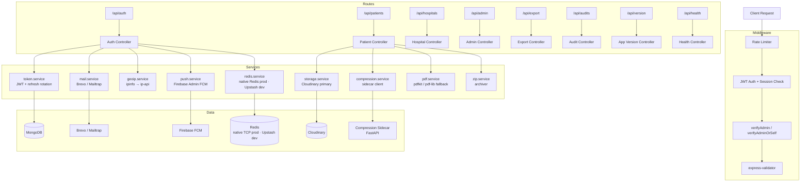
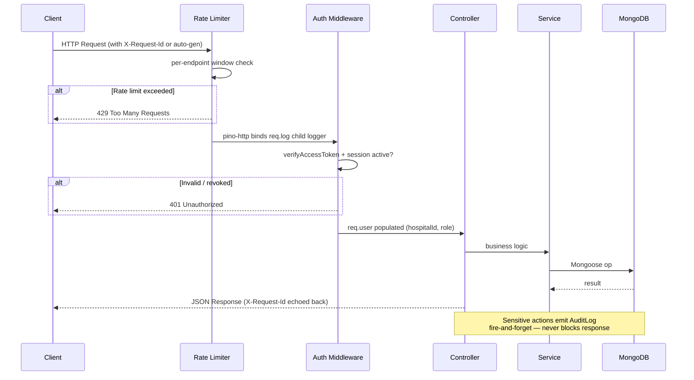
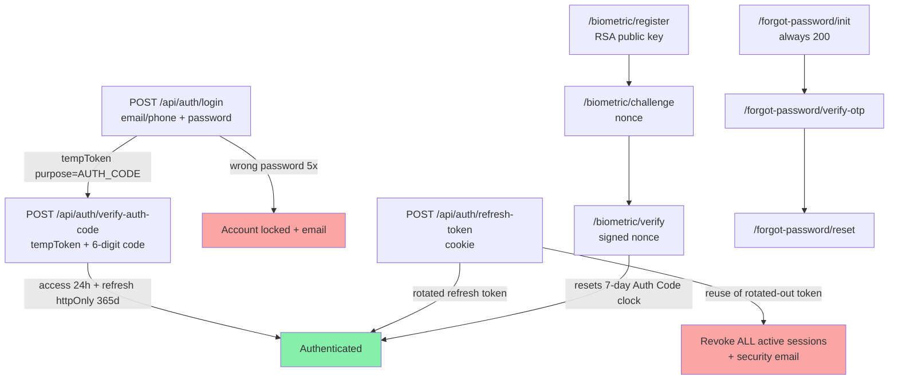
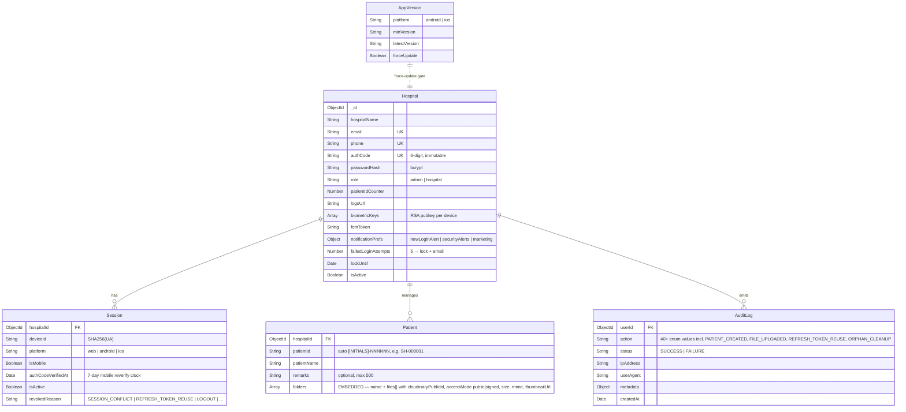
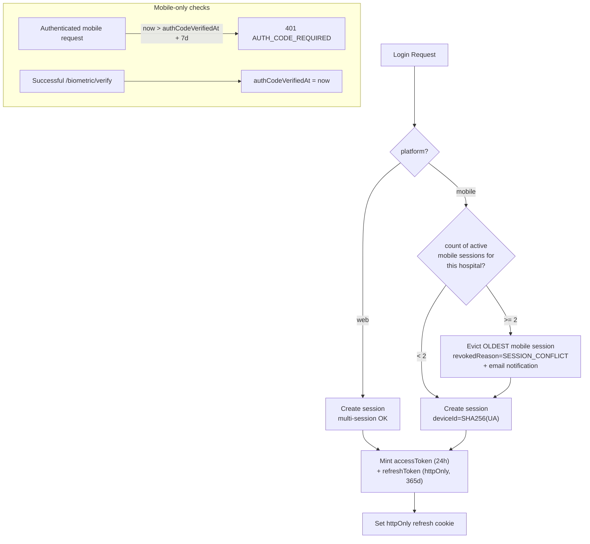

# Backend — MediVault API

Node.js + Express REST API. MongoDB (Mongoose 7) for persistence; Redis (native TCP in production, Upstash REST in development, with in-memory fallback) for ephemeral OTP/registration state; Cloudinary for file storage; Brevo (prod) / Mailtrap (dev) for email; Firebase Admin for FCM push; a Python compression sidecar for PDF merging.

The canonical project context is [CLAUDE.md](../CLAUDE.md). Full audit set: [docs/audit/](../docs/audit/). The 17 backend/web/sidecar architecture diagrams are in [docs/audit/03-architecture-diagrams.md](../docs/audit/03-architecture-diagrams.md).

---

## Architecture



`r2.service.js` exists on disk but has zero importers (TD-003 dead code). Active storage is Cloudinary via `storage.service.js`.

---

## Request Lifecycle



---

## Directory Structure

```text
backend/
├── src/
│   ├── config/
│   │   ├── db.js               # MongoDB connection
│   │   └── env.js              # Environment validation (refuses to boot without compression sidecar in prod — TD-D4)
│   ├── controllers/
│   │   ├── auth.controller.js
│   │   ├── patient.controller.js
│   │   ├── hospitals.controller.js
│   │   ├── admin.controller.js
│   │   ├── export.controller.js
│   │   ├── audit.controller.js
│   │   ├── appVersion.controller.js
│   │   └── health.controller.js
│   ├── middleware/
│   │   ├── auth.js             # verifyAccessToken, verifyTempToken, verifyAdmin, verifyAdminOrSelf, attachHospitalData
│   │   ├── errorHandler.js
│   │   ├── rateLimiter.js
│   │   └── validateRequest.js
│   ├── models/                 # Five Mongoose schemas
│   │   ├── Hospital.js
│   │   ├── Session.js
│   │   ├── Patient.js          # Folders + files embedded inside Patient.folders[]
│   │   ├── AuditLog.js
│   │   └── AppVersion.js
│   ├── routes/
│   │   ├── auth.routes.js      # 24 endpoints
│   │   ├── patient.routes.js   # 20 endpoints (16 primary + 4 legacy GET aliases)
│   │   ├── hospitals.routes.js # 12 endpoints
│   │   ├── admin.routes.js
│   │   ├── audit.routes.js
│   │   ├── export.routes.js
│   │   ├── appVersion.routes.js
│   │   └── health.routes.js
│   ├── services/
│   │   ├── token.service.js    # JWT mint + refresh rotation + reuse detection (TD-002)
│   │   ├── storage.service.js  # Cloudinary primary
│   │   ├── compression.service.js # Sidecar client (X-Internal-Secret)
│   │   ├── mail.service.js     # Brevo prod / Mailtrap dev
│   │   ├── push.service.js     # Firebase Admin FCM
│   │   ├── redis.service.js    # Upstash REST + in-memory Map fallback
│   │   ├── geoip.service.js    # ipinfo.io → ip-api.com chain
│   │   ├── health.service.js   # Deep dependency probes
│   │   ├── patient.service.js
│   │   ├── pdf.service.js      # pdfkit + pdf-lib (in-process fallback)
│   │   ├── zip.service.js      # archiver
│   │   └── r2.service.js       # DEAD CODE — TD-003, kept for legacy fallback only
│   ├── jobs/
│   │   ├── autoDelete.job.js   # Nightly 00:00 UTC: hard-delete patients >90d, cascade Cloudinary delete
│   │   └── idleSweep.job.js    # Every 5 min: revoke web sessions idle >60 min (revokedReason=IDLE_TIMEOUT). Mobile is exempt — see commit 61fa6ad
│   ├── utils/
│   │   ├── logger.js           # pino logger + redactions (Authorization, Cookie, password*, token, otp, authCode)
│   │   ├── jwt.js              # JWT mint/verify — verification PINNED to HS256 (rejects alg:none / RS256 swap)
│   │   ├── clientIp.js         # getClientIp(req) — CF-Connecting-IP → True-Client-IP → X-Forwarded-For[0] → req.ip
│   │   ├── hash.js
│   │   └── …
│   └── index.js
├── scripts/                    # Operator CLIs — intentionally use raw console.* (not pino)
│   ├── manage-app-version.js   # Update minVersion / forceUpdate flags
│   ├── migrate-patient-ids.js  # SH-001 → SH-000001 padding migration
│   ├── migrate-cloudinary-paths.js
│   ├── migrate-hospital-authcode.js
│   ├── purge-soft-deleted-hospitals.js
│   └── send-test-push.js
├── Dockerfile
├── package.json
└── seed.js
```

---

## Authentication

Two-step login on every email/password attempt — the **immutable 6-digit Auth Code** is the only second factor (per [CLAUDE.md §5](../CLAUDE.md)). TOTP was ripped out; [auth.controller.js:851](src/controllers/auth.controller.js) literally documents `// Second factor is now the 6-digit hospital authCode (replaces TOTP).`



**Refresh token rotation (TD-002, 2026-04-21):** every `/api/auth/refresh-token` mints a fresh refresh token. Replaying a rotated-out token revokes every active session for the hospital with `revokedReason: "REFRESH_TOKEN_REUSE"` and sends a security email. Reuse detection is guarded against post-logout false positives by requiring at least one other active session before escalating. Token rotation churn vs. real session revoke is tracked via distinct revoke reasons (`TOKEN_ROTATION` vs `SESSION_REVOKED` / `REFRESH_TOKEN_REUSE` / `SESSION_LIMIT_EXCEEDED` / `IDLE_TIMEOUT`) so audit history doesn't conflate them. Implementation in [src/services/token.service.js](src/services/token.service.js); coverage in [src/**tests**/refreshToken.rotation.test.js](src/__tests__/refreshToken.rotation.test.js).

**JWT HS256 pinning (2026-04-25):** [src/utils/jwt.js](src/utils/jwt.js) passes `algorithms: ["HS256"]` to every `jwt.verify()`. Without this pin, jsonwebtoken silently accepts `alg: none` and is vulnerable to RS256 → HS256 algorithm-swap attacks. Do not remove.

**Server-side idle revoke (2026-04-25):** [src/jobs/idleSweep.job.js](src/jobs/idleSweep.job.js) runs every 5 min and revokes any **web** session with `lastSeenAt` older than **60 min** (`revokedReason: "IDLE_TIMEOUT"` + `SESSION_IDLE_REVOKED` audit). Mobile sessions are **exempt** (`isMobile: false` filter — commit `61fa6ad`) because Android already heartbeats every 60 s and the foreground re-validate path drives logouts on the client. Threshold was 15 min initially but was too aggressive for hospital workflow — clinicians reading PDFs / filling long forms make no API calls and look "idle". Web has no heartbeat, so anything under ~30 min logs out passive readers mid-task. **Don't reduce IDLE_MS below 30 min without re-evaluating the heartbeat strategy.**

**Real client IP behind Cloudflare (2026-04-25):** [src/utils/clientIp.js](src/utils/clientIp.js) reads `CF-Connecting-IP` first, then `True-Client-IP`, then `X-Forwarded-For[0]`, then `req.ip`. When the production host is behind Cloudflare, that proxy strips the original client IP at the TCP layer; without this helper geoip resolves to the Cloudflare PoP. **Every controller capturing an IP for audit/session/email must call `getClientIp(req)`, never `req.ip` directly.** Auth middleware re-runs geoip when `lastSeenIp` changes (mobile devices roaming WiFi/cellular); `lastSeenIp` is rendered alongside `ipAddress` in the Sessions list so users can spot cross-network reuse.

---

## API Endpoints

52 total. Base path: `/api`. Counts: auth 24 · patients 20 (16 primary + 4 legacy GET aliases) · hospitals 12 · export 1 · audit 2 · admin 2 · version 1 · health 2.

### Authentication (`/api/auth`)

| Method | Endpoint                               | Auth       | Description                                                          |
| ------ | -------------------------------------- | ---------- | -------------------------------------------------------------------- |
| `POST` | `/login`                               | None       | Email/phone + password → tempToken (purpose=AUTH_CODE)               |
| `POST` | `/verify-auth-code`                    | Temp Token | tempToken + 6-digit Auth Code → access + refresh                     |
| `POST` | `/refresh-token`                       | Cookie     | Rotate refresh, mint new access (TD-002)                             |
| `POST` | `/logout`                              | Cookie     | End current session                                                  |
| `POST` | `/biometric/register`                  | Access     | Android: register RSA public key for device                          |
| `POST` | `/biometric/challenge`                 | None       | Issue nonce for biometric verify                                     |
| `POST` | `/biometric/verify`                    | None       | Verify signed nonce, mint tokens, reset 7-day clock                  |
| `POST` | `/session/check-conflict`              | None       | Pre-flight: would this device evict another mobile session?          |
| `GET`  | `/session/validate`                    | Access     | Heartbeat — is this session still live?                              |
| `POST` | `/session/force-logout`                | Access     | Force-logout other sessions (e.g. on password change)                |
| `GET`  | `/session/list`                        | Access     | List active sessions for this hospital (with GeoIP)                  |
| `POST` | `/session/revoke/:id`                  | Access     | Revoke a specific session by id                                      |
| `POST` | `/session/revoke-all-others`           | Access     | Revoke every session except the current one                          |
| `POST` | `/change-password`                     | Access     | Change password while authenticated                                  |
| `POST` | `/forgot-password/init`                | None       | Always returns 200 (anti-enumeration) — emails OTP if account exists |
| `POST` | `/forgot-password/verify-otp`          | None       | Verify OTP, returns short-lived resetToken                           |
| `POST` | `/forgot-password/reset`               | resetToken | Set new password, revokes all sessions                               |
| `POST` | `/register-hospital`                   | Admin      | Create hospital + send welcome email with temp password              |
| `POST` | `/register`                            | None       | Self-service: stash form in Redis, send email OTP                    |
| `POST` | `/register/verify-otp`                 | None       | Create hospital from Redis-staged form                               |
| `POST` | `/register/resend-otp`                 | None       | Resend (60s cooldown per email)                                      |
| `POST` | `/auth-code/resend`                    | Access     | Resend Auth Code via email                                           |
| `POST` | `/contact-change/{init,verify,resend}` | Access     | Email/phone change with email-OTP confirmation                       |
| `POST` | `/fcm/register`                        | Access     | Register Android FCM token                                           |

### Patients (`/api/patients`)

| Method   | Endpoint                                | Description                                                                                                        |
| -------- | --------------------------------------- | ------------------------------------------------------------------------------------------------------------------ |
| `GET`    | `/`                                     | List patients (cursor-paginated, server-side search)                                                               |
| `POST`   | `/`                                     | Create patient — auto-generates `patientId` like `SH-000001`                                                       |
| `GET`    | `/:id`                                  | Get patient with embedded folders/files                                                                            |
| `PATCH`  | `/:id`                                  | Update patient (name, remarks)                                                                                     |
| `DELETE` | `/:id`                                  | Delete patient + cascade Cloudinary delete                                                                         |
| `POST`   | `/:id/folders`                          | Create folder                                                                                                      |
| `GET`    | `/:id/folders/:folder/files`            | List files                                                                                                         |
| `POST`   | `/:id/folders/:folder/files`            | Upload file (multipart, Cloudinary public*id `MediVault/h*{hospitalId}/p*{patientId}/{folder_slug}/{date}*{hash}`) |
| `PATCH`  | `/:id/folders/:folder/files/:fileId`    | Rename file                                                                                                        |
| `DELETE` | `/:id/folders/:folder/files/:fileId`    | Delete file                                                                                                        |
| `GET`    | `/:id/files/:folder/:fileId/signed-url` | 5-min signed URL                                                                                                   |
| `GET`    | `/:id/files/:folder/:fileId/compressed` | Single-file compressed download (sidecar)                                                                          |
| `POST`   | `/:id/download/pdf`                     | Whole-patient merged PDF (sidecar; accepts ZIP-or-PDF mode body)                                                   |
| `POST`   | `/:id/download/zip`                     | Whole-patient per-folder ZIP                                                                                       |
| `GET`    | `/:id/folders/:folder/download/pdf`     | Folder PDF (sidecar)                                                                                               |
| `GET`    | `/:id/folders/:folder/download/zip`     | Folder ZIP                                                                                                         |
| `GET`    | `/:id/download/zip/size-check`          | Size pre-flight (soft 10 MB / hard 100 MB gate)                                                                    |

Plus 4 legacy `GET` aliases — `GET /:id/download/{pdf,zip}` and `GET /:id/folders/:folder/{pdf,zip}` — kept for backward compatibility with older Android builds.

### Hospitals (`/api/hospitals`)

| Method   | Endpoint                                  | Auth          | Description                                                     |
| -------- | ----------------------------------------- | ------------- | --------------------------------------------------------------- |
| `GET`    | `/me`                                     | Access        | Current hospital profile                                        |
| `PATCH`  | `/me`                                     | Access        | Patch own profile (name, logo, contact) — multipart for logo    |
| `GET`    | `/me/notification-preferences`            | Access        | Notification preferences                                        |
| `PUT`    | `/me/notification-preferences`            | Access        | Update notification preferences                                 |
| `POST`   | `/me/change-contact/{init,verify,resend}` | Access        | Change email/phone (email-OTP confirmed)                        |
| `GET`    | `/`                                       | Admin         | List hospitals (cursor pagination + server-side search, TD-005) |
| `GET`    | `/:id`                                    | Admin or Self | Get hospital by id                                              |
| `PUT`    | `/:id`                                    | Admin or Self | Update any hospital — multipart for logo                        |
| `DELETE` | `/:id`                                    | Admin         | Hard-delete hospital (cascades patients + Cloudinary)           |
| `POST`   | `/:id/resend-welcome`                     | Admin         | Re-send welcome email with new temp password                    |

### Other

| Method | Endpoint                    | Auth                                                 | Description                                                                                             |
| ------ | --------------------------- | ---------------------------------------------------- | ------------------------------------------------------------------------------------------------------- |
| `GET`  | `/api/audits`               | Admin (hospital-scoped, `userId` forced server-side) | Cursor-paginated audit log                                                                              |
| `GET`  | `/api/audits/actions`       | Admin                                                | List of distinct action enum values                                                                     |
| `POST` | `/api/admin/orphans/scan`   | Admin                                                | Scan Cloudinary for orphaned objects                                                                    |
| `POST` | `/api/admin/orphans/delete` | Admin                                                | Delete orphans (emits `ORPHAN_CLEANUP` audit)                                                           |
| `POST` | `/api/export/patients-pdf`  | Access                                               | Per-hospital patient roster export                                                                      |
| `GET`  | `/api/version`              | None                                                 | App version table per platform (drives Android force-update gate)                                       |
| `GET`  | `/api/health`               | None                                                 | Liveness                                                                                                |
| `GET`  | `/api/health/deep`          | None                                                 | Mongo + Redis + Cloudinary + Brevo + FCM + sidecar probes (3s per-dep timeout, returns `degraded` flag) |

---

## Redis Usage

Redis (Upstash REST) is used only for ephemeral, TTL-scoped concerns in the self-service registration and forgot-password flows. Sessions, login lockouts, and audit logs live in MongoDB.

| Key                       | Purpose                                                                                                                                     | TTL    |
| ------------------------- | ------------------------------------------------------------------------------------------------------------------------------------------- | ------ |
| `otp:{email}`             | SHA-256 hash of the 6-digit OTP + wrong-attempt counter. Burns itself after max attempts.                                                   | 10 min |
| `partial_reg:{email}`     | Pending registration form data — hashed password, normalised phone, logo, name, address. Hospital is only created when the OTP is verified. | 30 min |
| `last_otp_sent:{email}`   | Unix-ms timestamp. Enforces the 60-second resend cooldown.                                                                                  | 60 sec |
| `forgot_otp:{email}`      | OTP hash + counter for forgot-password flow.                                                                                                | 10 min |
| `reset_token:{tokenHash}` | One-time reset token issued by `forgot-password/verify-otp`.                                                                                | 10 min |

**Fallback:** if `UPSTASH_REDIS_REST_URL` / `..._TOKEN` are missing or the endpoint is unreachable, [src/services/redis.service.js](src/services/redis.service.js) latches to an in-memory `Map` with full TTL semantics (see SRS §2.1). A warning is logged once per process. Local dev and short outages stay functional.

**Testing:** `node scripts/test-redis.js` for a helper-level check, or `node scripts/test-self-registration.js` for the full self-registration flow including Redis inspection between steps.

---

## Data Models

Five MongoDB collections — Hospital, Session, Patient, AuditLog, AppVersion. Folders and files are **embedded inside `Patient.folders[]`** — they are not top-level collections. The legacy `BackupCode` collection was removed with TOTP; the `OTP` collection was deprecated when SMS was deferred.



The Python sidecar additionally writes `merged_pdf_cache` and `compression_audits` collections — separate concern, not user-facing.

`Patient.toJSON()` strips internal fields (`cloudinaryPublicId`, `resourceType`, `accessMode`) before responses. **All mutation handlers must emit an `AuditLog` entry**; the `action` enum will silently reject unknown values, so register new actions in [src/models/AuditLog.js](src/models/AuditLog.js) when adding handlers (see [CLAUDE.md §12](../CLAUDE.md)).

---

## Session Management



Compound unique index `(hospitalId, deviceId)` enforces single-device-session at the database level. Web is exempt from the 7-day reverify check.

---

## Compression Sidecar Integration

The Python compression sidecar handles all production PDF merging + compression. The backend is a thin client.

| Sidecar endpoint             | Backend caller             |
| ---------------------------- | -------------------------- |
| `POST /api/folder-download`  | Folder PDF download        |
| `POST /api/patient-download` | Whole-patient PDF download |

Single-file compressed download (`GET /api/patients/:id/files/:folder/:fileId/compressed`) currently runs through the in-process compression path, not a dedicated sidecar endpoint.

All sidecar calls carry `X-Internal-Secret: ${COMPRESSION_SERVICE_SECRET}` matching the sidecar's `INTERNAL_API_SECRET`. Backend timeout: 300 s. The sidecar fetches inputs from Cloudinary directly, runs a tier ladder (digital / scanned / aggressive), uploads the result, and caches by SHA256 of inputs.

**TD-D4 (2026-04-25) — sidecar mandatory in prod:** [src/config/env.js](src/config/env.js) refuses to boot when `NODE_ENV=production` AND `USE_COMPRESSION_SERVICE !== "true"`. The in-process pdf-lib fallback OOMs at scale on large patients. The fallback path remains in [src/services/pdf.service.js](src/services/pdf.service.js) for dev / small deployments only.

---

## Rate Limiting

| Limiter          | Window | Max | Applied To                       |
| ---------------- | ------ | --- | -------------------------------- |
| `generalLimiter` | 15 sec | 10  | Most routes (disabled in dev)    |
| `authLimiter`    | 15 min | 5   | Login, register, password change |
| `otpLimiter`     | 1 min  | 3   | OTP / Auth Code verification     |
| `patientLimiter` | 1 min  | 10  | File downloads                   |

Per-IP rate-limiting honours `TRUST_PROXY_HOPS` (default `2`). It must be a numeric integer — `true` is rejected by `express-rate-limit` with `ERR_ERL_PERMISSIVE_TRUST_PROXY`.

---

## Logging

All backend logs flow through pino ([src/utils/logger.js](src/utils/logger.js)). Pretty-printed in dev (`pino-pretty`), JSON in production. Level via `LOG_LEVEL` env (default `info` in prod, `debug` in dev).

Every HTTP request is tagged with a `request_id` (from `X-Request-Id` header or auto-generated UUID) and echoed back on the response. Inside an Express handler prefer `req.log.*` — it's a child logger pre-bound to the request id. Outside handlers (services, jobs), import the module-level `logger`.

Redaction is centralised: Authorization + Cookie headers, plus top-level + nested `password / newPassword / oldPassword / currentPassword / confirmPassword / token / refreshToken / otp / authCode` are auto-censored in every log record. Do not add ad-hoc logging that bypasses the shared logger.

Files under [scripts/](scripts/) intentionally still use `console.*` — those are operator CLIs (migrations, smoke tests) where raw stdout is clearer than structured logs.

TD-007 (shipped 2026-04-21) — pino + pino-http + redaction + request-id; zero `console.*` remain in `backend/src/`.

---

## Setup

### Development

```bash
cd backend
npm install
npm run dev   # nodemon on port 5000 (or PORT env)
```

### Seed Database

```bash
node src/seed.js
```

Creates 5 hospitals (1 admin + 4 regular, password `Test@1234`) and 54 patients distributed across them; clears existing data first.

### Production (Docker)

```bash
docker-compose up --build backend
```

### Environment Variables

| Variable                                                                   | Default                                  | Description                                                           |
| -------------------------------------------------------------------------- | ---------------------------------------- | --------------------------------------------------------------------- |
| `PORT`                                                                     | 5000                                     | Server port                                                           |
| `NODE_ENV`                                                                 | development                              | Environment mode                                                      |
| `MONGODB_URI`                                                              | —                                        | MongoDB connection string                                             |
| `JWT_SECRET`                                                               | —                                        | Access token secret (64+ chars, no `dev-` prefix in prod)             |
| `REFRESH_TOKEN_SECRET`                                                     | —                                        | Refresh token secret (64+ chars)                                      |
| `JWT_EXPIRY`                                                               | 24h                                      | Access token lifetime                                                 |
| `REFRESH_TOKEN_EXPIRY`                                                     | 365d                                     | Refresh token lifetime                                                |
| `OTP_EXPIRY_MINUTES`                                                       | 10                                       | Email OTP TTL                                                         |
| `OTP_LENGTH`                                                               | 6                                        | OTP digits (frontend assumes 6)                                       |
| `MAX_OTP_ATTEMPTS`                                                         | 5                                        | Failed attempts before OTP burn                                       |
| `CLOUDINARY_CLOUD_NAME` / `_API_KEY` / `_API_SECRET`                       | —                                        | Required — primary file storage                                       |
| `SIGNED_UPLOADS_ENABLED`                                                   | true                                     | Toggle signed Cloudinary URLs                                         |
| `BREVO_API_KEY`                                                            | —                                        | Required in prod (Mailtrap in dev)                                    |
| `BREVO_SENDER_EMAIL` / `_NAME`                                             | —                                        | "From" header for outbound mail                                       |
| `MAILTRAP_HOST` / `_PORT` / `_USER` / `_PASS`                              | —                                        | Dev SMTP                                                              |
| `FIREBASE_PROJECT_ID`                                                      | —                                        | FCM                                                                   |
| `FIREBASE_PRIVATE_KEY`                                                     | —                                        | FCM (PEM, escaped newlines)                                           |
| `FIREBASE_CLIENT_EMAIL`                                                    | —                                        | FCM                                                                   |
| `FIREBASE_SERVICE_ACCOUNT_JSON`                                            | —                                        | Alternative auth path                                                 |
| `FIREBASE_SERVICE_ACCOUNT_PATH`                                            | —                                        | Alternative auth path                                                 |
| `UPSTASH_REDIS_REST_URL` / `_TOKEN`                                        | —                                        | Optional — falls back to in-memory Map                                |
| `USE_COMPRESSION_SERVICE`                                                  | false (dev) / **true (prod, mandatory)** | TD-D4 — env.js refuses to boot otherwise                              |
| `COMPRESSION_SERVICE_URL`                                                  | —                                        | Sidecar base URL                                                      |
| `COMPRESSION_SERVICE_SECRET`                                               | —                                        | Shared secret with sidecar's `INTERNAL_API_SECRET`                    |
| `IPINFO_TOKEN`                                                             | —                                        | Optional — activates ipinfo.io as primary GeoIP provider              |
| `GEOIP_DEV_OVERRIDE_IP`                                                    | —                                        | e.g. `8.8.8.8` — forces every lookup to that IP for localhost testing |
| `TRUST_PROXY_HOPS`                                                         | 2                                        | Numeric only — `true` is rejected                                     |
| `FRONTEND_URL`                                                             | <http://localhost:5173>                  | CORS allowed origin (comma-separated list OK)                         |
| `LOG_LEVEL`                                                                | info (prod) / debug (dev)                | pino level                                                            |
| `R2_ENDPOINT` / `R2_ACCESS_KEY_ID` / `_SECRET_ACCESS_KEY` / `_BUCKET_NAME` | —                                        | Legacy fallback only — `r2.service.js` is dead code (TD-003)          |

See [.env.example](../.env.example) for the canonical list (in sync with code as of 2026-04-21, TD-004).

---

## Error Codes

| Code | Meaning                                                               |
| ---- | --------------------------------------------------------------------- |
| 400  | Validation error / bad request                                        |
| 401  | Invalid / expired token, `AUTH_CODE_REQUIRED` (mobile 7-day reverify) |
| 403  | Forbidden / inactive account / wrong role                             |
| 404  | Resource not found                                                    |
| 409  | Duplicate (`SESSION_CONFLICT`, duplicate email/phone)                 |
| 423  | Account locked (5 failed login attempts)                              |
| 429  | Rate limit exceeded                                                   |
| 500  | Internal server error                                                 |

Android's `AuthInterceptor` classifies 401s by substring-matching the response body (`SESSION_CONFLICT`, `AUTH_CODE_REQUIRED`, `ACCOUNT_DISABLED`). Coordinated fix to add a stable `errorCode` field is tracked as [TD-A07](../docs/audit/06-tech-debt-ledger.md).

---

## Dependencies

| Package                       | Version  | Purpose                                              |
| ----------------------------- | -------- | ---------------------------------------------------- |
| express                       | ^4.18.2  | Web framework                                        |
| mongoose                      | ^7.5.0   | MongoDB ODM                                          |
| jsonwebtoken                  | ^9.0.2   | JWT                                                  |
| bcryptjs                      | ^3.0.3   | Password + Auth Code hashing                         |
| cloudinary                    | ^2.9.0   | Primary file storage                                 |
| multer                        | ^2.0.2   | Multipart upload                                     |
| multer-storage-cloudinary     | ^2.2.1   | Multer ↔ Cloudinary glue                             |
| @upstash/redis                | ^1.37.0  | Redis REST (with in-memory fallback)                 |
| firebase-admin                | ^13.0.0  | FCM push                                             |
| nodemailer                    | ^8.0.5   | Mailtrap SMTP (dev)                                  |
| pdfkit                        | ^0.17.2  | PDF generation                                       |
| pdf-lib                       | ^1.17.1  | In-process PDF merge fallback (sidecar handles prod) |
| archiver                      | ^7.0.1   | ZIP creation                                         |
| node-cron                     | ^4.2.1   | Auto-delete cron                                     |
| pino                          | ^10.3.1  | Structured JSON logger                               |
| pino-http                     | ^11.0.0  | Per-request logger + `X-Request-Id` middleware       |
| pino-pretty                   | ^13.1.3  | Dev pretty-printer                                   |
| helmet                        | ^7.0.0   | Security headers                                     |
| express-rate-limit            | ^6.10.0  | Rate limiting                                        |
| express-validator             | ^7.0.0   | Input validation                                     |
| cookie-parser                 | ^1.4.7   | httpOnly cookie parsing                              |
| @aws-sdk/client-s3            | ^3.932.0 | Legacy R2 fallback (TD-003 dead code)                |
| @aws-sdk/s3-request-presigner | ^3.932.0 | Legacy R2 fallback (TD-003 dead code)                |

`speakeasy` (TOTP) and `qrcode` (TOTP setup QR) were removed when TOTP was retired. `axios` and `@getbrevo/brevo` were removed in TD-012 (2026-04-21) — they had zero importers.

---

## Operator Scripts

[scripts/](scripts/) — these intentionally use `console.*` (operator CLIs):

| Script                                       | Purpose                                                      |
| -------------------------------------------- | ------------------------------------------------------------ |
| `manage-app-version.js`                      | Bump `minVersion`/`latestVersion`/`forceUpdate` per platform |
| `migrate-patient-ids.js`                     | One-time `SH-001` → `SH-000001` zero-padding                 |
| `migrate-cloudinary-paths.js`                | Re-key Cloudinary public_ids                                 |
| `migrate-hospital-authcode.js`               | Backfill missing `authCode` values                           |
| `purge-soft-deleted-hospitals.js`            | Delete hospitals tagged for purge                            |
| `send-test-push.js`                          | Send a test FCM notification                                 |
| `test-redis.js`, `test-self-registration.js` | Smoke tests                                                  |
