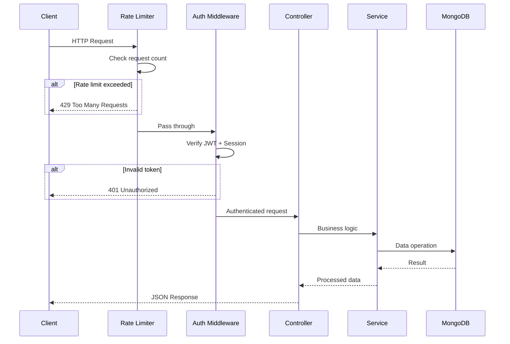
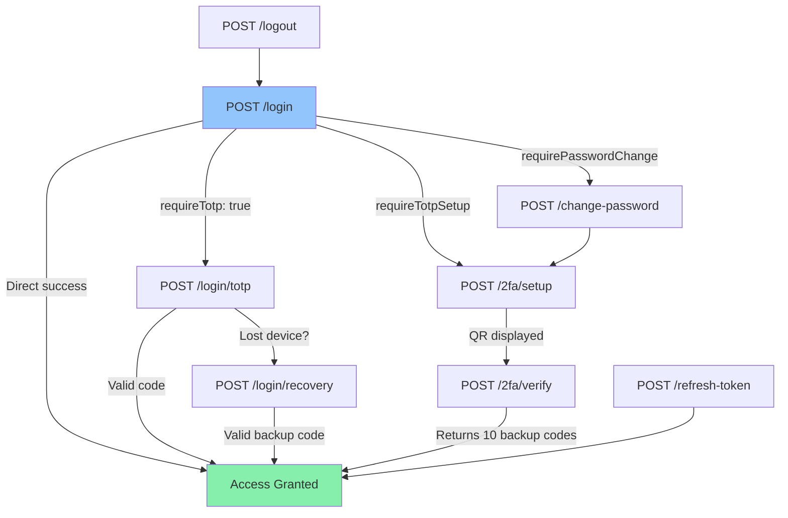
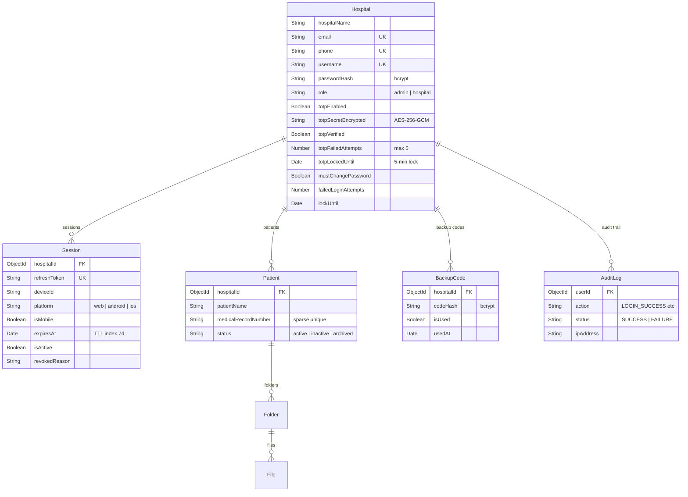
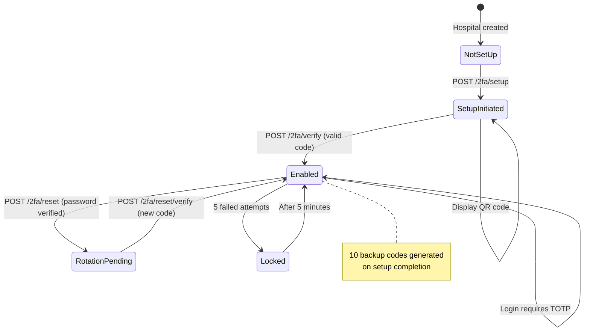
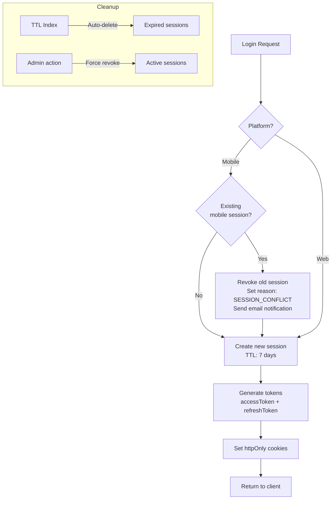

# Backend - Hospital Management API

Node.js + Express REST API with MongoDB, Redis, TOTP 2FA, and Cloudflare R2 file storage.

---

## Architecture

```mermaid
graph TB
    subgraph Middleware
        RL[Rate Limiter] --> AUTH[JWT Auth]
        AUTH --> VAL[Request Validator]
        VAL --> SAN[Sanitizer]
    end

    subgraph Routes
        AR[/api/auth] --> AC[Auth Controller]
        PR[/api/patients] --> PC[Patient Controller]
        HR[/api/hospitals] --> HC[Hospital Controller]
        ER[/api/export] --> EC[Export Controller]
    end

    subgraph Services
        AC --> TS[Token Service]
        AC --> TOTP[TOTP Service]
        AC --> ES[Email Service]
        PC --> PS[Patient Service]
        PC --> R2S[R2 Storage]
        PC --> PDFS[PDF Service]
        PC --> ZIPS[ZIP Service]
        EC --> PDFS
        EC --> ZIPS
    end

    subgraph Data
        TS --> MONGO[(MongoDB)]
        TS --> REDIS[(Redis)]
        TOTP --> MONGO
        PS --> MONGO
        R2S --> R2[(Cloudflare R2)]
        ES --> SMTP[SMTP Server]
    end

    CLIENT[Client Request] --> RL
```

---

## Request Lifecycle



---

## Directory Structure

```
backend/
├── src/
│   ├── config/
│   │   ├── db.js              # MongoDB connection
│   │   ├── env.js             # Environment validation
│   │   └── redis.js           # Redis client + in-memory fallback
│   ├── controllers/
│   │   ├── auth.controller.js # Login, TOTP, sessions, password
│   │   ├── patient.controller.js
│   │   ├── hospital.controller.js
│   │   └── export.controller.js
│   ├── middleware/
│   │   ├── auth.js            # JWT verify, session check, admin guard
│   │   ├── errorHandler.js    # Centralized error handling
│   │   ├── rateLimiter.js     # Per-endpoint rate limits
│   │   └── validateRequest.js # Input validation + sanitization
│   ├── models/
│   │   ├── Hospital.js        # Hospital account + TOTP fields
│   │   ├── Session.js         # DB-backed sessions (TTL: 7d)
│   │   ├── Patient.js         # Patient + nested folders/files
│   │   ├── AuditLog.js        # Security event logging
│   │   ├── BackupCode.js      # 2FA recovery codes
│   │   ├── OTP.js             # Legacy SMS OTP (disabled)
│   │   └── PendingHospital.js # Temp registration (TTL: 15min)
│   ├── routes/
│   │   ├── auth.routes.js     # 15+ auth endpoints
│   │   ├── patient.routes.js  # CRUD + file upload/download
│   │   ├── hospitals.routes.js
│   │   └── export.routes.js
│   ├── services/
│   │   ├── token.service.js   # Session creation, refresh, invalidation
│   │   ├── totp.service.js    # TOTP generate, verify, backup codes
│   │   ├── email.service.js   # HTML templates (invite, lock, revoke)
│   │   ├── patient.service.js # Patient CRUD with pagination
│   │   ├── r2.service.js      # Cloudflare R2 file operations
│   │   ├── pdf.service.js     # PDF generation
│   │   └── zip.service.js     # ZIP archive creation
│   ├── jobs/
│   │   └── autoDelete.job.js  # Cron: cleanup old patient data
│   └── index.js               # App entry point
├── Dockerfile
├── package.json
└── seed.js
```

---

## API Endpoints

### Authentication (`/api/auth`)



| Method | Endpoint | Auth | Rate Limit | Description |
|--------|----------|------|------------|-------------|
| `POST` | `/login` | None | 5/15min | Login with identifier + password |
| `POST` | `/login/totp` | Temp Token | 3/1min | Verify TOTP code |
| `POST` | `/login/recovery` | Temp Token | 3/1min | Login with backup code |
| `POST` | `/refresh-token` | Cookie | - | Refresh access token |
| `POST` | `/logout` | Cookie | - | End session |
| `POST` | `/change-password` | Temp Token | 5/15min | Reset password (first login) |
| `POST` | `/register-hospital` | Admin | 5/15min | Create hospital account |
| `POST` | `/2fa/setup` | Access Token | - | Generate TOTP QR code |
| `POST` | `/2fa/verify` | Access Token | 3/1min | Complete TOTP setup |
| `POST` | `/2fa/disable` | Access Token | - | Disable 2FA |
| `POST` | `/2fa/reset` | Access Token | - | Rotate 2FA key (lost device) |
| `POST` | `/2fa/reset/verify` | Access Token | - | Confirm 2FA rotation |
| `POST` | `/session/check-conflict` | None | 5/15min | Check for session conflicts |
| `GET`  | `/session/validate` | Access Token | - | Validate current session |
| `POST` | `/session/force-logout` | Access Token | - | Force logout other sessions |

### Patients (`/api/patients`)

| Method | Endpoint | Description |
|--------|----------|-------------|
| `GET`  | `/` | List patients (paginated, searchable) |
| `POST` | `/` | Create patient |
| `GET`  | `/:id` | Get patient with folder structure |
| `PUT`  | `/:id` | Update patient details |
| `POST` | `/:id/folders` | Create folder |
| `GET`  | `/:id/files/:folder` | List files in folder |
| `POST` | `/:id/files/:folder` | Upload file (max 20MB) |
| `GET`  | `/:id/download/pdf` | Download all files as PDF |
| `GET`  | `/:id/download/zip` | Download all files as ZIP |
| `GET`  | `/:id/folders/:folder/pdf` | Download folder as PDF |
| `GET`  | `/:id/folders/:folder/zip` | Download folder as ZIP |

**Supported file types:** JPEG, PNG, GIF, WebP, PDF, DOC, DOCX, XLS, XLSX, CSV, TXT, DICOM

### Hospitals (`/api/hospitals`)

| Method | Endpoint | Auth | Description |
|--------|----------|------|-------------|
| `GET`  | `/me` | Access Token | Get current hospital profile |
| `GET`  | `/` | Admin | List all hospitals |
| `GET`  | `/:id` | Admin/Self | Get hospital by ID |
| `PUT`  | `/:id` | Admin/Self | Update hospital |

### Export (`/api/export`)

| Method | Endpoint | Rate Limit | Description |
|--------|----------|------------|-------------|
| `POST` | `/archive` | 3/hour | Export modules as ZIP archive |

### Health

| Method | Endpoint | Description |
|--------|----------|-------------|
| `GET`  | `/api/health` | Basic health check |
| `GET`  | `/api/health/deep` | DB + Redis connectivity check |

---

## Data Models



---

## TOTP 2FA Lifecycle



---

## Session Management



---

## Rate Limiting

| Limiter | Window | Max Requests | Applied To |
|---------|--------|--------------|------------|
| `generalLimiter` | 15 sec | 10 | All routes (disabled in dev) |
| `authLimiter` | 15 min | 5 | Login, register, password change |
| `otpLimiter` | 1 min | 3 | TOTP verification |
| `patientLimiter` | 1 min | 10 | File downloads |

---

## Setup

### Development

```bash
cd backend
npm install
npm run dev       # Starts with nodemon on port 5000
```

### Seed Database

```bash
node src/seed.js
```

Creates:
- **5 hospitals** (1 admin + 4 regular) - Password: `Test@1234`
- **54 patients** distributed across hospitals
- Clears existing data before seeding

### Production (Docker)

```bash
docker-compose up --build backend
```

### Environment Variables

| Variable | Default | Description |
|----------|---------|-------------|
| `PORT` | 5000 | Server port |
| `NODE_ENV` | development | Environment mode |
| `MONGODB_URI` | - | MongoDB connection string |
| `JWT_SECRET` | - | Access token secret (64+ chars, no `dev-` prefix in prod) |
| `REFRESH_TOKEN_SECRET` | - | Refresh token secret (64+ chars) |
| `JWT_EXPIRY` | 24h | Access token lifetime |
| `REFRESH_TOKEN_EXPIRY` | 7d | Refresh token lifetime |
| `TOTP_ENCRYPTION_KEY` | - | 64-char hex for AES-256-GCM |
| `TOTP_WINDOW` | 1 | Clock drift tolerance (login: ±30s, setup: exact) |
| `TOTP_MAX_ATTEMPTS` | 5 | Failed attempts before 5-min lockout |
| `SMTP_HOST` | - | SMTP server host |
| `SMTP_PORT` | 587 | SMTP port |
| `SMTP_USER` | - | SMTP username |
| `SMTP_PASS` | - | SMTP password |
| `SMTP_FROM` | - | Sender email address |
| `FRONTEND_URL` | http://localhost:3000 | CORS allowed origin |
| `R2_ENDPOINT` | - | Cloudflare R2 endpoint |
| `R2_ACCESS_KEY_ID` | - | R2 access key |
| `R2_SECRET_ACCESS_KEY` | - | R2 secret key |
| `R2_BUCKET_NAME` | - | R2 bucket name |
| `REDIS_URL` | - | Redis connection (falls back to in-memory Map) |

---

## Error Codes

| Code | Meaning |
|------|---------|
| 400 | Validation error / Bad request |
| 401 | Invalid or expired token |
| 403 | Forbidden / Inactive account |
| 404 | Resource not found |
| 423 | Account locked (too many failed attempts) |
| 429 | Rate limit exceeded |
| 500 | Internal server error |

---

## Dependencies

| Package | Version | Purpose |
|---------|---------|---------|
| express | 4.18.2 | Web framework |
| mongoose | 7.5.0 | MongoDB ODM |
| jsonwebtoken | 9.0.2 | JWT tokens |
| bcryptjs | 2.4.3 | Password hashing |
| speakeasy | 2.0.0 | TOTP 2FA generation |
| ioredis | 5.10.1 | Redis client |
| @aws-sdk/client-s3 | 3.932.0 | Cloudflare R2 storage |
| nodemailer | 7.0.12 | Email delivery |
| pdfkit | 0.17.2 | PDF generation |
| archiver | 7.0.1 | ZIP creation |
| multer | 2.0.2 | File uploads (20MB limit) |
| helmet | - | Security headers |
| express-rate-limit | 6.10.0 | Rate limiting |
| express-validator | 7.0.0 | Input validation |
| node-cron | 4.2.1 | Scheduled jobs |
| qrcode | 1.5.4 | QR code for TOTP setup |
| cookie-parser | - | Parse httpOnly cookies |
