# Architecture Diagrams — MediVault

**Verified at commit:** `defa74a` (2026-04-17)
**Audit date:** 2026-04-21

Every diagram below is derived from the actual code, not from the prose audit docs. Each section cites the source-of-truth files from which the diagram was generated.

---

## 1. System Context

Shows the trust boundaries and which clients/services talk to which external dependency. The backend is the only service with direct Mongo/Redis access; the Python sidecar shares Mongo read/write for cache + audit tables.

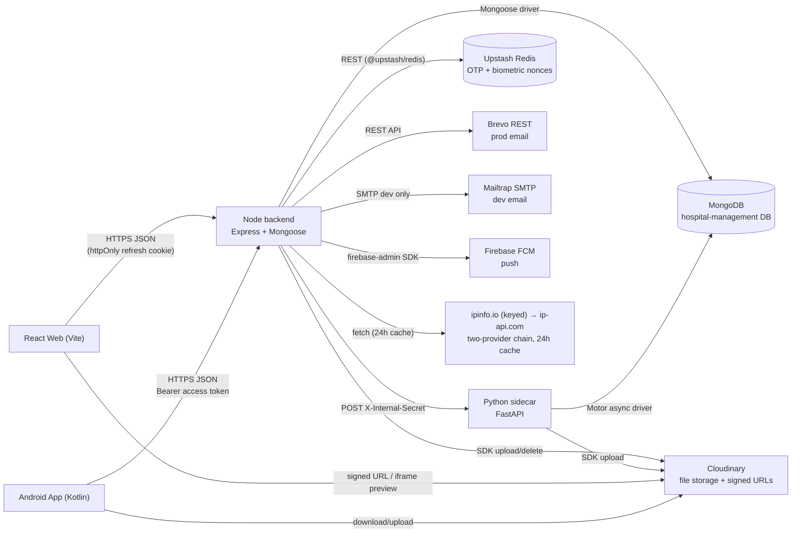
```mermaid
flowchart LR
  Web["React Web (Vite)"]
  Mobile["Android App (Kotlin)"]
  Backend["Node backend<br/>Express + Mongoose"]
  Sidecar["Python sidecar<br/>FastAPI"]
  Mongo[("MongoDB<br/>hospital-management DB")]
  Redis[("Upstash Redis<br/>OTP + biometric nonces")]
  Cloud["Cloudinary<br/>file storage + signed URLs"]
  Brevo["Brevo REST<br/>prod email"]
  Mailtrap["Mailtrap SMTP<br/>dev email"]
  FCM["Firebase FCM<br/>push"]
  GeoIP["ipinfo.io (keyed) → ip-api.com<br/>two-provider chain, 24h cache"]

  Web -- "HTTPS JSON<br/>(httpOnly refresh cookie)" --> Backend
  Mobile -- "HTTPS JSON<br/>Bearer access token" --> Backend
  Backend -- "Mongoose driver" --> Mongo
  Backend -- "REST (@upstash/redis)" --> Redis
  Backend -- "SDK upload/delete" --> Cloud
  Backend -- "REST API" --> Brevo
  Backend -- "SMTP dev only" --> Mailtrap
  Backend -- "firebase-admin SDK" --> FCM
  Backend -- "fetch (24h cache)" --> GeoIP
  Backend -- "POST X-Internal-Secret" --> Sidecar
  Sidecar -- "Motor async driver" --> Mongo
  Sidecar -- "SDK upload" --> Cloud
  Web -- "signed URL / iframe preview" --> Cloud
  Mobile -- "download/upload" --> Cloud
```

**Source of truth:** [backend/src/index.js](../../backend/src/index.js), [backend/src/services/](../../backend/src/services/), [compression-service/app/main.py](../../compression-service/app/main.py).

---

## 2. MongoDB ER Diagram

Five collections in the main `hospital-management` DB plus two shared with the Python sidecar. Most relationships are soft (hospitalId is a string FK in embedded docs).

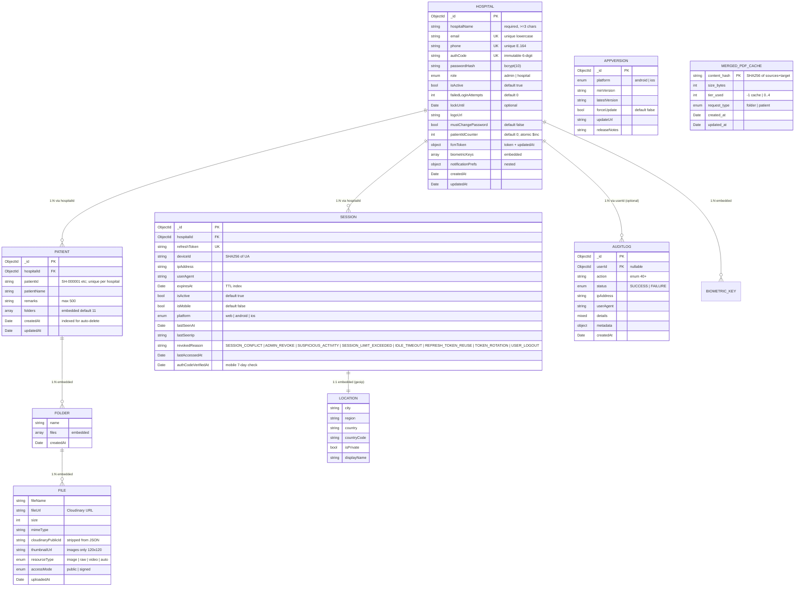
```mermaid
erDiagram
  HOSPITAL ||--o{ PATIENT : "1:N via hospitalId"
  HOSPITAL ||--o{ SESSION : "1:N via hospitalId"
  HOSPITAL ||--o{ AUDITLOG : "1:N via userId (optional)"
  HOSPITAL ||--o{ BIOMETRIC_KEY : "1:N embedded"
  PATIENT ||--o{ FOLDER : "1:N embedded"
  FOLDER ||--o{ FILE : "1:N embedded"
  SESSION ||--|| LOCATION : "1:1 embedded (geoip)"

  HOSPITAL {
    ObjectId _id PK
    string hospitalName "required, >=3 chars"
    string email UK "unique lowercase"
    string phone UK "unique E.164"
    string authCode UK "immutable 6-digit"
    string passwordHash "bcrypt(10)"
    enum role "admin | hospital"
    bool isActive "default true"
    int failedLoginAttempts "default 0"
    Date lockUntil "optional"
    string logoUrl
    bool mustChangePassword "default false"
    int patientIdCounter "default 0; atomic $inc"
    object fcmToken "token + updatedAt"
    array biometricKeys "embedded"
    object notificationPrefs "nested"
    Date createdAt
    Date updatedAt
  }
  PATIENT {
    ObjectId _id PK
    ObjectId hospitalId FK
    string patientId "SH-000001 etc; unique per hospital"
    string patientName
    string remarks "max 500"
    array folders "embedded default 11"
    Date createdAt "indexed for auto-delete"
    Date updatedAt
  }
  FOLDER {
    string name
    array files "embedded"
    Date createdAt
  }
  FILE {
    string fileName
    string fileUrl "Cloudinary URL"
    int size
    string mimeType
    string cloudinaryPublicId "stripped from JSON"
    string thumbnailUrl "images only 120x120"
    enum resourceType "image | raw | video | auto"
    enum accessMode "public | signed"
    Date uploadedAt
  }
  SESSION {
    ObjectId _id PK
    ObjectId hospitalId FK
    string refreshToken UK
    string deviceId "SHA256 of UA"
    string ipAddress
    string userAgent
    Date expiresAt "TTL index"
    bool isActive "default true"
    bool isMobile "default false"
    enum platform "web | android | ios"
    Date lastSeenAt
    string lastSeenIp
    string revokedReason "SESSION_CONFLICT | ADMIN_REVOKE | SUSPICIOUS_ACTIVITY | SESSION_LIMIT_EXCEEDED | IDLE_TIMEOUT | REFRESH_TOKEN_REUSE | TOKEN_ROTATION | USER_LOGOUT"
    Date lastAccessedAt
    Date authCodeVerifiedAt "mobile 7-day check"
  }
  LOCATION {
    string city
    string region
    string country
    string countryCode
    bool isPrivate
    string displayName
  }
  AUDITLOG {
    ObjectId _id PK
    ObjectId userId FK "nullable"
    string action "enum 40+"
    enum status "SUCCESS | FAILURE"
    string ipAddress
    string userAgent
    mixed details
    object metadata
    Date createdAt
  }
  APPVERSION {
    ObjectId _id PK
    enum platform "android | ios"
    string minVersion
    string latestVersion
    bool forceUpdate "default false"
    string updateUrl
    string releaseNotes
  }
  MERGED_PDF_CACHE {
    string content_hash PK "SHA256 of sources+target"
    int size_bytes
    int tier_used "-1 cache | 0..4"
    enum request_type "folder | patient"
    Date created_at
    Date updated_at
  }
```

**Source of truth:** [backend/src/models/Hospital.js](../../backend/src/models/Hospital.js), [Patient.js](../../backend/src/models/Patient.js), [Session.js](../../backend/src/models/Session.js), [AuditLog.js](../../backend/src/models/AuditLog.js), [AppVersion.js](../../backend/src/models/AppVersion.js), [compression-service/app/merged_cache.py](../../compression-service/app/merged_cache.py).

---

## 3. Backend Layered Architecture (Example: Login Flow)

Canonical request lifecycle from router through middleware, controller, service, and model layers. Drawn for the POST `/api/auth/login` path.

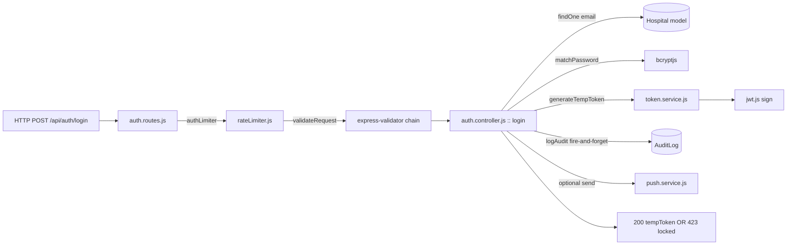
```mermaid
flowchart LR
  Req[HTTP POST /api/auth/login] --> Route[auth.routes.js]
  Route -->|authLimiter| MW1[rateLimiter.js]
  MW1 -->|validateRequest| MW2[express-validator chain]
  MW2 --> Ctrl[auth.controller.js :: login]
  Ctrl -->|findOne email| Model1[(Hospital model)]
  Ctrl -->|matchPassword| Util1[bcryptjs]
  Ctrl -->|generateTempToken| Svc1[token.service.js]
  Svc1 --> Util2[jwt.js sign]
  Ctrl -->|logAudit fire-and-forget| Model2[(AuditLog)]
  Ctrl -->|optional send| Svc2[push.service.js]
  Ctrl --> Resp[200 tempToken OR 423 locked]
```

**Source of truth:** [backend/src/routes/auth.routes.js:176](../../backend/src/routes/auth.routes.js), [backend/src/controllers/auth.controller.js](../../backend/src/controllers/auth.controller.js), [backend/src/services/token.service.js](../../backend/src/services/token.service.js).

---

## 4. Frontend Route Tree

Routes grouped by guard. Routes inside `MainLayout` inherit the shared navbar + padding; standalone routes own their chrome.

```mermaid
flowchart TB
  Root["BrowserRouter"]
  Root --> Public["Public routes (no guard, no MainLayout)"]
  Root --> Outside["Standalone auth flows (no guard, no MainLayout)"]
  Root --> AdminOnly["AdminRoute (no MainLayout)"]
  Root --> Shell["ProtectedRoute → MainLayout"]
  Root --> CatchAll["* → NotFound"]

  Public --> P1["/ LandingPage"]
  Public --> P2["/terms Terms"]
  Public --> P3["/privacy Privacy"]
  Public --> P4["/components-preview ComponentsPreview"]
  Public --> P5["/spinners-preview LoadingSpinners"]

  Outside --> O1["/login Login"]
  Outside --> O2["/verify-auth-code VerifyAuthCode"]
  Outside --> O3["/change-password ChangePassword"]
  Outside --> O4["/forgot-password ForgotPassword"]

  AdminOnly --> A1["/register HospitalRegistration"]

  Shell --> S1["/dashboard Dashboard"]
  Shell --> S2["/profile Profile"]
  Shell --> S3["/password Password"]
  Shell --> S4["/sessions Sessions"]
  Shell --> S5["/notifications NotificationSettings"]
  Shell --> S6["/security → Navigate /sessions"]
  Shell --> S7["/patients/:id PatientDetails"]
  Shell --> S8["/patients/:id/folders/:name FolderView"]
  Shell --> S9["Nested AdminRoute"]
  S9 --> S9a["/hospitals HospitalsList"]
  S9 --> S9b["/activity ActivityLog"]
```

**Source of truth:** [frontend/src/routes/AppRoutes.tsx](../../frontend/src/routes/AppRoutes.tsx).

---

## 5. Auth State Machine

All states a hospital account can be in, driven by endpoints. Biometric verify resets the 7-day mobile clock back to `Authenticated`.

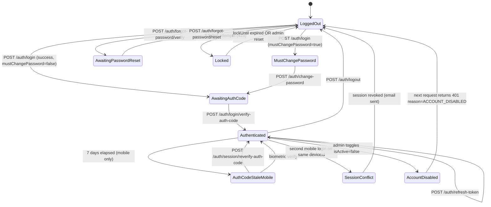
```mermaid
stateDiagram-v2
  [*] --> LoggedOut
  LoggedOut --> AwaitingAuthCode : POST /auth/login (success, mustChangePassword=false)
  LoggedOut --> MustChangePassword : POST /auth/login (mustChangePassword=true)
  LoggedOut --> AwaitingPasswordReset : POST /auth/forgot-password/verify
  LoggedOut --> Locked : 5 failed attempts (423)
  Locked --> LoggedOut : lockUntil expired OR admin reset
  MustChangePassword --> AwaitingAuthCode : POST /auth/change-password
  AwaitingAuthCode --> Authenticated : POST /auth/login/verify-auth-code
  AwaitingPasswordReset --> LoggedOut : POST /auth/forgot-password/reset
  Authenticated --> Authenticated : POST /auth/refresh-token
  Authenticated --> AuthCodeStaleMobile : 7 days elapsed (mobile only)
  AuthCodeStaleMobile --> Authenticated : POST /auth/session/reverify-auth-code
  AuthCodeStaleMobile --> Authenticated : biometric verify
  Authenticated --> LoggedOut : POST /auth/logout
  Authenticated --> SessionConflict : second mobile login on same deviceId
  SessionConflict --> LoggedOut : session revoked (email sent)
  Authenticated --> AccountDisabled : admin toggles isActive=false
  AccountDisabled --> LoggedOut : next request returns 401 reason=ACCOUNT_DISABLED
```

**Source of truth:** [backend/src/controllers/auth.controller.js](../../backend/src/controllers/auth.controller.js), [backend/src/middleware/auth.js](../../backend/src/middleware/auth.js).

---

## 6. Login Sequence (Web + Mobile)

Two-step login. Mobile path enforces the 7-day Auth Code re-verify on subsequent requests; web path does not.

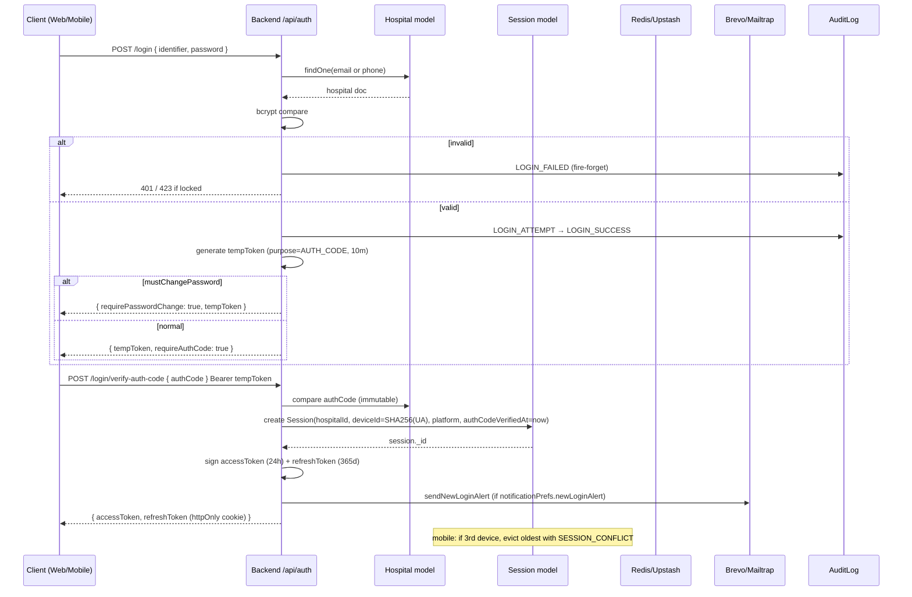
```mermaid
sequenceDiagram
  participant C as Client (Web/Mobile)
  participant API as Backend /api/auth
  participant H as Hospital model
  participant S as Session model
  participant R as Redis/Upstash
  participant E as Brevo/Mailtrap
  participant A as AuditLog

  C->>API: POST /login { identifier, password }
  API->>H: findOne(email or phone)
  H-->>API: hospital doc
  API->>API: bcrypt compare
  alt invalid
    API->>A: LOGIN_FAILED (fire-forget)
    API-->>C: 401 / 423 if locked
  else valid
    API->>A: LOGIN_ATTEMPT → LOGIN_SUCCESS
    API->>API: generate tempToken (purpose=AUTH_CODE, 10m)
    alt mustChangePassword
      API-->>C: { requirePasswordChange: true, tempToken }
    else normal
      API-->>C: { tempToken, requireAuthCode: true }
    end
  end
  C->>API: POST /login/verify-auth-code { authCode } Bearer tempToken
  API->>H: compare authCode (immutable)
  API->>S: create Session(hospitalId, deviceId=SHA256(UA), platform, authCodeVerifiedAt=now)
  S-->>API: session._id
  API->>API: sign accessToken (24h) + refreshToken (365d)
  API->>E: sendNewLoginAlert (if notificationPrefs.newLoginAlert)
  API-->>C: { accessToken, refreshToken (httpOnly cookie) }
  Note over S: mobile: if 3rd device, evict oldest with SESSION_CONFLICT
```

**Source of truth:** [backend/src/controllers/auth.controller.js](../../backend/src/controllers/auth.controller.js), [backend/src/services/token.service.js](../../backend/src/services/token.service.js).

---

## 7. Token Refresh Interceptor (Frontend)

Frontend Axios handles 401s by serialising refresh attempts behind a mutex so parallel in-flight requests don't trigger multiple refreshes.

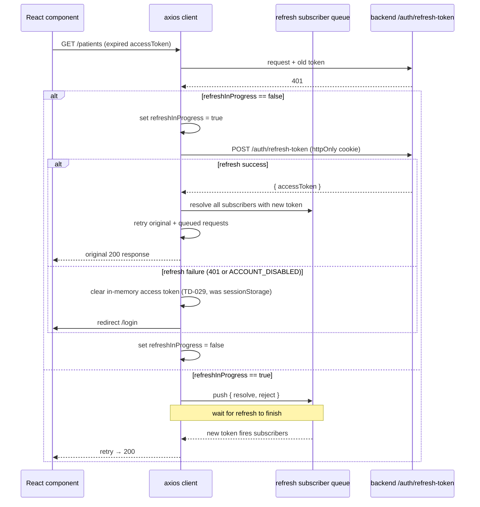
```mermaid
sequenceDiagram
  participant UI as React component
  participant AX as axios client
  participant Q as refresh subscriber queue
  participant API as backend /auth/refresh-token

  UI->>AX: GET /patients (expired accessToken)
  AX->>API: request + old token
  API-->>AX: 401
  alt refreshInProgress == false
    AX->>AX: set refreshInProgress = true
    AX->>API: POST /auth/refresh-token (httpOnly cookie)
    alt refresh success
      API-->>AX: { accessToken }
      AX->>Q: resolve all subscribers with new token
      AX->>AX: retry original + queued requests
      AX-->>UI: original 200 response
    else refresh failure (401 or ACCOUNT_DISABLED)
      AX->>AX: clear in-memory access token (TD-029, was sessionStorage)
      AX->>UI: redirect /login
    end
    AX->>AX: set refreshInProgress = false
  else refreshInProgress == true
    AX->>Q: push { resolve, reject }
    Note over AX,Q: wait for refresh to finish
    Q-->>AX: new token fires subscribers
    AX-->>UI: retry → 200
  end
```

**Source of truth:** [frontend/src/services/api.ts](../../frontend/src/services/api.ts).

---

## 8. File Upload Pipeline (Mobile)

Multer streams into Cloudinary; the controller updates the embedded `folders[].files[]` array and fires an audit write (currently MISSING per §00-drift §10).

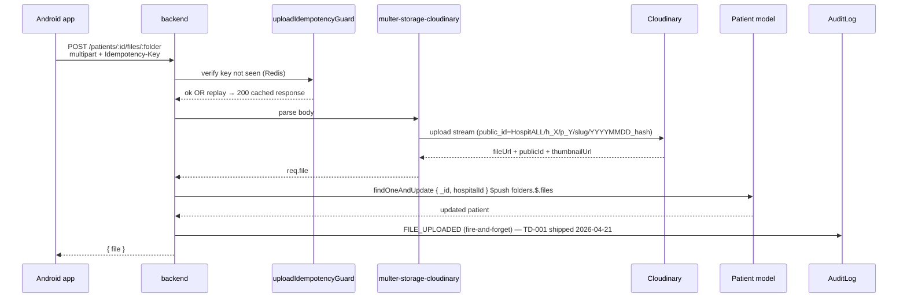
```mermaid
sequenceDiagram
  participant M as Android app
  participant API as backend
  participant IG as uploadIdempotencyGuard
  participant MU as multer-storage-cloudinary
  participant CL as Cloudinary
  participant PT as Patient model
  participant A as AuditLog

  M->>API: POST /patients/:id/files/:folder<br/>multipart + Idempotency-Key
  API->>IG: verify key not seen (Redis)
  IG-->>API: ok OR replay → 200 cached response
  API->>MU: parse body
  MU->>CL: upload stream (public_id=HospitALL/h_X/p_Y/slug/YYYYMMDD_hash)
  CL-->>MU: fileUrl + publicId + thumbnailUrl
  MU-->>API: req.file
  API->>PT: findOneAndUpdate { _id, hospitalId } $push folders.$.files
  PT-->>API: updated patient
  API->>A: FILE_UPLOADED (fire-and-forget) — TD-001 shipped 2026-04-21
  API-->>M: { file }
```

**Source of truth:** [backend/src/routes/patient.routes.js:115-120](../../backend/src/routes/patient.routes.js), [backend/src/middleware/upload.js](../../backend/src/middleware/upload.js), [backend/src/controllers/patient.controller.js](../../backend/src/controllers/patient.controller.js).

---

## 9. Compression Sidecar Pipeline

The sidecar handles cache short-circuit first, then runs the tier ladder. Timeouts and error branches shown explicitly.

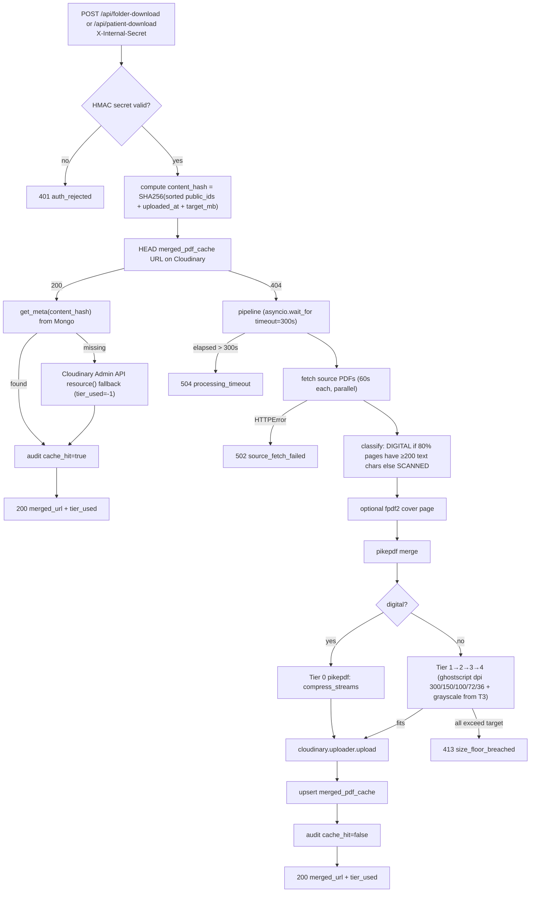
```mermaid
flowchart TD
  In["POST /api/folder-download or /api/patient-download<br/>X-Internal-Secret"] --> Auth{"HMAC secret valid?"}
  Auth -->|no| Reject["401 auth_rejected"]
  Auth -->|yes| Hash["compute content_hash = SHA256(sorted public_ids + uploaded_at + target_mb)"]
  Hash --> CacheHead["HEAD merged_pdf_cache URL on Cloudinary"]
  CacheHead -->|200| Meta["get_meta(content_hash) from Mongo"]
  Meta -->|found| Audit1["audit cache_hit=true"] --> Out1["200 merged_url + tier_used"]
  Meta -->|missing| CloudinaryFB["Cloudinary Admin API resource() fallback (tier_used=-1)"] --> Audit1
  CacheHead -->|404| Pipe["pipeline (asyncio.wait_for timeout=300s)"]
  Pipe --> Fetch["fetch source PDFs (60s each, parallel)"]
  Fetch -->|HTTPError| Err502["502 source_fetch_failed"]
  Fetch --> Classify["classify: DIGITAL if 80% pages have ≥200 text chars else SCANNED"]
  Classify --> Cover["optional fpdf2 cover page"]
  Cover --> Merge["pikepdf merge"]
  Merge --> Branch{"digital?"}
  Branch -->|yes| T0["Tier 0 pikepdf: compress_streams"]
  T0 --> Upload
  Branch -->|no| Ladder["Tier 1→2→3→4 (ghostscript dpi 300/150/100/72/36 + grayscale from T3)"]
  Ladder -->|fits| Upload["cloudinary.uploader.upload"]
  Ladder -->|all exceed target| Err413["413 size_floor_breached"]
  Pipe -->|elapsed > 300s| Err504["504 processing_timeout"]
  Upload --> Meta2["upsert merged_pdf_cache"]
  Meta2 --> Audit2["audit cache_hit=false"]
  Audit2 --> Out2["200 merged_url + tier_used"]
```

**Source of truth:** [compression-service/app/endpoints/folder.py](../../compression-service/app/endpoints/folder.py), [tier_ladder.py](../../compression-service/app/compression/tier_ladder.py), [cloudinary_client.py](../../compression-service/app/cloudinary_client.py), [merged_cache.py](../../compression-service/app/merged_cache.py).

---

## 10. Patient Download Orchestration

Node's `patient.controller.js` branches between ZIP vs PDF, merged vs per-folder, sidecar vs local, and emits streaming responses.

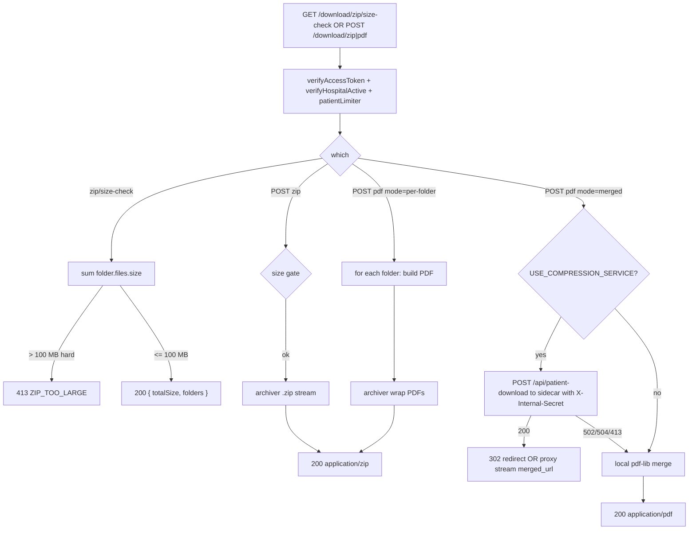
```mermaid
flowchart TD
  Req["GET /download/zip/size-check OR POST /download/zip|pdf"] --> Auth[verifyAccessToken + verifyHospitalActive + patientLimiter]
  Auth --> Branch{which}
  Branch -->|zip/size-check| SZ["sum folder.files.size"]
  SZ -->|"> 100 MB hard"| ZipBlock["413 ZIP_TOO_LARGE"]
  SZ -->|"<= 100 MB"| SZOut["200 { totalSize, folders }"]
  Branch -->|POST zip| ZipGate{"size gate"}
  ZipGate -->|ok| Archive["archiver .zip stream"]
  Archive --> ZipOut["200 application/zip"]
  Branch -->|POST pdf mode=merged| Sidecar{"USE_COMPRESSION_SERVICE?"}
  Sidecar -->|yes| Proxy["POST /api/patient-download to sidecar with X-Internal-Secret"]
  Proxy -->|200| Stream["302 redirect OR proxy stream merged_url"]
  Proxy -->|502/504/413| Fallback["local pdf-lib merge"]
  Sidecar -->|no| Fallback
  Fallback --> PDFOut["200 application/pdf"]
  Branch -->|POST pdf mode=per-folder| PerF["for each folder: build PDF"] --> ZipPerF["archiver wrap PDFs"]
  ZipPerF --> ZipOut
```

**Source of truth:** [backend/src/controllers/patient.controller.js](../../backend/src/controllers/patient.controller.js), [backend/src/services/compression.service.js](../../backend/src/services/compression.service.js), [backend/src/services/zip.service.js](../../backend/src/services/zip.service.js), [backend/src/services/pdf.service.js](../../backend/src/services/pdf.service.js).

---

## 11. Auto-Delete Cron Flow

Nightly job; hard delete with cascade to Cloudinary, audit-logged once with aggregate counts.

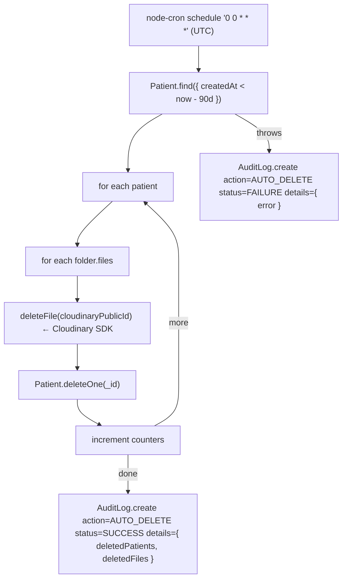
```mermaid
flowchart TD
  Cron["node-cron schedule '0 0 * * *' (UTC)"] --> Q["Patient.find({ createdAt < now - 90d })"]
  Q --> For["for each patient"]
  For --> Files["for each folder.files"]
  Files --> Del["deleteFile(cloudinaryPublicId) ← Cloudinary SDK"]
  Del --> Rm["Patient.deleteOne(_id)"]
  Rm --> Tally["increment counters"]
  Tally -->|more| For
  Tally -->|done| OK["AuditLog.create action=AUTO_DELETE status=SUCCESS details={ deletedPatients, deletedFiles }"]
  Q -->|throws| Err["AuditLog.create action=AUTO_DELETE status=FAILURE details={ error }"]
```

**Source of truth:** [backend/src/jobs/autoDelete.job.js](../../backend/src/jobs/autoDelete.job.js), [backend/src/services/patient.service.js:442-490](../../backend/src/services/patient.service.js).

---

## 12. Session Lifecycle

States plus revocation reasons. TTL index on `expiresAt` auto-prunes expired docs; `cleanupExpiredSessions()` is dead code (see dead-code §D).

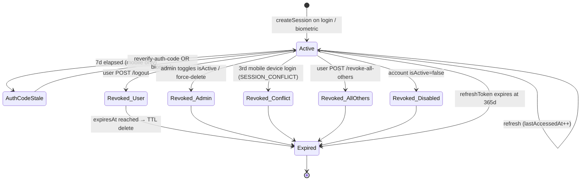
```mermaid
stateDiagram-v2
  [*] --> Active : createSession on login / biometric
  Active --> Active : refresh (lastAccessedAt++)
  Active --> AuthCodeStale : 7d elapsed (mobile only)
  AuthCodeStale --> Active : reverify-auth-code OR biometric
  Active --> Revoked_User : user POST /logout
  Active --> Revoked_Admin : admin toggles isActive / force-delete
  Active --> Revoked_Conflict : 3rd mobile device login (SESSION_CONFLICT)
  Active --> Revoked_AllOthers : user POST /revoke-all-others
  Active --> Revoked_Disabled : account isActive=false
  Revoked_User --> Expired : expiresAt reached → TTL delete
  Revoked_Admin --> Expired
  Revoked_Conflict --> Expired
  Revoked_AllOthers --> Expired
  Revoked_Disabled --> Expired
  Active --> Expired : refreshToken expires at 365d
  Expired --> [*]
```

**Source of truth:** [backend/src/models/Session.js](../../backend/src/models/Session.js), [backend/src/services/token.service.js](../../backend/src/services/token.service.js), [backend/src/controllers/auth.controller.js](../../backend/src/controllers/auth.controller.js).

---

## 13. Notification Dispatch Decision Tree

Both channels gated by `notificationPrefs`; FCM only fires if `hospital.fcmToken.token` is set.

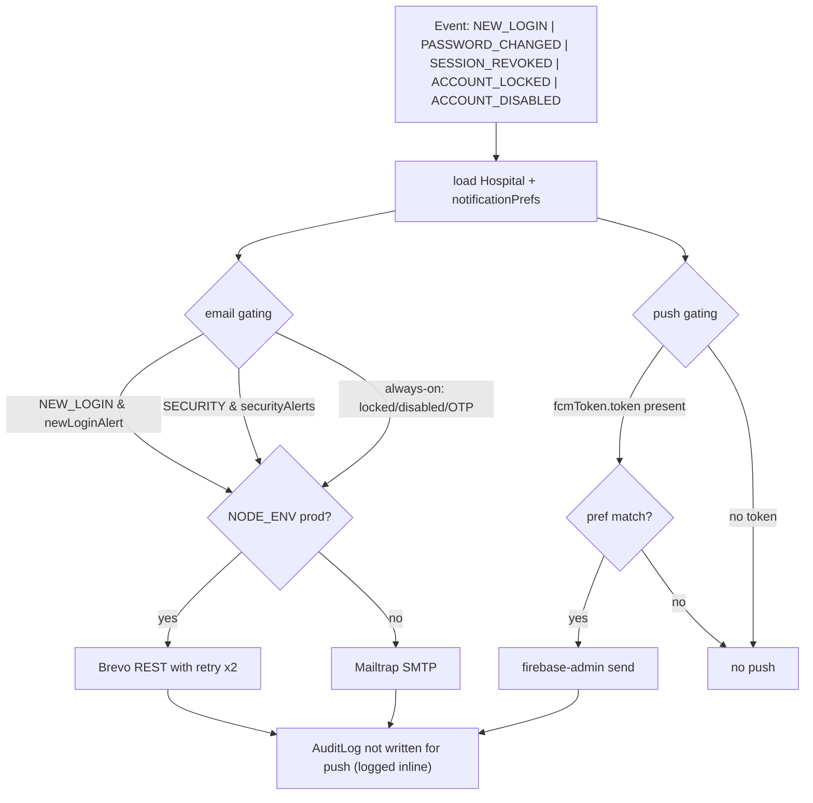
```mermaid
flowchart TD
  Evt["Event: NEW_LOGIN | PASSWORD_CHANGED | SESSION_REVOKED | ACCOUNT_LOCKED | ACCOUNT_DISABLED"] --> Load["load Hospital + notificationPrefs"]
  Load --> Email{"email gating"}
  Email -->|NEW_LOGIN & newLoginAlert| E1
  Email -->|SECURITY & securityAlerts| E1
  Email -->|always-on: locked/disabled/OTP| E1
  E1{"NODE_ENV prod?"} -->|yes| Brevo["Brevo REST with retry x2"]
  E1 -->|no| Mailtrap["Mailtrap SMTP"]
  Load --> Push{"push gating"}
  Push -->|fcmToken.token present| Pg{"pref match?"}
  Pg -->|yes| FCM["firebase-admin send"]
  Pg -->|no| Skip
  Push -->|no token| Skip["no push"]
  FCM --> Audit["AuditLog not written for push (logged inline)"]
  Brevo --> Audit
  Mailtrap --> Audit
```

**Source of truth:** [backend/src/services/mail.service.js](../../backend/src/services/mail.service.js), [backend/src/services/push.service.js](../../backend/src/services/push.service.js), [backend/src/controllers/auth.controller.js](../../backend/src/controllers/auth.controller.js).

---

## 14. Forgot Password Flow

Three-step flow with explicit "always return 200" on step 1 to prevent account enumeration.

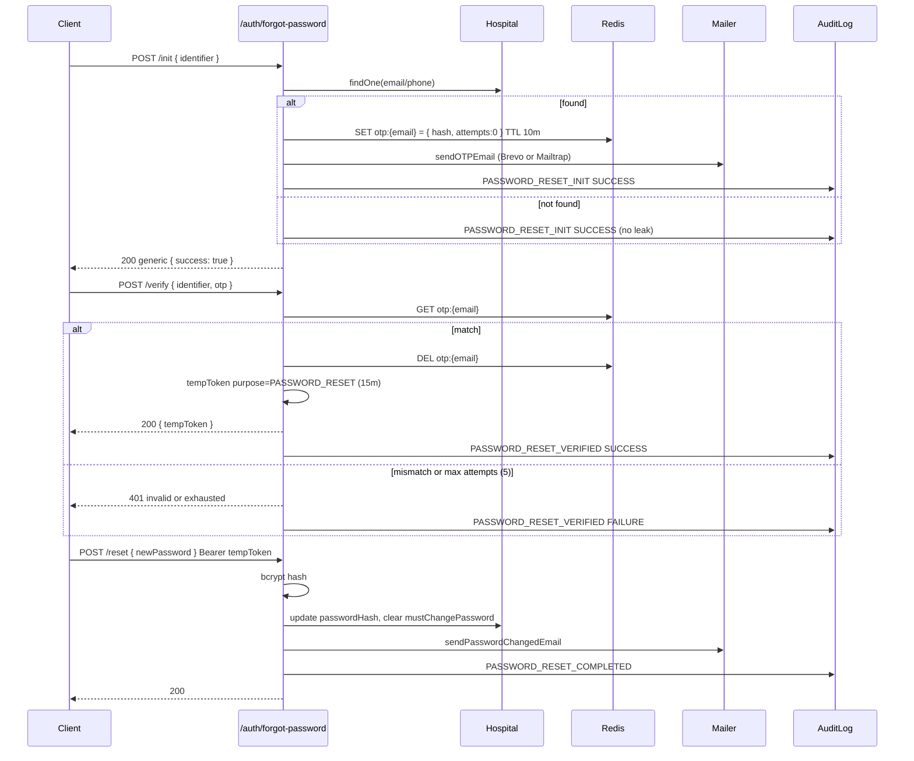
```mermaid
sequenceDiagram
  participant C as Client
  participant API as /auth/forgot-password
  participant H as Hospital
  participant R as Redis
  participant M as Mailer
  participant A as AuditLog

  C->>API: POST /init { identifier }
  API->>H: findOne(email/phone)
  alt found
    API->>R: SET otp:{email} = { hash, attempts:0 } TTL 10m
    API->>M: sendOTPEmail (Brevo or Mailtrap)
    API->>A: PASSWORD_RESET_INIT SUCCESS
  else not found
    API->>A: PASSWORD_RESET_INIT SUCCESS (no leak)
  end
  API-->>C: 200 generic { success: true }

  C->>API: POST /verify { identifier, otp }
  API->>R: GET otp:{email}
  alt match
    API->>R: DEL otp:{email}
    API->>API: tempToken purpose=PASSWORD_RESET (15m)
    API-->>C: 200 { tempToken }
    API->>A: PASSWORD_RESET_VERIFIED SUCCESS
  else mismatch or max attempts (5)
    API-->>C: 401 invalid or exhausted
    API->>A: PASSWORD_RESET_VERIFIED FAILURE
  end

  C->>API: POST /reset { newPassword } Bearer tempToken
  API->>API: bcrypt hash
  API->>H: update passwordHash, clear mustChangePassword
  API->>M: sendPasswordChangedEmail
  API->>A: PASSWORD_RESET_COMPLETED
  API-->>C: 200
```

**Source of truth:** [backend/src/controllers/auth.controller.js](../../backend/src/controllers/auth.controller.js) (forgot-password group), [backend/src/services/mail.service.js](../../backend/src/services/mail.service.js).

---

## 15. MainLayout Component Hierarchy

Composition inside the shell, including where portaled modals attach (body root, not layout).

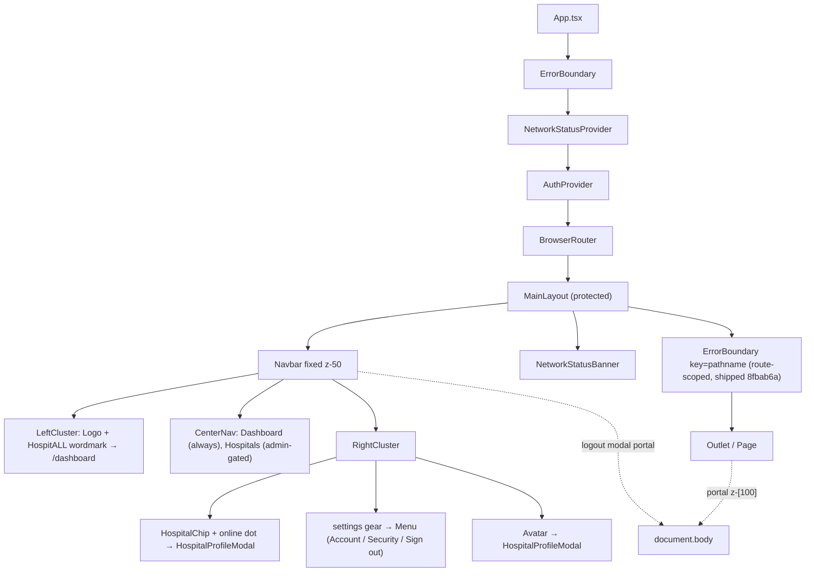
```mermaid
flowchart TB
  Body["document.body"]
  App["App.tsx"] --> EB["ErrorBoundary"]
  EB --> NS["NetworkStatusProvider"]
  NS --> Auth["AuthProvider"]
  Auth --> Router["BrowserRouter"]
  Router --> ML["MainLayout (protected)"]
  ML --> NB["Navbar fixed z-50"]
  NB --> LC["LeftCluster: Logo + HospitALL wordmark → /dashboard"]
  NB --> CN["CenterNav: Dashboard (always), Hospitals (admin-gated)"]
  NB --> RC["RightCluster"]
  RC --> Chip["HospitalChip + online dot → HospitalProfileModal"]
  RC --> Gear["settings gear → Menu (Account / Security / Sign out)"]
  RC --> Av["Avatar → HospitalProfileModal"]
  ML --> NSB["NetworkStatusBanner"]
  ML --> InnerEB["ErrorBoundary key=pathname (route-scoped, shipped 8fbab6a)"]
  InnerEB --> Main["Outlet / Page"]
  Main -.portal z-[100].-> Body
  NB -.logout modal portal.-> Body
```

**Source of truth:** [frontend/src/layouts/MainLayout.tsx](../../frontend/src/layouts/MainLayout.tsx), [frontend/src/components/Navbar.tsx](../../frontend/src/components/Navbar.tsx).

---

## 16. Service Dependency Graph (High-Coupling Services)

Services imported by 3+ controllers are highlighted; they're the natural bus-factor hotspots.

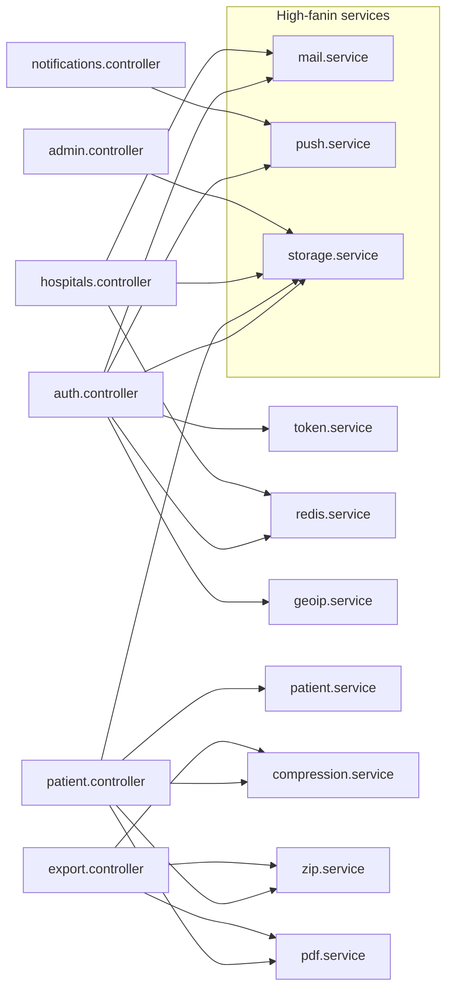
```mermaid
flowchart LR
  auth["auth.controller"] --> token["token.service"]
  auth --> mail["mail.service"]
  auth --> push["push.service"]
  auth --> redis["redis.service"]
  auth --> storage["storage.service"]
  auth --> geoip["geoip.service"]
  patient["patient.controller"] --> patientSvc["patient.service"]
  patient --> storage
  patient --> compression["compression.service"]
  patient --> zip["zip.service"]
  patient --> pdf["pdf.service"]
  hospital["hospitals.controller"] --> mail
  hospital --> redis
  hospital --> storage
  export["export.controller"] --> pdf
  export --> zip
  export --> compression
  admin["admin.controller"] --> storage
  notifications["notifications.controller"] --> push
  subgraph hot["High-fanin services"]
    mail
    storage
    push
  end
```

**Source of truth:** [backend/src/controllers/](../../backend/src/controllers/) + [backend/src/services/](../../backend/src/services/) — grep of `import ... from`.

---

## 17. Patient ID Generation

Atomic `$inc` via `findByIdAndUpdate` guarantees serialisation. Initials come from hospital name.

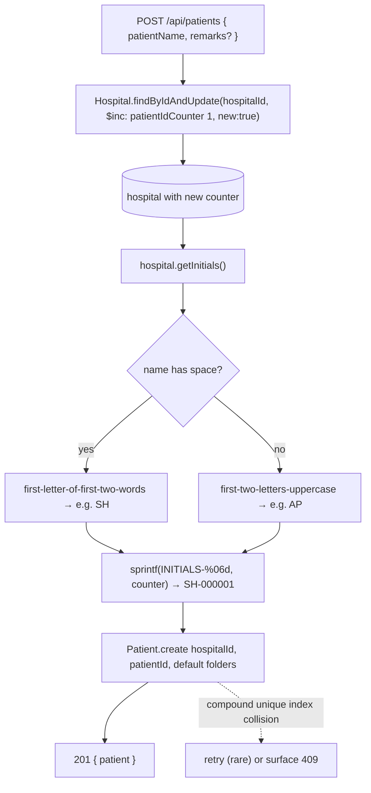
```mermaid
flowchart TD
  Call["POST /api/patients { patientName, remarks? }"] --> HospAtomic["Hospital.findByIdAndUpdate(hospitalId, $inc: patientIdCounter 1, new:true)"]
  HospAtomic --> H[("hospital with new counter")]
  H --> Init["hospital.getInitials()"]
  Init --> Multi{"name has space?"}
  Multi -->|yes| TwoW["first-letter-of-first-two-words → e.g. SH"]
  Multi -->|no| OneW["first-two-letters-uppercase → e.g. AP"]
  TwoW --> Fmt
  OneW --> Fmt["sprintf(INITIALS-%06d, counter) → SH-000001"]
  Fmt --> Ins["Patient.create hospitalId, patientId, default folders"]
  Ins --> OK["201 { patient }"]
  Ins -.compound unique index collision.-> Retry["retry (rare) or surface 409"]
```

**Source of truth:** [backend/src/services/patient.service.js:22-26](../../backend/src/services/patient.service.js), [backend/src/models/Hospital.js](../../backend/src/models/Hospital.js) (getInitials method).

---

*17 diagrams, all derived from live code. Proceed to `04-enhancements.md` for the findings feed.*

---

## Part B — Android Architecture Diagrams

Added 2026-04-24 with first-pass Android audit. 13 diagrams, all derived from `android-app/` source as of commit `1b3bf22`. Every diagram cites `path:line` evidence.

---

## 18. Android Module + Package Layout

Single Gradle module (`:app`). Packages mapped by layer. Each arrow represents `import com.hospital.management.<target>.*` from at least one file in the source package.

```mermaid
flowchart LR
  subgraph Apps["com.hospital.management"]
    App["HospitalApplication"]
  end
  subgraph UI["ui.*"]
    Splash["splash.SplashActivity"]
    Auth["auth.* (8 activities)"]
    Dash["dashboard.DashboardActivity"]
    Patients["patients.* (orphan + adapter)"]
    Folders["folders.* (4 activities + 2 adapters)"]
    Admission["admission.AdmissionActivity"]
    Scanner["scanner.ScannerActivity"]
    Upload["upload.UploadActivity"]
    Profile["profile.* (4 activities + adapter)"]
    Base["base.BaseActivity"]
    Components["components.* (Glass widgets, animations)"]
  end
  subgraph VM["presentation.viewmodel"]
    AuthVM["AuthViewModel"]
    PatVM["PatientViewModel"]
    ProfVM["ProfileViewModel"]
    Factory["ViewModelFactory"]
  end
  subgraph Domain["domain.usecase"]
    AuthUC["AuthUseCases (6)"]
    PatUC["PatientUseCases (11)"]
  end
  subgraph DataRepo["data.repository"]
    AuthRepo["AuthRepository"]
    PatRepo["PatientRepository"]
    ProfRepo["ProfileRepository"]
    DocRepo["DocumentRepository"]
  end
  subgraph DataApi["data.api"]
    ApiSvc["ApiService (Retrofit)"]
    AuthInt["AuthInterceptor"]
    Client["RetrofitClient"]
  end
  subgraph DataLocal["data.local"]
    DB["AppDatabase + 4 DAOs"]
    TM["TokenManager (EncryptedSharedPreferences)"]
  end
  subgraph DataModels["data.models"]
    Models["Gson DTOs (5 files)"]
  end
  subgraph Services["services"]
    FCM["HmsFirebaseMessagingService"]
  end
  subgraph Workers["worker"]
    Sync["SyncDocumentsWorker"]
    DW["DownloadWorker"]
    Logout["OfflineLogoutWorker"]
    FcmW["FcmTokenWorker"]
  end
  subgraph Utils["utils"]
    SM["SessionManager"]
    NM["NetworkMonitor"]
    FL["FileLogger"]
    Bio["BiometricHelper"]
    Sec["SecurityUtils"]
    PdfU["PdfUtils"]
  end

  App --> UI
  App --> DataLocal
  App --> DataApi
  App --> Workers
  App --> Utils
  UI --> VM
  UI --> Utils
  UI --> DataApi
  UI --> DataLocal
  VM --> Factory
  VM --> Domain
  Domain --> DataRepo
  DataRepo --> DataApi
  DataRepo --> DataLocal
  DataRepo --> DataModels
  DataApi --> DataModels
  Client --> AuthInt
  AuthInt --> TM
  Workers --> DataApi
  Workers --> DataLocal
  Services --> DataApi
  Services --> Workers
  Utils --> DataLocal
  Utils --> DataApi
```

**Source of truth:** [android-app/app/src/main/java/com/hospital/management/](../../android-app/app/src/main/java/com/hospital/management/) — top-level package tree + all `import com.hospital.management.*` lines.

---

## 19. Full Navigation Graph

Every `startActivity`/`Intent` call site mapped. "Orphan" Activities (declared in manifest, zero inbound calls) are highlighted with a dashed border.

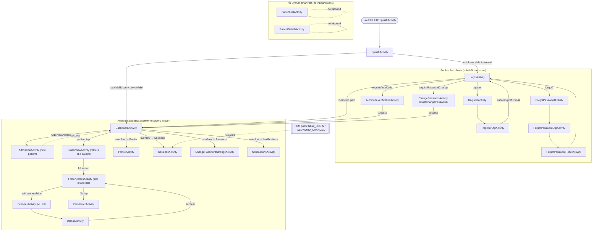
```mermaid
flowchart TB
  Launcher(["LAUNCHER: SplashActivity"])
  Splash["SplashActivity"]
  subgraph Public["Public / Auth flows (isAuthScreen=true)"]
    Login["LoginActivity"]
    Auth2FA["AuthCodeVerificationActivity"]
    ChgPw["ChangePasswordActivity (mustChangePassword)"]
    Reg["RegisterActivity"]
    RegOtp["RegisterOtpActivity"]
    Forgot["ForgotPasswordActivity"]
    ForgotOtp["ForgotPasswordOtpActivity"]
    ForgotReset["ForgotPasswordResetActivity"]
  end
  subgraph Protected["Authenticated (BaseActivity receivers active)"]
    Dash["DashboardActivity"]
    Admission["AdmissionActivity (new patient)"]
    FolderView["FolderViewActivity (folders of a patient)"]
    FolderDet["FolderDetailsActivity (files of a folder)"]
    Scanner["ScannerActivity (ML Kit)"]
    Upload["UploadActivity"]
    FileViewer["FileViewerActivity"]
    Profile["ProfileActivity"]
    Sessions["SessionsActivity"]
    ChgPwSet["ChangePasswordSettingsActivity"]
    Notifs["NotificationsActivity"]
  end
  subgraph Orphans["🟡 Orphan (manifest, no inbound calls)"]
    PatList["PatientListActivity"]
    PatDet["PatientDetailsActivity"]
  end

  Launcher --> Splash
  Splash -->|hasValidToken + serverValid| Dash
  Splash -->|no token / stale / revoked| Login
  Login -->|forgot?| Forgot
  Login -->|register| Reg
  Login -->|requireAuthCode| Auth2FA
  Login -->|requirePasswordChange| ChgPw
  Login -->|biometric path| Dash
  Auth2FA -->|success| Dash
  ChgPw -->|success| Dash
  Reg --> RegOtp
  RegOtp -->|success prefillEmail| Login
  Forgot --> ForgotOtp
  ForgotOtp --> ForgotReset
  ForgotReset --> Login

  Dash -->|FAB New Admission| Admission
  Dash -->|patient tap| FolderView
  Dash -->|overflow → Profile| Profile
  Dash -->|overflow → Password| ChgPwSet
  Dash -->|overflow → Sessions| Sessions
  Dash -->|overflow → Notifications| Notifs
  FolderView -->|folder tap| FolderDet
  FolderDet -->|add scanned doc| Scanner
  Scanner --> Upload
  Upload -->|success| FolderDet
  FolderDet -->|file tap| FileViewer

  Admission -.success.-> Dash

  FCM[["FCM push: NEW_LOGIN / PASSWORD_CHANGED"]] -.deep link.-> Sessions

  %% Orphans — never reached
  PatList -.no inbound.- PatList
  PatDet -.no inbound.- PatDet
```

**Source of truth:** [AndroidManifest.xml:42-127](../../android-app/app/src/main/AndroidManifest.xml) + grep of `Intent(this|..., <Activity>::class.java)` across `android-app/app/src/main/java/`.

**Orphans:** [PatientListActivity.kt](../../android-app/app/src/main/java/com/hospital/management/ui/patients/PatientListActivity.kt) and [PatientDetailsActivity.kt](../../android-app/app/src/main/java/com/hospital/management/ui/patients/PatientDetailsActivity.kt) have zero `Intent(this, PatientList*...::class.java)` hits; see [`01-dead-code.md §J5`](01-dead-code.md).

---

## 20. Android Layered Architecture (example: POST `/api/auth/login`)

Canonical request lifecycle inside the app. Mirrors `03` § "Backend Layered Architecture" but for the Android side.

```mermaid
flowchart LR
  U[User taps Login] --> Act["LoginActivity.setupListeners()"]
  Act -->|validation OK| Pre["POST /auth/session/check-conflict (pre-flight)"]
  Pre -->|200 no conflict| VM["AuthViewModel.login(id, pw)"]
  VM -->|UseCase wraps Repo| UC["LoginUseCase.invoke"]
  UC -->|suspend repo call| Repo["AuthRepository.login"]
  Repo -->|apiService.login(LoginRequest)| Retro["Retrofit → OkHttp"]
  Retro -->|UserAgentInterceptor → AuthInterceptor| OK[OkHttpClient]
  AuthInterceptorAttach["AuthInterceptor.attachAuthHeaders()<br/>X-Client-Type + X-Hospital-Id if present"] -.headers.- OK
  OK -->|HTTPS POST| Backend[("/api/auth/login")]
  Backend -->|LoginResponse| OK
  OK --> Retro
  Retro --> Repo
  Repo --> UC
  UC --> VM
  VM -->|StateFlow emit| Act
  Act -->|branch on AuthState| Next{RequireAuthCode / RequirePasswordChange / LoggedIn}
```

**Source of truth:** [LoginActivity.kt](../../android-app/app/src/main/java/com/hospital/management/ui/auth/LoginActivity.kt), [AuthViewModel.kt](../../android-app/app/src/main/java/com/hospital/management/presentation/viewmodel/AuthViewModel.kt), [AuthUseCases.kt](../../android-app/app/src/main/java/com/hospital/management/domain/usecase/AuthUseCases.kt), [AuthRepository.kt](../../android-app/app/src/main/java/com/hospital/management/data/repository/AuthRepository.kt), [ApiService.kt](../../android-app/app/src/main/java/com/hospital/management/data/api/ApiService.kt), [RetrofitClient.kt](../../android-app/app/src/main/java/com/hospital/management/data/api/RetrofitClient.kt), [AuthInterceptor.kt](../../android-app/app/src/main/java/com/hospital/management/data/api/AuthInterceptor.kt).

---

## 21. Android Auth State Machine

States the app's `AuthState` sealed class can be in, plus the broadcast-driven transitions that fire from `AuthInterceptor` (body-substring match on 401 error payload).

```mermaid
stateDiagram-v2
  [*] --> LoggedOut
  LoggedOut --> Loading : LoginActivity.login()
  Loading --> RequireAuthCode : 200 + requireAuthCode=true
  Loading --> RequirePasswordChange : 200 + requirePasswordChange=true
  Loading --> LoggedIn : biometric verify (fresh tokens)
  Loading --> ErrorState : 401 / network
  RequireAuthCode --> Loading : verify-auth-code POST
  RequirePasswordChange --> Loading : change-password POST
  LoggedIn --> LoggedIn : /auth/refresh-token (transparent, via AuthInterceptor)
  LoggedIn --> AuthCodeStale : 401 body~AUTH_CODE_REQUIRED → broadcast ACTION_AUTH_CODE_REQUIRED
  AuthCodeStale --> LoggedIn : /auth/session/reverify-auth-code
  LoggedIn --> SessionConflict : 401 body~SESSION_CONFLICT → broadcast ACTION_SESSION_REVOKED
  LoggedIn --> AccountDisabled : 401 body~ACCOUNT_DISABLED → broadcast ACTION_SESSION_REVOKED
  LoggedIn --> ClientInactivityExpired : 7 d since last interaction (SessionManager)
  SessionConflict --> LoggedOut : BaseActivity Toast + SessionManager.logoutUser
  AccountDisabled --> LoggedOut : same
  ClientInactivityExpired --> LoggedOut : same
  LoggedIn --> LoggedOut : user logout / DashboardActivity.showLogoutDialog
  ErrorState --> LoggedOut : Snackbar dismissed
```

**Source of truth:** [AuthViewModel.kt:14-21 (sealed class)](../../android-app/app/src/main/java/com/hospital/management/presentation/viewmodel/AuthViewModel.kt), [AuthInterceptor.kt:96-120](../../android-app/app/src/main/java/com/hospital/management/data/api/AuthInterceptor.kt), [BaseActivity.kt:78-116](../../android-app/app/src/main/java/com/hospital/management/ui/base/BaseActivity.kt), [SessionManager.kt:64-84](../../android-app/app/src/main/java/com/hospital/management/utils/SessionManager.kt).

---

## 22. Android Login Sequence (password path)

Two-step login. Mirrors `03` §6 but includes the Android-only `/session/check-conflict` pre-flight and the post-login biometric enrolment dialog.

```mermaid
sequenceDiagram
  participant U as User
  participant L as LoginActivity
  participant VM as AuthViewModel
  participant I as AuthInterceptor
  participant API as Backend
  participant TM as TokenManager (EncryptedSharedPreferences)
  participant B as BiometricHelper

  U->>L: type identifier + password
  L->>API: POST /auth/session/check-conflict {identifier}
  API-->>L: {conflict: bool, activeDevice?, sessionLimit?}
  alt conflict
    L->>U: MaterialAlertDialogBuilder "Active Session Found"
    U->>L: Continue Login
  end
  L->>VM: login(id, pw)
  VM->>API: POST /auth/login {identifier, email, password}
  Note over I: AuthInterceptor attaches X-Client-Type=Android<br/>(no access token yet)
  API-->>VM: LoginResponse { requireAuthCode, tempToken OR requirePasswordChange }
  alt requirePasswordChange
    VM-->>L: AuthState.RequirePasswordChange(tempToken)
    L->>U: navigate to ChangePasswordActivity
  else requireAuthCode
    VM-->>L: AuthState.RequireAuthCode(tempToken)
    L->>U: navigate to AuthCodeVerificationActivity
    U->>L: enter 6-digit code (auto-submit)
    L->>API: POST /auth/login/verify-auth-code (Bearer tempToken)
    API-->>L: {accessToken, refreshToken, hospital}
    L->>TM: saveTokens + saveHospitalInfo
  end
  L->>API: POST /auth/fcm-token (fire-and-forget)
  L->>B: isBiometricEnabled(hospitalId) && hasKeyPair(hospitalId)?
  alt never enrolled on this device
    L->>U: "Enable Biometric Login?" AlertDialog
    U->>L: Enable
    L->>B: generateKeyPair(hospitalId)
    B-->>L: publicKey Base64
    L->>API: POST /auth/biometric/register {publicKey, deviceId=ANDROID_ID}
    API-->>L: 200
    L->>TM: setBiometricEnabled(hospitalId, true) + saveBiometricEmail
  end
  L->>U: navigateToDashboard()
```

**Source of truth:** [LoginActivity.kt:130-188 (conflict pre-flight)](../../android-app/app/src/main/java/com/hospital/management/ui/auth/LoginActivity.kt), [LoginActivity.kt:215-258 (FCM + biometric enrol)](../../android-app/app/src/main/java/com/hospital/management/ui/auth/LoginActivity.kt), [AuthCodeVerificationActivity.kt:67-118](../../android-app/app/src/main/java/com/hospital/management/ui/auth/AuthCodeVerificationActivity.kt), [BiometricHelper.kt:75-100 (keypair)](../../android-app/app/src/main/java/com/hospital/management/utils/BiometricHelper.kt).

---

## 23. Android Biometric Sequence

Subsequent logins via RSA-SHA256 signing of a server challenge. Keystore key is bound to `BIOMETRIC_STRONG` + invalidated on biometric re-enrollment.

```mermaid
sequenceDiagram
  participant U as User
  participant L as LoginActivity
  participant TM as TokenManager
  participant B as BiometricHelper
  participant KS as AndroidKeyStore
  participant OS as BiometricPrompt (OS)
  participant API as Backend

  L->>TM: getLastBiometricHospitalId
  TM-->>L: hospitalId
  L->>B: isBiometricEnabled + hasKeyPair(hospitalId)
  B-->>L: true / true
  L->>U: show "Biometric" button
  U->>L: tap
  L->>API: POST /auth/biometric/challenge {identifier, deviceId}
  API-->>L: {challenge, hospitalId serverSide}
  L->>L: assert serverHospitalId == keystore-bound hospitalId<br/>(if not → wipe, force password login)
  L->>B: showBiometricPromptForSigning(challenge)
  B->>KS: getKey(alias = "hospital_biometric_key_<id>")
  KS-->>B: PrivateKey (Keystore-bound)
  B->>B: sig.initSign(privateKey)
  B->>OS: BiometricPrompt.authenticate(CryptoObject(sig))
  OS->>U: fingerprint / face prompt
  U->>OS: success
  OS-->>B: AuthenticationResult { cryptoObject.signature }
  B->>B: sig.update(challenge.toByteArray()); sig.sign()
  B-->>L: signatureBase64
  L->>API: POST /auth/biometric/verify {hospitalId, deviceId, signature}
  API->>API: verify signature against stored publicKey
  API-->>L: LoginResponse {accessToken, refreshToken, hospital}
  L->>TM: saveTokens + saveHospitalInfo
  L->>U: navigateToDashboard()
  Note over B: If KeyPermanentlyInvalidatedException →<br/>onKeyInvalidated() → wipe local state,<br/>hide biometric button, password login
```

**Source of truth:** [LoginActivity.kt:380-522](../../android-app/app/src/main/java/com/hospital/management/ui/auth/LoginActivity.kt), [BiometricHelper.kt:132-205](../../android-app/app/src/main/java/com/hospital/management/utils/BiometricHelper.kt).

---

## 24. Android Token Refresh Flow

Transparent refresh on 401. Single module-level `refreshLock` prevents parallel-401 stampede. Backend rotates the refresh token on every refresh (TD-002); Android saves the new refresh when present.

```mermaid
sequenceDiagram
  participant A1 as Request A (e.g. GET /patients)
  participant A2 as Request B (concurrent GET)
  participant I as AuthInterceptor
  participant TM as EncryptedSharedPreferences
  participant RC as Bare OkHttpClient (refreshClient)
  participant API as Backend

  A1->>I: chain.proceed(request with old access token)
  API-->>I: 401
  I->>I: peekBody(1024)
  I->>I: body not~SESSION_CONFLICT/ACCOUNT_DISABLED/AUTH_CODE_*
  A2->>I: chain.proceed(other request)
  API-->>I: 401 (same old token)
  par Request A acquires lock
    I->>I: synchronized(refreshLock)
    I->>TM: getString("refresh_token")
    TM-->>I: refreshToken
    I->>RC: POST /auth/refresh-token {refreshToken}
    API-->>RC: 200 {accessToken, refreshToken: NEW}
    I->>TM: putString("access_token", new); putString("refresh_token", NEW)
  and Request B waits on refreshLock
    I->>I: synchronized — blocks
    I->>I: on entry: check current token != sent → reuse the fresh one
    Note over I: "Double-check reuse":<br/>if prefs.access_token ≠ bearer sent,<br/>another thread already refreshed. Skip call.
  end
  I->>API: retry Request A with NEW access token
  API-->>I: 200
  I-->>A1: response
  I->>API: retry Request B with NEW access token
  API-->>I: 200
  I-->>A2: response
  alt refresh fails (401/network)
    I->>I: broadcast ACTION_SESSION_REVOKED reason=SESSION_EXPIRED
    I-->>A1: pass-through 401
  end
```

**Source of truth:** [AuthInterceptor.kt:78-169 (intercept)](../../android-app/app/src/main/java/com/hospital/management/data/api/AuthInterceptor.kt), [AuthInterceptor.kt:199-242 (performRefresh)](../../android-app/app/src/main/java/com/hospital/management/data/api/AuthInterceptor.kt).

---

## 25. Android File Upload Pipeline

Online vs offline routing. Offline path persists the file URI + `owner_hospital_id` + stable `Idempotency-Key`; WorkManager drains the queue when network returns.

```mermaid
sequenceDiagram
  participant U as User
  participant UP as UploadActivity
  participant PU as PdfUtils
  participant IU as ImageUtils
  participant DR as DocumentRepository
  participant DAO as DocumentDao (Room)
  participant WM as WorkManager
  participant SW as SyncDocumentsWorker
  participant TM as TokenManager
  participant API as Backend /files/:folder

  U->>UP: tap Upload
  UP->>PU: buildPdf(scannedPages, greyscale?)
  PU-->>UP: PdfResult(file, profileUsed)
  alt file.size > 20 MB
    UP->>U: error "too large"
  else online
    UP->>DR: uploadDocument(file, idempotencyKey)
    DR->>API: POST /files/:folder (multipart + Idempotency-Key + X-Upload-Profile)
    API-->>DR: 200 | retryable | non-retryable
    DR-->>UP: UploadAttempt
  else offline
    UP->>DR: saveOffline(uri, ownerHospitalId, idempotencyKey)
    DR->>DAO: insert(OfflineDocument)
    UP->>WM: enqueueUniqueWork("auto_sync_documents", KEEP)
  end

  Note over WM,SW: Later — network regained / app foreground
  WM->>SW: doWork()
  SW->>TM: hasValidToken? getHospitalId?
  alt no auth
    SW->>DAO: deleteAllNotOwnedBy("__none__") (orphan GC)
    SW-->>WM: Result.success()
  end
  SW->>DAO: deleteAllNotOwnedBy(currentHospitalId) (cross-account GC)
  SW->>DAO: resetStuckUploading
  SW->>DAO: getPendingDocuments
  loop for each pending
    SW->>DR: uploadDocument(file, idempotencyKey)
    DR->>API: POST /files/:folder
    alt success
      SW->>DAO: delete row + delete local file
    else retryable
      SW->>DAO: update(status=FAILED, retryCount+1)
    end
  end
  SW-->>WM: Result.success / retry
```

**Source of truth:** [UploadActivity.kt](../../android-app/app/src/main/java/com/hospital/management/ui/upload/UploadActivity.kt), [DocumentRepository.kt](../../android-app/app/src/main/java/com/hospital/management/data/repository/DocumentRepository.kt), [SyncDocumentsWorker.kt](../../android-app/app/src/main/java/com/hospital/management/worker/SyncDocumentsWorker.kt), [OfflineDocument.kt](../../android-app/app/src/main/java/com/hospital/management/data/local/OfflineDocument.kt), [DocumentDao.kt:52-69](../../android-app/app/src/main/java/com/hospital/management/data/local/DocumentDao.kt).

---

## 26. Android Download Pipeline (foreground-service Worker)

`DownloadWorker` is a `CoroutineWorker` promoted to a foreground service. Supports resume-from-byte (`Range: bytes=…`), Last-Modified-based cache invalidation, and 500 MB LRU cache with a 60 s eviction safety window.

```mermaid
flowchart TD
  Req["FolderDetailsActivity.downloadFileCompressed()"] --> Enq["WorkManager.enqueueUniqueWork(download_<url-hash>, REPLACE)"]
  Enq --> FG["doWork() → setForeground(PREPARING notification) within 10s"]
  FG --> Poll{"KEY_STATUS_URL supplied?"}
  Poll -->|yes (server-side merge in progress, Phase 1+2 active)| PollLoop["pollUntilReady every 3.5s<br/>surfaces stage hint<br/>max 10 min"]
  Poll -->|no (direct download)| HEAD
  PollLoop --> HEAD["HEAD request — get Last-Modified + Accept-Ranges"]
  HEAD --> Hash["contentHash = SHA256(url | lastModified)"]
  Hash --> Cache{cached & !isStale?}
  Cache -->|hit| Touch["touchAccess(hash) → finalizeReady"]
  Cache -->|miss| GET["GET with Range header if resume possible"]
  GET -->|206 partial| Resume["seek RAF + write"]
  GET -->|200 full| Restart["start from byte 0"]
  GET -->|401/403| AuthFail["fail ERROR_AUTH_EXPIRED"]
  GET -->|4xx| ClientErr["fail ERROR_SERVER"]
  GET -->|5xx / network| Retry["maybeRetry(run < maxRetries → Result.retry w/ backoff)"]
  Resume --> Write["stream to tmp + emit progress bytes/total/speed"]
  Restart --> Write
  Write --> Rename["rename tmp → final + cacheDao.upsert"]
  Rename --> Evict{"totalBytes > 500 MB?"}
  Evict -->|yes| LRU["delete oldest accessed > 60s ago until under budget"]
  Evict -->|no| MediaStore["saveToMediaStore(Downloads/HospitalRecords/...)"]
  LRU --> MediaStore
  MediaStore --> Ready["finalizeReady → buildReady notification<br/>(tap → FileProvider ACTION_VIEW)"]
  Touch --> Ready
  Retry --> Backoff["WorkManager exponential backoff (30s × 2^attempt)"]
```

**Source of truth:** [DownloadWorker.kt](../../android-app/app/src/main/java/com/hospital/management/worker/DownloadWorker.kt), [DownloadCacheDao.kt](../../android-app/app/src/main/java/com/hospital/management/data/local/DownloadCacheDao.kt), [DownloadNotifier.kt](../../android-app/app/src/main/java/com/hospital/management/utils/DownloadNotifier.kt).

---

## 27. Android FCM Dispatch

`HmsFirebaseMessagingService.onMessageReceived` branches by `data["type"]`. Notable: `SESSION_REVOKED` is validated against the server first before acting — the push is account-scoped, not device-scoped.

```mermaid
flowchart TD
  Push[["FCM push — data.type"]] --> Type{type}
  Type -->|NEW_LOGIN| NL["Notification + group summary → Sessions"]
  Type -->|PASSWORD_CHANGED| PC["Notification → Sessions"]
  Type -->|SESSION_REVOKED| SR["showNotification + handleSessionRevoked"]
  Type -->|else| Gen["Generic notification → Launcher"]

  SR --> HV{hasValidToken?}
  HV -->|no| Ign1["ignore (already logged out)"]
  HV -->|yes| Val["GET /auth/session/validate"]
  Val -->|200| Ign2["Ignore — push was for another device"]
  Val -->|!200| Wait["AuthInterceptor on next request catches 401 → broadcast revoke"]

  OnNewToken[["FCM onNewToken"]] --> HasToken{accessToken present?}
  HasToken -->|yes| Post["POST /auth/fcm-token"]
  HasToken -->|no| Stash["savePendingToken(fcm_prefs) + enqueue FcmTokenWorker"]
  Post -.fails.-> Stash
  Stash --> Later{network+auth later}
  Later --> Post
```

**Source of truth:** [HmsFirebaseMessagingService.kt](../../android-app/app/src/main/java/com/hospital/management/services/HmsFirebaseMessagingService.kt), [FcmTokenWorker.kt](../../android-app/app/src/main/java/com/hospital/management/worker/FcmTokenWorker.kt).

---

## 28. Session Heartbeat + Logout Guard Sequence

Two cross-cutting concerns: the 60 s foreground `session/validate` heartbeat, and the six-step logout that keeps healthcare-compliance invariants.

```mermaid
sequenceDiagram
  participant App as HospitalApplication
  participant API as Backend /session/validate
  participant U as User
  participant SM as SessionManager
  participant WM as WorkManager
  participant DAO as DocumentDao
  participant TM as TokenManager
  participant OLW as OfflineLogoutWorker

  Note over App: while foreground (activityReferences > 0)
  loop every 60 s
    App->>API: GET /auth/session/validate (bearer current access token)
    API-->>App: 200 OK → continue
  end
  API-->>App: 401
  App->>App: broadcast ACTION_SESSION_REVOKED (classified by body)

  U->>SM: Logout (Dashboard overflow)
  SM->>SM: snapshot refreshToken + hospitalId BEFORE clear
  SM->>WM: cancelUniqueWork("auto_sync_documents")
  SM->>WM: cancelAllWorkByTag(DownloadWorker.TAG_DOWNLOAD)
  SM->>DAO: deleteAllForHospital(hospitalIdSnapshot)
  SM->>API: POST /auth/logout (direct, NonCancellable)
  alt online ok
    API-->>SM: 200
  else offline / 5xx
    SM->>OLW: enqueue(refreshTokenSnapshot)
    Note over OLW: bare OkHttp (no AuthInterceptor)<br/>retries w/ backoff until 2xx | 4xx
  end
  SM->>TM: clearAll
  SM->>SM: RetrofitClient.reset (cookies + instance)
  SM-->>U: LoginActivity.startActivity(NEW_TASK|CLEAR_TASK)
```

**Source of truth:** [HospitalApplication.kt:154-194 (heartbeat)](../../android-app/app/src/main/java/com/hospital/management/HospitalApplication.kt), [SessionManager.kt:122-201 (logout)](../../android-app/app/src/main/java/com/hospital/management/utils/SessionManager.kt), [OfflineLogoutWorker.kt](../../android-app/app/src/main/java/com/hospital/management/worker/OfflineLogoutWorker.kt).

---

## 29. Android Room Entity Relationships

Client-side cache schema (version 8). All relationships are "soft" — composite keys on `(patientId, folderName)` for files.

```mermaid
erDiagram
  CACHED_PATIENTS ||--o{ CACHED_FILE_ITEMS : "(patientId) N:M via folderName"
  OFFLINE_DOCUMENTS }o--|| CACHED_PATIENTS : "patientId (logical FK)"
  DOWNLOAD_CACHE ||--|| REMOTE_URL : "hash(url+lastModified)"

  CACHED_PATIENTS {
    string id PK "Mongo _id"
    string patientId "display SH-000001"
    string patientName
    string remarks
    string hospitalId
    string createdAt
    int folderCount
    string foldersJson "preserved across list refreshes"
    long cachedAt
  }
  CACHED_FILE_ITEMS {
    string fileId PK1
    string patientId PK2
    string folderName PK3
    string fileName
    string fileUrl
    string thumbnailUrl
    string mimeType
    long size
    string uploadedAt
    long cachedAt
  }
  OFFLINE_DOCUMENTS {
    long id PK "auto-increment"
    string patientId
    string folderName
    string fileUri "file:// or content://"
    long timestamp
    enum status "PENDING|UPLOADING|FAILED|COMPLETED"
    string errorMessage
    int retryCount
    string idempotencyKey "reused across retries"
    int uploadProfileUsed "from PdfUtils"
    string ownerHospitalId "v8 migration - cross-account guard"
  }
  DOWNLOAD_CACHE {
    string contentHash PK "SHA256(url+lastModified)"
    string downloadUrl
    string localPath
    string fileName
    long sizeBytes
    long lastAccessedAt
    long createdAt
    string lastModifiedHeader "HEAD request"
    bool isStale
  }
```

**Source of truth:** [AppDatabase.kt](../../android-app/app/src/main/java/com/hospital/management/data/local/AppDatabase.kt), [OfflineDocument.kt](../../android-app/app/src/main/java/com/hospital/management/data/local/OfflineDocument.kt), [CachedPatient.kt](../../android-app/app/src/main/java/com/hospital/management/data/local/CachedPatient.kt), [CachedFileItem.kt](../../android-app/app/src/main/java/com/hospital/management/data/local/CachedFileItem.kt), [DownloadCache.kt](../../android-app/app/src/main/java/com/hospital/management/data/local/DownloadCache.kt).

---

## 30. Background Work Map

Triggers and constraints for every WorkManager request + the FCM service.

```mermaid
flowchart LR
  subgraph Triggers
    AppFG["App foreground<br/>HospitalApplication.onActivityStarted"]
    Net["Network available<br/>ConnectivityManager.NetworkCallback"]
    SyncBtn["Manual sync toolbar button"]
    LogoutOffline["SessionManager.logoutUser fails to reach /auth/logout"]
    FileDL["FolderDetailsActivity download tap"]
    RetryDL["Download notification Retry action"]
    FcmNewToken["HmsFirebaseMessagingService.onNewToken"]
  end
  subgraph Workers["WorkManager"]
    SW[["SyncDocumentsWorker<br/>KEEP, NetworkType.CONNECTED<br/>30s exp backoff"]]
    DW[["DownloadWorker<br/>REPLACE, NetworkType.CONNECTED<br/>foreground=DATA_SYNC"]]
    OLW[["OfflineLogoutWorker<br/>KEEP (collapse dupes)<br/>bare OkHttp"]]
    FcmW[["FcmTokenWorker<br/>one-shot"]]
  end
  subgraph Services
    FcmSvc["HmsFirebaseMessagingService<br/>exported=false"]
    DAR["DownloadActionReceiver<br/>Cancel/Retry routes"]
  end

  AppFG --> SW
  Net --> SW
  SyncBtn --> SW
  FileDL --> DW
  RetryDL --> DW
  LogoutOffline --> OLW
  FcmNewToken --> FcmW
  DW --> DAR
  FcmSvc --> FcmW
```

**Source of truth:** [HospitalApplication.kt:201-229 (auto sync)](../../android-app/app/src/main/java/com/hospital/management/HospitalApplication.kt), [DashboardActivity.kt:159-193 (manual sync)](../../android-app/app/src/main/java/com/hospital/management/ui/dashboard/DashboardActivity.kt), [SessionManager.kt:175-188 (offline logout)](../../android-app/app/src/main/java/com/hospital/management/utils/SessionManager.kt), [OfflineLogoutWorker.kt:58-85](../../android-app/app/src/main/java/com/hospital/management/worker/OfflineLogoutWorker.kt), [FolderDetailsActivity.kt](../../android-app/app/src/main/java/com/hospital/management/ui/folders/FolderDetailsActivity.kt), [AndroidManifest.xml:157-160](../../android-app/app/src/main/AndroidManifest.xml).

---

*13 Android diagrams (§18–§30) + 17 backend / web / sidecar diagrams (§1–§17) = 30 total.*
