# Architecture Diagrams — Hospital Management System

**Verified at commit:** `defa74a` (2026-04-17)
**Audit date:** 2026-04-21

Every diagram below is derived from the actual code, not from the prose audit docs. Each section cites the source-of-truth files from which the diagram was generated.

---

## 1. System Context

Shows the trust boundaries and which clients/services talk to which external dependency. The backend is the only service with direct Mongo/Redis access; the Python sidecar shares Mongo read/write for cache + audit tables.

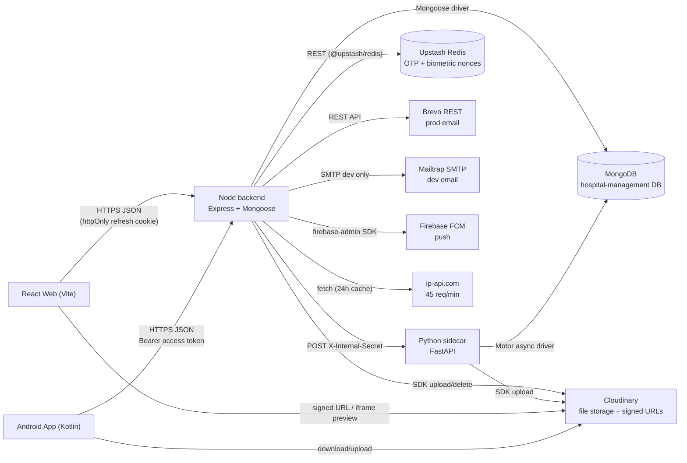

**Source of truth:** [backend/src/index.js](../../backend/src/index.js), [backend/src/services/](../../backend/src/services/), [compression-service/app/main.py](../../compression-service/app/main.py).

---

## 2. MongoDB ER Diagram

Five collections in the main `hospital-management` DB plus two shared with the Python sidecar. Most relationships are soft (hospitalId is a string FK in embedded docs).

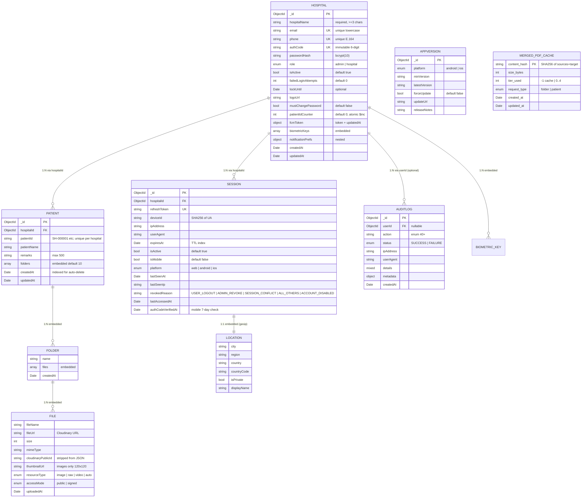

**Source of truth:** [backend/src/models/Hospital.js](../../backend/src/models/Hospital.js), [Patient.js](../../backend/src/models/Patient.js), [Session.js](../../backend/src/models/Session.js), [AuditLog.js](../../backend/src/models/AuditLog.js), [AppVersion.js](../../backend/src/models/AppVersion.js), [compression-service/app/merged_cache.py](../../compression-service/app/merged_cache.py).

---

## 3. Backend Layered Architecture (Example: Login Flow)

Canonical request lifecycle from router through middleware, controller, service, and model layers. Drawn for the POST `/api/auth/login` path.

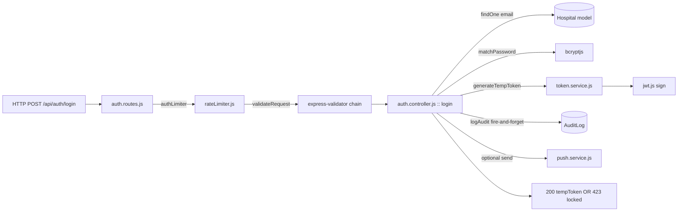

**Source of truth:** [backend/src/routes/auth.routes.js:176](../../backend/src/routes/auth.routes.js), [backend/src/controllers/auth.controller.js](../../backend/src/controllers/auth.controller.js), [backend/src/services/token.service.js](../../backend/src/services/token.service.js).

---

## 4. Frontend Route Tree

Routes grouped by guard. Routes inside `MainLayout` inherit the shared navbar + padding; standalone routes own their chrome.

```mermaid
flowchart TB
  Root["BrowserRouter"]
  Root --> Public["Public routes (no guard, no MainLayout)"]
  Root --> Outside["Standalone auth flows (no guard, no MainLayout)"]
  Root --> AdminOnly["AdminRoute (no MainLayout)"]
  Root --> Shell["ProtectedRoute → MainLayout"]
  Root --> CatchAll["* → NotFound"]

  Public --> P1["/ LandingPage"]
  Public --> P2["/terms Terms"]
  Public --> P3["/privacy Privacy"]
  Public --> P4["/components-preview ComponentsPreview"]
  Public --> P5["/spinners-preview LoadingSpinners"]

  Outside --> O1["/login Login"]
  Outside --> O2["/verify-auth-code VerifyAuthCode"]
  Outside --> O3["/change-password ChangePassword"]
  Outside --> O4["/forgot-password ForgotPassword"]

  AdminOnly --> A1["/register HospitalRegistration"]

  Shell --> S1["/dashboard Dashboard"]
  Shell --> S2["/profile Profile"]
  Shell --> S3["/password Password"]
  Shell --> S4["/sessions Sessions"]
  Shell --> S5["/notifications NotificationSettings"]
  Shell --> S6["/security → Navigate /sessions"]
  Shell --> S7["/patients/:id PatientDetails"]
  Shell --> S8["/patients/:id/folders/:name FolderView"]
  Shell --> S9["Nested AdminRoute"]
  S9 --> S9a["/hospitals HospitalsList"]
  S9 --> S9b["/activity ActivityLog"]
```

**Source of truth:** [frontend/src/routes/AppRoutes.tsx](../../frontend/src/routes/AppRoutes.tsx).

---

## 5. Auth State Machine

All states a hospital account can be in, driven by endpoints. Biometric verify resets the 7-day mobile clock back to `Authenticated`.

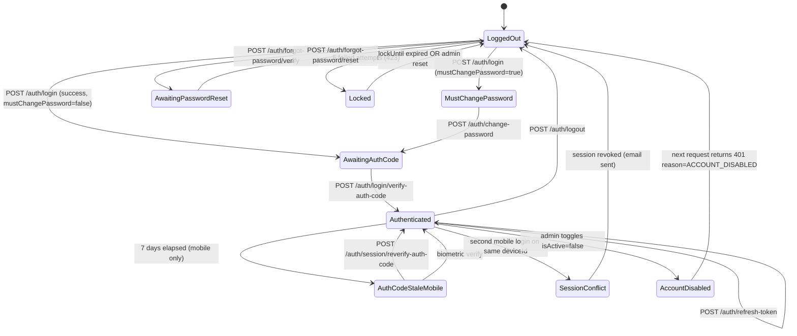

**Source of truth:** [backend/src/controllers/auth.controller.js](../../backend/src/controllers/auth.controller.js), [backend/src/middleware/auth.js](../../backend/src/middleware/auth.js).

---

## 6. Login Sequence (Web + Mobile)

Two-step login. Mobile path enforces the 7-day Auth Code re-verify on subsequent requests; web path does not.

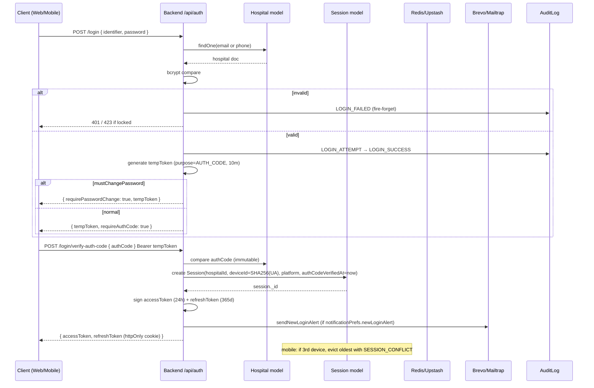

**Source of truth:** [backend/src/controllers/auth.controller.js](../../backend/src/controllers/auth.controller.js), [backend/src/services/token.service.js](../../backend/src/services/token.service.js).

---

## 7. Token Refresh Interceptor (Frontend)

Frontend Axios handles 401s by serialising refresh attempts behind a mutex so parallel in-flight requests don't trigger multiple refreshes.

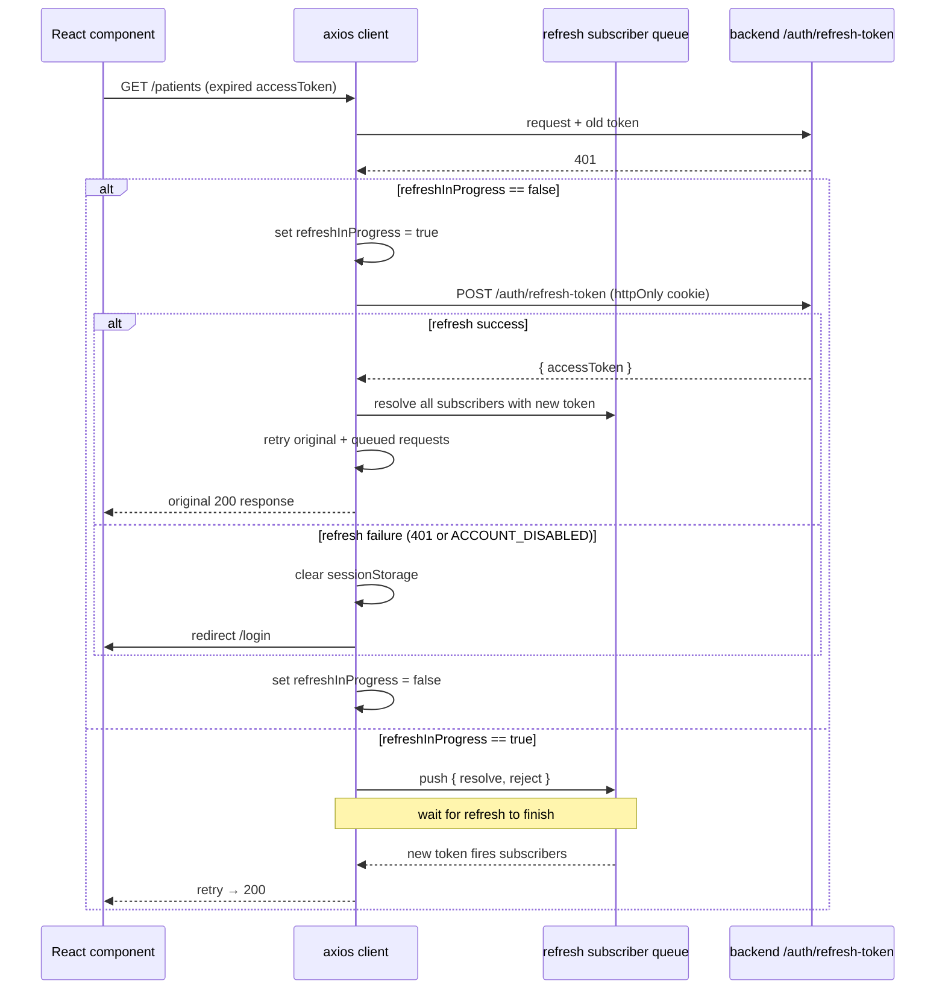

**Source of truth:** [frontend/src/services/api.ts](../../frontend/src/services/api.ts).

---

## 8. File Upload Pipeline (Mobile)

Multer streams into Cloudinary; the controller updates the embedded `folders[].files[]` array and fires an audit write (currently MISSING per §00-drift §10).

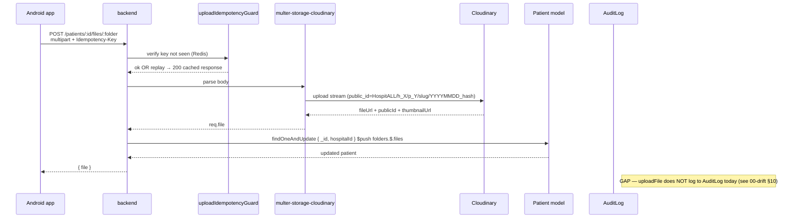

**Source of truth:** [backend/src/routes/patient.routes.js:115-120](../../backend/src/routes/patient.routes.js), [backend/src/middleware/upload.js](../../backend/src/middleware/upload.js), [backend/src/controllers/patient.controller.js](../../backend/src/controllers/patient.controller.js).

---

## 9. Compression Sidecar Pipeline

The sidecar handles cache short-circuit first, then runs the tier ladder. Timeouts and error branches shown explicitly.

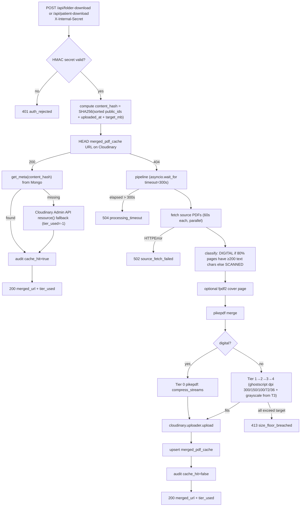

**Source of truth:** [compression-service/app/endpoints/folder.py](../../compression-service/app/endpoints/folder.py), [tier_ladder.py](../../compression-service/app/compression/tier_ladder.py), [cloudinary_client.py](../../compression-service/app/cloudinary_client.py), [merged_cache.py](../../compression-service/app/merged_cache.py).

---

## 10. Patient Download Orchestration

Node's `patient.controller.js` branches between ZIP vs PDF, merged vs per-folder, sidecar vs local, and emits streaming responses.

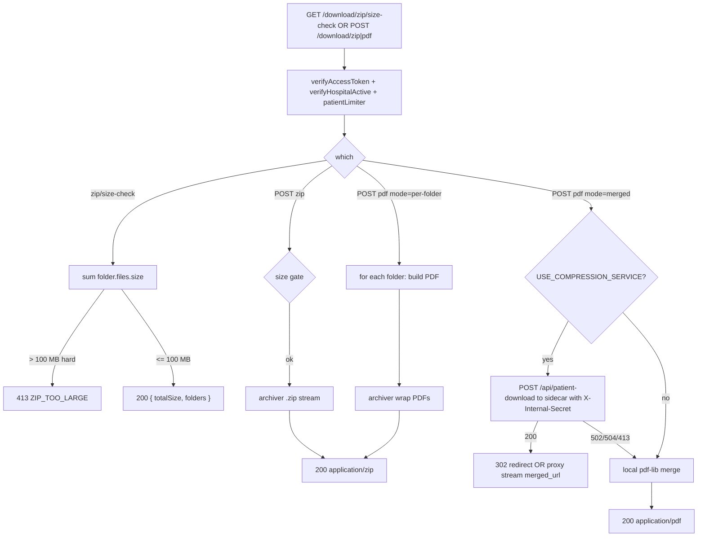

**Source of truth:** [backend/src/controllers/patient.controller.js](../../backend/src/controllers/patient.controller.js), [backend/src/services/compression.service.js](../../backend/src/services/compression.service.js), [backend/src/services/zip.service.js](../../backend/src/services/zip.service.js), [backend/src/services/pdf.service.js](../../backend/src/services/pdf.service.js).

---

## 11. Auto-Delete Cron Flow

Nightly job; hard delete with cascade to Cloudinary, audit-logged once with aggregate counts.

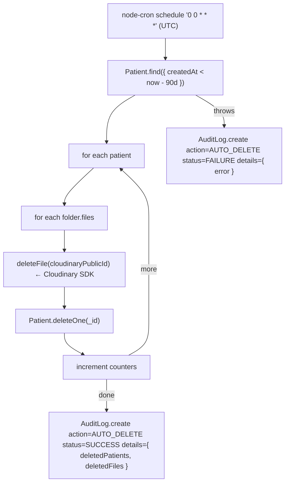

**Source of truth:** [backend/src/jobs/autoDelete.job.js](../../backend/src/jobs/autoDelete.job.js), [backend/src/services/patient.service.js:442-490](../../backend/src/services/patient.service.js).

---

## 12. Session Lifecycle

States plus revocation reasons. TTL index on `expiresAt` auto-prunes expired docs; `cleanupExpiredSessions()` is dead code (see dead-code §D).

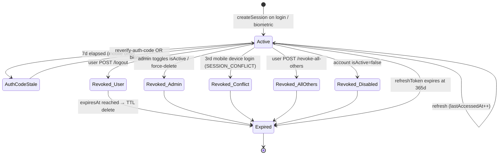

**Source of truth:** [backend/src/models/Session.js](../../backend/src/models/Session.js), [backend/src/services/token.service.js](../../backend/src/services/token.service.js), [backend/src/controllers/auth.controller.js](../../backend/src/controllers/auth.controller.js).

---

## 13. Notification Dispatch Decision Tree

Both channels gated by `notificationPrefs`; FCM only fires if `hospital.fcmToken.token` is set.

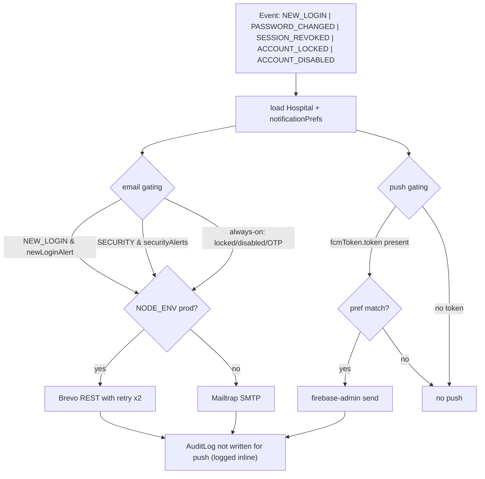

**Source of truth:** [backend/src/services/mail.service.js](../../backend/src/services/mail.service.js), [backend/src/services/push.service.js](../../backend/src/services/push.service.js), [backend/src/controllers/auth.controller.js](../../backend/src/controllers/auth.controller.js).

---

## 14. Forgot Password Flow

Three-step flow with explicit "always return 200" on step 1 to prevent account enumeration.

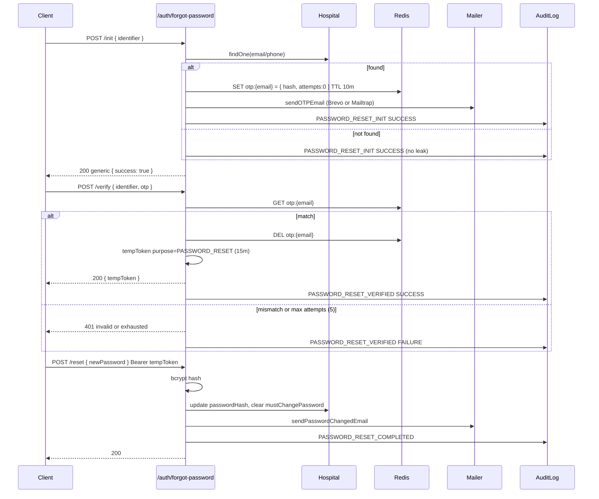

**Source of truth:** [backend/src/controllers/auth.controller.js](../../backend/src/controllers/auth.controller.js) (forgot-password group), [backend/src/services/mail.service.js](../../backend/src/services/mail.service.js).

---

## 15. MainLayout Component Hierarchy

Composition inside the shell, including where portaled modals attach (body root, not layout).

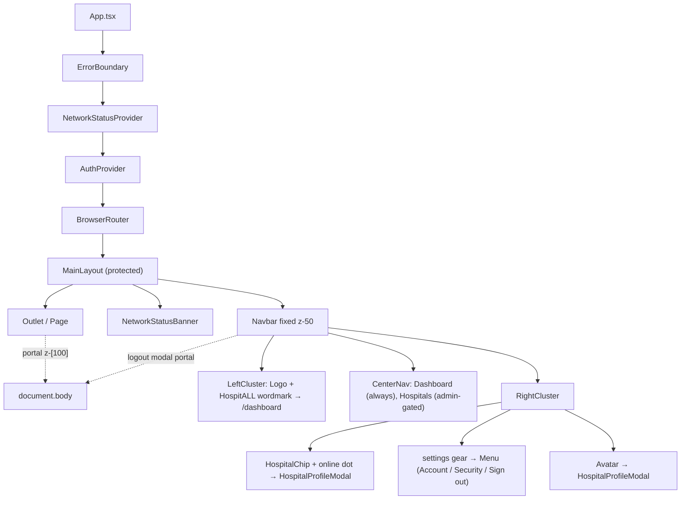

**Source of truth:** [frontend/src/layouts/MainLayout.tsx](../../frontend/src/layouts/MainLayout.tsx), [frontend/src/components/Navbar.tsx](../../frontend/src/components/Navbar.tsx).

---

## 16. Service Dependency Graph (High-Coupling Services)

Services imported by 3+ controllers are highlighted; they're the natural bus-factor hotspots.

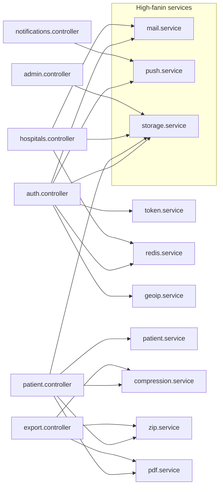

**Source of truth:** [backend/src/controllers/](../../backend/src/controllers/) + [backend/src/services/](../../backend/src/services/) — grep of `import ... from`.

---

## 17. Patient ID Generation

Atomic `$inc` via `findByIdAndUpdate` guarantees serialisation. Initials come from hospital name.

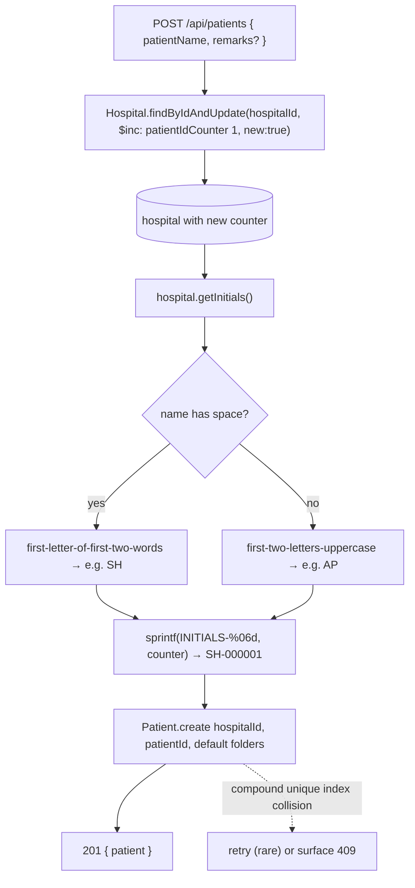

**Source of truth:** [backend/src/services/patient.service.js:22-26](../../backend/src/services/patient.service.js), [backend/src/models/Hospital.js](../../backend/src/models/Hospital.js) (getInitials method).

---

*17 diagrams, all derived from live code. Proceed to `04-enhancements.md` for the findings feed.*
