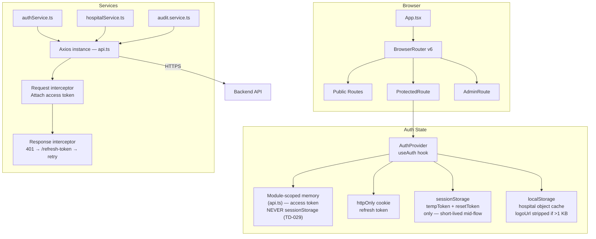
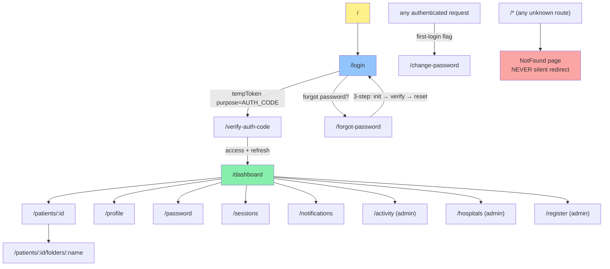
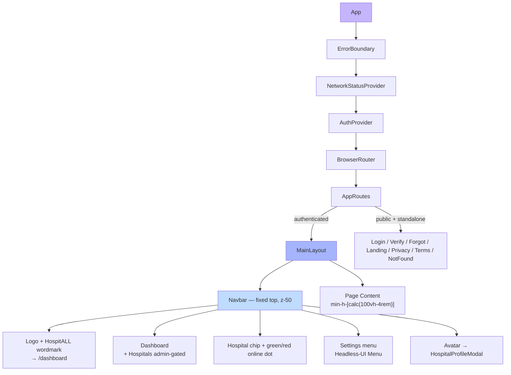
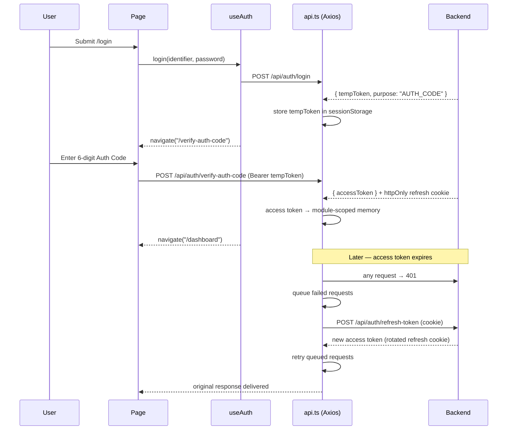
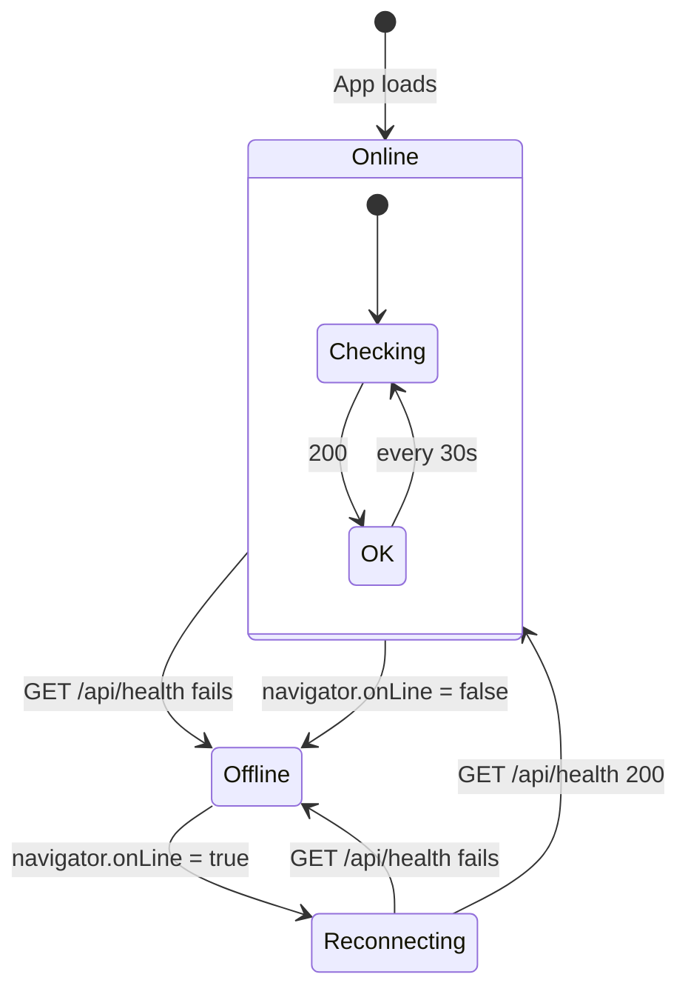

# Frontend — MediVault Web App

React 18 + TypeScript single-page application. Read-mostly admin/management console — file mutations live primarily in the [Android app](../android-app/README.md). Authenticates via the same two-step Auth Code flow as Android (no TOTP — see [CLAUDE.md §5](../CLAUDE.md)).

The canonical project context is [CLAUDE.md](../CLAUDE.md). Audit set: [docs/audit/](../docs/audit/). Frontend-specific audit: [docs/audit/frontend.md](../docs/audit/frontend.md).

---

## Architecture



`patientApi.ts` was removed in TD-010 (2026-04-21). Dashboard's inline fetcher is the only patient-list caller; no shared service module is required.

---

## Page Flow



The unauthenticated landing/login/forgot/verify chrome lives **outside** `MainLayout` — those pages own their own header/footer. Every standalone-page Back button must use `navigate(-1)` with a `location.key !== "default"` fallback to `/` (not `navigate("/")` directly — that bounces logged-in users straight to dashboard).

---

## Component Tree



---

## Directory Structure

```text
frontend/
├── src/
│   ├── components/
│   │   ├── Navbar.tsx                # 3-column top nav
│   │   ├── Button.tsx
│   │   ├── TextInput.tsx
│   │   ├── OtpInput.tsx              # 6-digit Auth Code input, auto-submit
│   │   ├── ErrorMessage.tsx
│   │   ├── ErrorBoundary.tsx
│   │   ├── LogoHeader.tsx
│   │   ├── ProtectedRoute.tsx
│   │   ├── AdminRoute.tsx
│   │   ├── NetworkStatus.tsx         # Provider + pill + banner
│   │   ├── HospitalProfileModal.tsx  # Portaled, z-[100]
│   │   ├── ConfirmDialog.tsx         # Portaled, z-[100]
│   │   ├── DocumentViewer.tsx        # Portaled iframe PDF preview
│   │   ├── PdfModeModal.tsx          # Portaled
│   │   ├── ZipSizeModal.tsx          # Portaled
│   │   ├── PageLoader.tsx            # Initial-fetch shell
│   │   └── Spinner.tsx               # heartbeat / scan / tri-ring variants
│   ├── pages/
│   │   ├── LandingPage.tsx
│   │   ├── Login.tsx
│   │   ├── VerifyAuthCode.tsx        # 6-digit Auth Code, post-login
│   │   ├── ForgotPassword.tsx        # 3-step: init → verify-otp → reset
│   │   ├── ChangePassword.tsx        # First-login enforcement
│   │   ├── Dashboard.tsx             # Greeting + patients workspace + bento stats
│   │   ├── PatientDetails.tsx        # Edit-Patient modal intentionally commented (web read-only)
│   │   ├── FolderView.tsx
│   │   ├── Profile.tsx               # Hospital profile
│   │   ├── Password.tsx              # Change password (authenticated)
│   │   ├── Sessions.tsx              # Active devices + GeoIP
│   │   ├── NotificationSettings.tsx
│   │   ├── ActivityLog.tsx           # Admin-only audit log
│   │   ├── HospitalRegistration.tsx  # Admin-only
│   │   ├── HospitalsList.tsx         # Admin-only — cursor pagination
│   │   ├── Privacy.tsx
│   │   ├── Terms.tsx
│   │   ├── NotFound.tsx              # Catch-all `*` route — no silent redirect
│   │   ├── ComponentsPreview.tsx     # Design gallery, unlinked
│   │   └── LoadingSpinners.tsx       # /spinners-preview gallery (19 variants)
│   ├── hooks/
│   │   ├── useAuth.tsx               # AuthContext — full auth flow
│   │   ├── useDocumentTitle.ts       # MUST use this — direct document.title leaks across nav
│   │   ├── useInactivityTimeout.ts
│   │   └── useScrollToHash.ts
│   ├── services/
│   │   ├── api.ts                    # Axios + access-token-in-memory + 401 retry (TD-029)
│   │   ├── authService.ts
│   │   ├── hospitalService.ts
│   │   └── audit.service.ts
│   ├── layouts/
│   │   └── MainLayout.tsx            # min-h-screen + pt-16 navbar offset (calc-height for children)
│   ├── routes/
│   │   └── AppRoutes.tsx             # 24 routes; `recharts` + `lucide-react` lazy-loaded into ComponentsPreview chunk only (TD-011)
│   ├── types/
│   ├── config/
│   ├── utils/
│   │   ├── validator.ts
│   │   └── avatar.ts                 # getAvatarGradient — single bg-gradient-primary fallback
│   ├── App.tsx                       # ErrorBoundary → NetworkStatusProvider → AuthProvider → Router
│   └── main.tsx
├── public/
│   └── logo.png
├── Dockerfile                        # Multi-stage Node 20 → Nginx 1.25 Alpine
├── nginx.conf                        # /api proxy + SPA fallback + 300s export timeout
├── tailwind.config.js
├── vite.config.ts
└── package.json
```

---

## Authentication & Token Management

**Access token in module-scoped memory** inside [services/api.ts](src/services/api.ts) — never persisted to `sessionStorage`/`localStorage` (TD-029, 2026-04-25). Tab-reopen / page-refresh bootstraps a fresh access token via the httpOnly `refreshToken` cookie + `/auth/refresh-token` round-trip in `AuthProvider.useEffect`. Only the short-lived `tempToken` (10–15 min, mid-login) and `resetToken` (forgot-password) live in `sessionStorage` — they need to survive an in-flow page navigation. Hospital object is cached in `localStorage` (with `logoUrl` stripped if >1 KB).



**On 401 with `ACCOUNT_DISABLED` body** — interceptor surfaces a logout instead of retrying.
**On 401 with `AUTH_CODE_REQUIRED` body** — Android-only error; web doesn't hit this because web sessions are not subject to the 7-day reverify (CLAUDE.md §5).

---

## Architectural Rules (do not violate)

These three rules are enforced across every page in `AppRoutes.tsx`. Violations cause subtle layout/navigation/title bugs.

1. **Pages inside `MainLayout` must use `min-h-[calc(100vh-4rem)]`, never `min-h-screen`.** MainLayout already applies `min-h-screen + pt-16`; a child `min-h-screen` compounds to `100vh + 4rem` and forces a phantom scrollbar.
2. **Every full-viewport modal MUST `createPortal(..., document.body)` and use `z-[100]`.** The fixed `<nav>` owns `z-50` and creates its own stacking context — any inline modal inside Navbar (or any positioned ancestor) gets its backdrop clipped. `Navbar` logout, `HospitalProfileModal`, `ConfirmDialog`, `DocumentViewer`, `PdfModeModal`, `ZipSizeModal`, `HospitalsList ModalShell`, `Profile` contact-change modal are all portaled (sweep done 2026-04-21).
3. **Every page sets its tab title via `useDocumentTitle("...")`** (`hooks/useDocumentTitle.ts`). Without this the previous page's title persists across navigation. Direct `document.title = "..."` does not restore the prior title on unmount — known violators noted in [CLAUDE.md §8](../CLAUDE.md).

---

## Routes

24 total. Catch-all `*` renders [pages/NotFound.tsx](src/pages/NotFound.tsx) — never silent-redirect.

| Path | Component | Auth | Notes |
|------|-----------|------|-------|
| `/` | LandingPage | Public | Marketing homepage |
| `/login` | Login | Public | Email/phone + password |
| `/verify-auth-code` | VerifyAuthCode | Temp Token | 6-digit Auth Code (immutable per-hospital) |
| `/forgot-password` | ForgotPassword | Public | 3-step: init → verify-otp → reset |
| `/change-password` | ChangePassword | Temp Token | First-login enforcement (CLAUDE.md §5) |
| `/terms` | Terms | Public | |
| `/privacy` | Privacy | Public | Reachable URL required for Play Store |
| `/components-preview` | ComponentsPreview | Public | Design gallery, unlinked |
| `/spinners-preview` | LoadingSpinners | Public | 19-variant spinner showcase |
| `/dashboard` | Dashboard | Protected | Greeting + bento stats + patients table |
| `/patients/:id` | PatientDetails | Protected | Edit-Patient modal intentionally commented (read-only) |
| `/patients/:id/folders/:name` | FolderView | Protected | |
| `/profile` | Profile | Protected | Hospital profile (with portaled contact-change modal) |
| `/password` | Password | Protected | Change password while authenticated |
| `/sessions` | Sessions | Protected | Active devices + GeoIP city/country per session |
| `/notifications` | NotificationSettings | Protected | Toggle newLoginAlert / securityAlerts / marketing |
| `/security` | (legacy alias) | Protected | Kept for old links |
| `/activity` | ActivityLog | Admin | Admin-only audit log |
| `/register` | HospitalRegistration | Admin | Create hospital → welcome email + temp password |
| `/hospitals` | HospitalsList | Admin | Cursor pagination + server-side search (TD-005) |
| `*` | NotFound | Public | Renders the 404 page — no redirect |

---

## Sessions Page (GeoIP)

[pages/Sessions.tsx](src/pages/Sessions.tsx) shows geolocation next to each session's IP, and login / password-change / logout emails include the same. Backend GeoIP chain (CLAUDE.md §9): **ipinfo.io** (when `IPINFO_TOKEN` is set, 50k/month free tier) → **ip-api.com** keyless fallback (45 req/min/IP). Private-IP detection (10/8, 172.16/12, 192.168/16, 127/8, ::1, fe80::) falls back to "Local network". 24h success cache + 5-min miss cache. Lookup is fire-and-forget on session create so login latency isn't blocked.

---

## Spinners

Shared `<Spinner>` ([components/Spinner.tsx](src/components/Spinner.tsx)) — variants:

- `heartbeat` (default, generic loading)
- `scan` (document/download/export/upload)
- `tri-ring` (fallback)

Uses `currentColor`. Swap default at the top of `Spinner.tsx` to flip app-wide. `/spinners-preview` hosts a 19-variant showcase. Initial-fetch states use `<PageLoader label="..." />` ([components/PageLoader.tsx](src/components/PageLoader.tsx)) for a consistent shell.

---

## Avatar Fallback

Avatar fallback across Navbar, LogoHeader, Profile, and HospitalsList uses a single `bg-gradient-primary` via [utils/avatar.ts](src/utils/avatar.ts) → `getAvatarGradient()`. The signature is preserved for legacy callers but the value is constant. Callers must render the returned class **WITHOUT** a `bg-gradient-to-br` prefix.

---

## Network Status



| Indicator | Location | Purpose |
|-----------|----------|---------|
| NetworkStatusPill | Navbar (top-right) | Green / yellow / red dot |
| NetworkStatusBanner | Below navbar | Full-width offline warning |

---

## Setup

### Development

```bash
cd frontend
npm install
npm run dev   # Vite on http://localhost:5173
```

### Environment Variables

| Variable        | Default   | Description          |
| --------------- | --------- | -------------------- |
| `VITE_API_URL`  | `/api`    | Backend API base URL |
| `VITE_APP_NAME` | MediVault | App title            |

### Build

```bash
npm run build       # Production build → dist/
npm run type-check  # TypeScript validation
npm run lint        # ESLint check
```

### Docker

```bash
docker build \
  --build-arg VITE_API_URL=/api \
  --build-arg VITE_APP_NAME="Hospital Management System" \
  -t hospital-frontend .
```

Multi-stage build: Node 20 Alpine (build) → Nginx 1.25 Alpine (serve).

### Nginx

- Proxies `/api/*` to `http://backend:5000`
- SPA fallback: all routes serve `index.html`
- Gzip compression
- Static assets cached 1 year
- Extended timeouts (300 s) for export endpoints

---

## Tech Stack

| Technology | Purpose |
|------------|---------|
| React 18 | UI framework |
| TypeScript 5 | Type safety |
| Vite | Build tool + HMR dev server |
| Tailwind CSS 3 | Utility-first styling |
| React Router 6 | Client-side routing |
| Axios | HTTP client + interceptors |
| Headless UI | Accessible menu / disclosure (Navbar settings menu) |
| React Context | Auth state, network status (no Redux/Zustand) |

`recharts` and `lucide-react` are gallery-only deps, **intentionally kept** and isolated to the `ComponentsPreview-*.js` lazy chunk via `React.lazy()` in [AppRoutes.tsx](src/routes/AppRoutes.tsx) (TD-011). Zero bytes in the main bundle.

---

## Open Frontend Tech-Debt

See [docs/audit/06-tech-debt-ledger.md](../docs/audit/06-tech-debt-ledger.md) for the full ledger. Notable web-side items:

- No form-validation library; validation hand-rolled and inconsistent across forms.
- Manual UA parsing on `/sessions` is brittle.
- Tailwind class strings are long and ternary-heavy.
- Admin nav invisible on mobile viewport.
- Frontend assumes `OTP_LENGTH = 6` — silent break if backend changes.
- Modal patterns still raw-div (not Headless UI Dialog) — OK for now; all are portaled + consistent.
