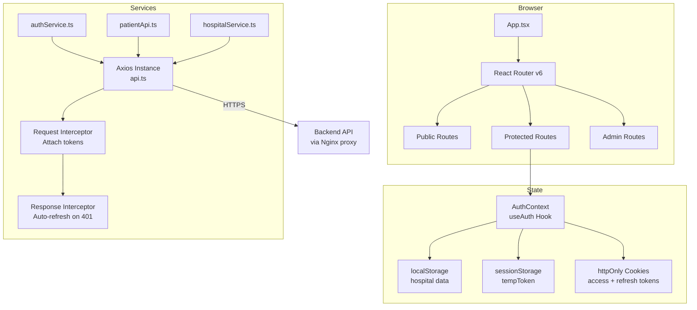
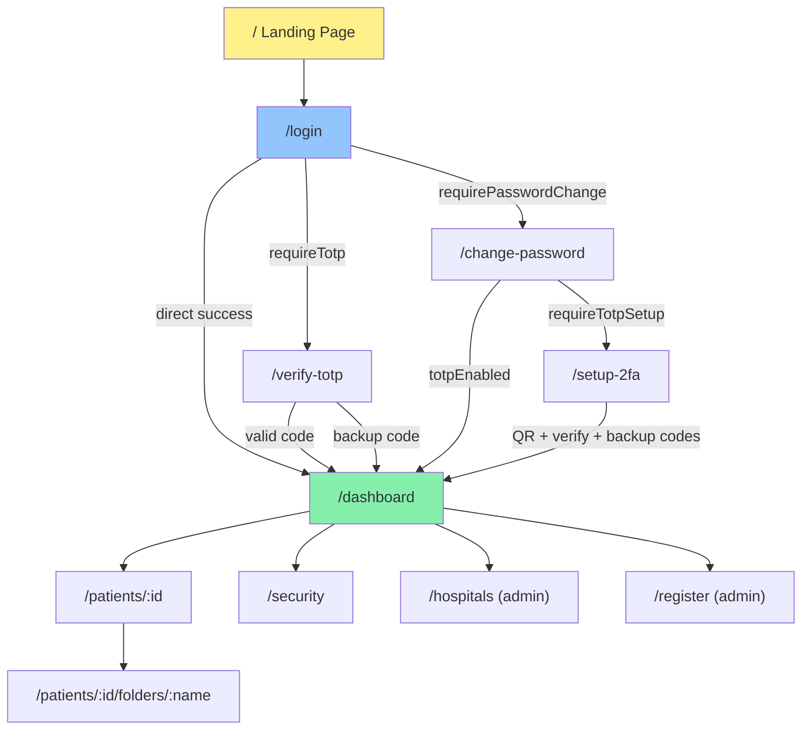
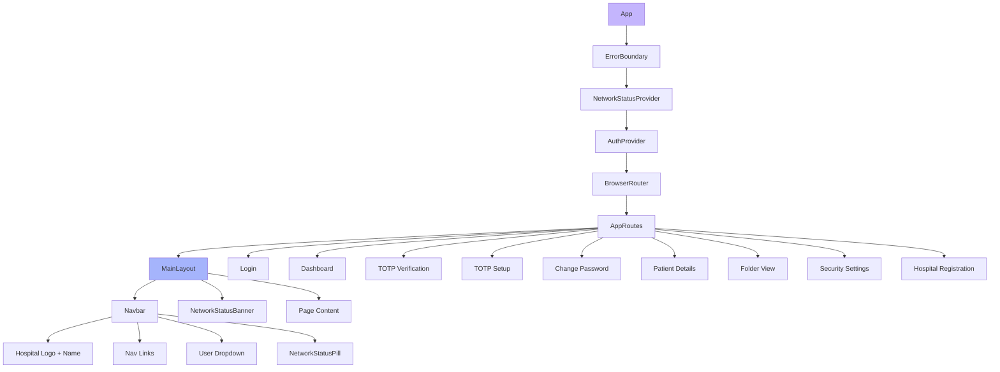
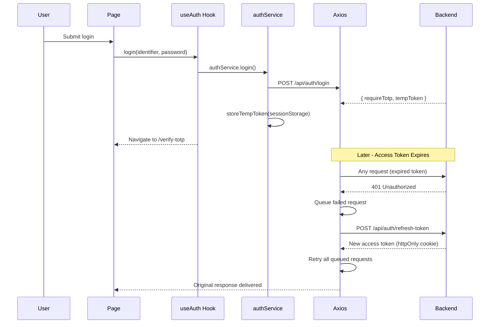
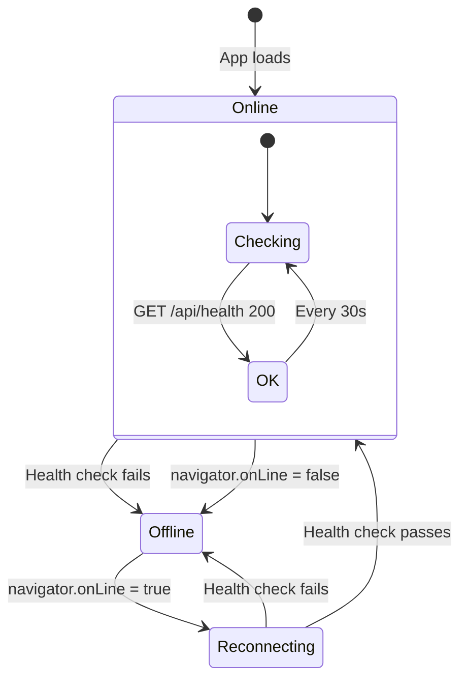

# Frontend - Hospital Management Web App

React 18 + TypeScript single-page application with Tailwind CSS, Vite, and enterprise-grade TOTP authentication.

---

## Architecture



---

## Page Flow



---

## Component Tree



---

## Directory Structure

```
frontend/
├── src/
│   ├── components/
│   │   ├── Navbar.tsx              # Top navigation + user menu
│   │   ├── Button.tsx              # primary | secondary | danger | ghost
│   │   ├── TextInput.tsx           # Input with icons and error state
│   │   ├── OtpInput.tsx            # 6-digit TOTP input, auto-submit
│   │   ├── ErrorMessage.tsx        # Dismissible alert banners
│   │   ├── ErrorBoundary.tsx       # React error boundary
│   │   ├── LogoHeader.tsx          # Branded header
│   │   ├── ProtectedRoute.tsx      # Auth guard
│   │   ├── AdminRoute.tsx          # Admin role guard
│   │   ├── NetworkStatus.tsx       # Provider + pill + banner
│   │   ├── TwoFactorSettings.tsx   # 2FA setup flow
│   │   ├── RotationSetupModal.tsx  # 2FA key rotation
│   │   ├── BackupCodesModal.tsx    # Display recovery codes
│   │   ├── PasswordConfirmModal.tsx
│   │   ├── HospitalProfileModal.tsx
│   │   ├── SkeletonLoader.tsx      # Loading placeholders
│   │   └── CountdownTimer.tsx
│   ├── pages/
│   │   ├── LandingPage.tsx         # Marketing homepage
│   │   ├── Login.tsx               # Email/phone/username login
│   │   ├── Dashboard.tsx           # Patient list + search + export
│   │   ├── TotpVerification.tsx    # 6-digit TOTP during login
│   │   ├── TotpSetupMandatory.tsx  # QR -> verify -> backup codes
│   │   ├── ChangePassword.tsx      # First-login password reset
│   │   ├── PatientDetails.tsx      # Patient info + folder grid
│   │   ├── FolderView.tsx          # Files in folder + download
│   │   ├── SecuritySettings.tsx    # 2FA management + rotation
│   │   ├── HospitalRegistration.tsx # Admin: create hospital
│   │   └── HospitalsList.tsx       # Admin: view all hospitals
│   ├── hooks/
│   │   └── useAuth.tsx             # AuthContext with full auth flow
│   ├── services/
│   │   ├── api.ts                  # Axios instance + interceptors
│   │   ├── authService.ts          # Auth API calls + TOTP
│   │   ├── patientApi.ts           # Patient/file API calls
│   │   └── hospitalService.ts      # Hospital API calls
│   ├── layouts/
│   │   └── MainLayout.tsx          # Navbar + NetworkBanner + Outlet
│   ├── routes/
│   │   └── AppRoutes.tsx           # Route definitions
│   ├── types/
│   │   └── auth.ts                 # TypeScript interfaces
│   ├── config/
│   │   └── constants.ts            # API_URL, OTP config
│   ├── utils/
│   │   ├── validator.ts            # Email/phone validation
│   │   └── persistentLogger.ts     # Client-side error logging
│   ├── App.tsx                     # Root: ErrorBoundary -> Providers -> Router
│   └── main.tsx                    # React DOM entry point
├── Dockerfile                      # Multi-stage: Node -> Nginx
├── nginx.conf                      # Reverse proxy + SPA fallback
├── .dockerignore
├── tailwind.config.js
├── vite.config.ts
├── tsconfig.json
└── package.json
```

---

## Token Management



---

## Network Status



| Indicator | Location | Purpose |
|-----------|----------|---------|
| **NetworkStatusPill** | Navbar (top-right) | Green/yellow/red dot |
| **NetworkStatusBanner** | Below navbar | Full-width offline warning |

---

## Routes

| Path | Component | Auth | Description |
|------|-----------|------|-------------|
| `/` | LandingPage | Public | Marketing homepage |
| `/login` | Login | Public | Credential entry |
| `/verify-totp` | TotpVerification | Temp Token | TOTP code input |
| `/setup-2fa` | TotpSetupMandatory | Temp/Access | 2FA enrollment |
| `/change-password` | ChangePassword | Temp Token | First-login password reset |
| `/dashboard` | Dashboard | Protected | Patient list + search |
| `/patients/:id` | PatientDetails | Protected | Patient info + folders |
| `/patients/:id/folders/:name` | FolderView | Protected | Files in folder |
| `/security` | SecuritySettings | Protected | 2FA management |
| `/hospitals` | HospitalsList | Admin | All hospitals |
| `/register` | HospitalRegistration | Admin | Create hospital |

---

## Key Features

### Multi-Step Authentication
- Unified identifier field (auto-detects email/phone/username)
- TOTP verification with 6-digit auto-submit input
- Backup code recovery for lost devices
- Mandatory 2FA setup after registration
- Password change enforcement on first login

### Patient Management
- Paginated patient list (10 per page) with search (350ms debounce)
- Folder-based document organization (8 predefined categories)
- Bulk download as PDF or ZIP
- Export all patient data

### Real-Time Connectivity
- Periodic health checks to backend (every 30s)
- Visual indicators for online/offline/reconnecting states
- Graceful degradation when backend unreachable

---

## Setup

### Development

```bash
cd frontend
npm install
npm run dev       # Vite dev server on http://localhost:5173
```

### Environment Variables

| Variable | Default | Description |
|----------|---------|-------------|
| `VITE_API_URL` | `/api` | Backend API base URL |
| `VITE_APP_NAME` | Hospital Management System | App title |

### Build

```bash
npm run build       # Production build -> dist/
npm run type-check  # TypeScript validation
npm run lint        # ESLint check
```

### Docker

```bash
docker build \
  --build-arg VITE_API_URL=/api \
  --build-arg VITE_APP_NAME="Hospital Management System" \
  -t hospital-frontend .
```

Multi-stage build: Node 20 Alpine (build) -> Nginx 1.25 Alpine (serve)

### Nginx

- Proxies `/api/*` to `http://backend:5000`
- SPA fallback: all routes serve `index.html`
- Gzip compression enabled
- Static assets cached 1 year
- Extended timeouts (300s) for export endpoints

---

## Tech Stack

| Technology | Version | Purpose |
|------------|---------|---------|
| React | 18.2.0 | UI framework |
| TypeScript | 5.2.0 | Type safety |
| Vite | 4.5.0 | Build tool + HMR dev server |
| Tailwind CSS | 3.3.0 | Utility-first styling |
| React Router | 6.15.0 | Client-side routing |
| Axios | 1.5.0 | HTTP client + interceptors |
| Headless UI | 2.2.9 | Accessible UI components |
